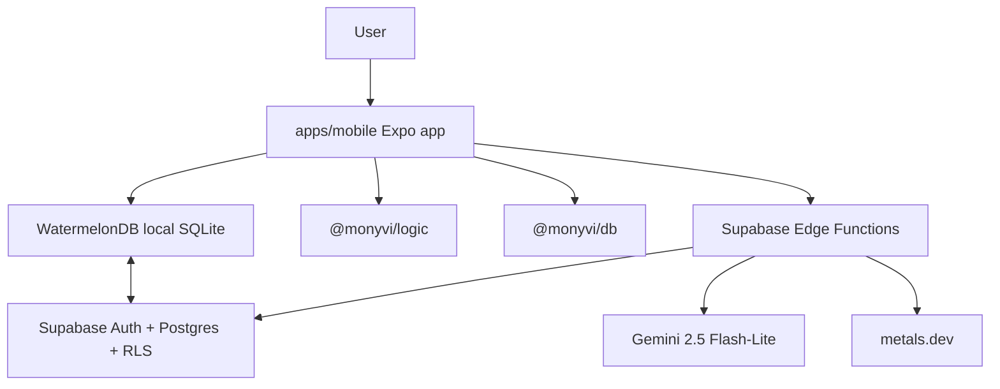
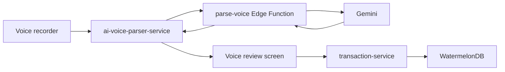

# Monyvi Technical Architecture

**Last updated:** 2026-05-10  
**Status:** Implementation-aligned architecture map

This document describes how the app is currently built. The constitution remains
the authority for required engineering principles; this file explains the
implemented shape, data flows, and known architecture debt.

## 1. System Overview

Monyvi is an Expo Router mobile app backed by WatermelonDB, Supabase Auth,
Supabase PostgreSQL sync tables, and Supabase Edge Functions.



## 2. Repository Structure

| Path                  | Purpose                                                                                |
| --------------------- | -------------------------------------------------------------------------------------- |
| `apps/mobile`         | Expo Router app, screens, providers, hooks, services, validation, i18n, NativeWind UI. |
| `packages/db`         | WatermelonDB schema, migrations, models, generated Supabase types, database bootstrap. |
| `packages/logic`      | Shared calculations, parsers, currency utilities, budget utilities, analytics helpers. |
| `supabase/functions`  | Edge Functions for market rates and AI parsing.                                        |
| `supabase/migrations` | Local SQL migrations for Supabase schema changes.                                      |
| `docs`                | Business, architecture, design, process, audit, and agent documentation.               |
| `specs`               | Feature specs, plans, contracts, and mockups.                                          |

## 3. Dependency Direction

The intended dependency direction is:

```text
apps/mobile -> packages/logic -> packages/db
```

Rules:

- `apps/mobile` may import from both packages.
- `packages/logic` may import DB types only when unavoidable.
- `packages/db` must not import from `apps/mobile` or `packages/logic`.

Current debt: some `packages/db` model getters import app/logic helpers. Treat
that as an existing architecture violation, not a precedent. New work should
avoid adding reverse dependencies and should move presentation formatting out of
DB models over time.

## 4. App Runtime And Routing

Root runtime:

- `apps/mobile/app/_layout.tsx` initializes fonts, i18n, Sentry, notifications,
  live SMS startup handlers, auth, locale, theme, safe area, and toast
  providers.
- `SafeAreaProvider` uses `initialWindowMetrics` to avoid first-render inset
  jumps.
- Public routes are `index`, `pitch`, `auth`, and `auth-callback`.

Private runtime:

- `apps/mobile/app/index.tsx` routes signed-out users to pitch/auth and
  signed-in users to `/startup`.
- `apps/mobile/app/(private)/_layout.tsx` mounts private providers only after
  auth is resolved.
- Provider order inside private runtime is:
  `QueryProvider -> DatabaseProvider -> PrivateDataBoundary -> SyncProvider -> MarketRatesRealtimeProvider -> CategoriesProvider -> SmsScanProvider -> FirstRunTooltipProvider`.
- `apps/mobile/app/(private)/startup.tsx` is the authenticated routing gate. It
  uses initial sync state and the scoped profile to route to onboarding,
  dashboard, loading, or retry.

## 5. Local Data Model

WatermelonDB schema version is currently `17`.

Core local tables:

- `profiles`
- `accounts`
- `bank_details`
- `transactions`
- `transfers`
- `categories`
- `user_category_settings`
- `budgets`
- `recurring_payments`
- `debts`
- `assets`
- `asset_metals`
- `market_rates`
- `daily_snapshot_balance`
- `daily_snapshot_assets`
- `daily_snapshot_net_worth`

Important schema facts:

- `asset_metals` uses `purity_fraction`, not `purity_karat`.
- Market rates are USD-based rows in `market_rates`.
- Snapshot tables are pull-only/server-generated in practice.
- `bank_details` and `asset_metals` inherit ownership through parent records
  rather than storing direct `user_id`.

## 6. User-Scoped Data Access

Local rows may remain after logout, so every private read/write must scope to
the current authenticated user.

Approved helper patterns live in `apps/mobile/services/user-data-access.ts`:

- `getCurrentUserDataScope()`
- `queryOwned()`
- `findOwnedById()`
- `observeOwnedById()`
- `queryAccessibleCategories()`
- `queryChildrenOfOwnedParent()`
- `queryChildrenOfOwnedParents()`
- `assertChildRecordParentOwned()`

Components should not import the raw `database` object. Hooks may observe scoped
queries. Services own writes and workflow mutations.

Known exception: `usePreferredCurrency` currently writes profile currency
directly. Future work should move that write into a service.

## 7. Sync Architecture

Sync is implemented in `apps/mobile/services/sync.ts` with WatermelonDB
`synchronize()`.

Pull behavior:

- User-owned tables pull by `user_id`.
- Categories pull system categories plus current-user categories.
- Child tables pull through owned parent IDs.
- `market_rates` pulls recent global rows.
- Snapshot tables pull current-user rows using specialized date-based logic.

Push behavior:

- Read-only tables are skipped.
- User-owned rows are asserted to belong to the authenticated user before push.
- Child rows are validated through owned parent IDs.
- Deletes are soft deletes in Supabase.
- Supabase errors throw and fail the sync.

`SyncProvider` manages:

- Initial sync gate with timeout.
- Background refresh when a current-user profile already exists locally.
- Foreground/background sync intervals.
- Manual retry from startup recovery UI.

## 8. Auth And Session Storage

Auth is Supabase Auth.

Implemented auth paths:

- Email/password signup and sign-in.
- Email verification.
- Password reset.
- Google OAuth through browser auth session.

Session persistence uses `expo-secure-store` through a chunked storage adapter
because Supabase JWT payloads can exceed SecureStore's per-key limit.

The app does not support anonymous auth.

## 9. Business Logic Placement

Use this placement model:

| Layer                    | Responsibility                                                                    |
| ------------------------ | --------------------------------------------------------------------------------- |
| `packages/logic`         | Pure calculations, parsers, currency/metal/budget/analytics helpers.              |
| `apps/mobile/services`   | WatermelonDB writes, orchestration, external service clients, sync, auth helpers. |
| `apps/mobile/hooks`      | React lifecycle, subscriptions, screen state, memoized derived UI state.          |
| `apps/mobile/components` | Render props/state, call callbacks, own UI-only concerns.                         |
| `supabase/functions`     | Secure network gateways for AI parsing and market-rate ingestion.                 |

Services should return explicit success/error results or throw intentional
errors that the caller can translate into UI feedback.

## 10. AI And Automation Flows

### Voice



The mobile client validates the edge-function response with Zod and maps AI
category names to local category IDs before review.

### SMS

Batch scan and live detection share the same invariants:

- Filter likely financial senders/messages.
- Hash SMS bodies.
- Deduplicate against transactions and transfers.
- Parse with AI or regex/native flow depending on path.
- Resolve account from bank details/default account.
- Save as transaction or ATM transfer.

Live Android detection is generated by the Expo config plugin
`withSmsBroadcastReceiver.js` and supports foreground/background events plus
HeadlessJS for killed-app delivery.

## 11. Backend And Edge Functions

Active Edge Functions:

| Function            | Purpose                                                                                |
| ------------------- | -------------------------------------------------------------------------------------- |
| `fetch-metal-rates` | Fetch USD-based currency and metal rates from metals.dev and insert a market-rate row. |
| `parse-sms`         | Parse batches of SMS messages with Gemini.                                             |
| `parse-voice`       | Parse voice recordings with Gemini multimodal input.                                   |

Deprecated or legacy:

- `parse-transaction` is an older OpenAI transaction parser and should not be
  used for new mobile flows.
- Express/Vercel API endpoints are not part of the current active app
  architecture.

## 12. Validation And Error Handling

Validation patterns:

- Forms use Zod schemas in `apps/mobile/validation`.
- AI service responses are validated with Zod before mapping.
- Translation resources are validated at i18n initialization.
- Service boundaries should validate runtime inputs that can arrive from outside
  TypeScript guarantees.

Error/logging patterns:

- Use `logger` from `apps/mobile/utils/logger.ts` for production code.
- Sentry is initialized in the root layout when `EXPO_PUBLIC_SENTRY_DSN` is set.
- Error boundaries provide root and section-level recovery.
- Avoid logging raw transcripts, SMS bodies, financial notes, or parsed
  transaction payloads.

Known debt:

- Several raw `console.*` calls remain.
- Some screens still use content-loading spinners instead of skeletons.
- Some root package scripts reference a nonexistent `@monyvi/api` workspace.

## 13. Developer Workflow

Common commands:

```bash
npm install
npm run mobile
npm test -w @monyvi/mobile
npm run lint
npm run db:sync-local
npm run db:migrate
```

Database workflow:

1. Write SQL migration under `supabase/migrations`.
2. Run the appropriate local DB sync/migration script.
3. Commit migration and generated schema/type changes together.

Do not make DDL changes directly in the Supabase dashboard or through MCP tools.
