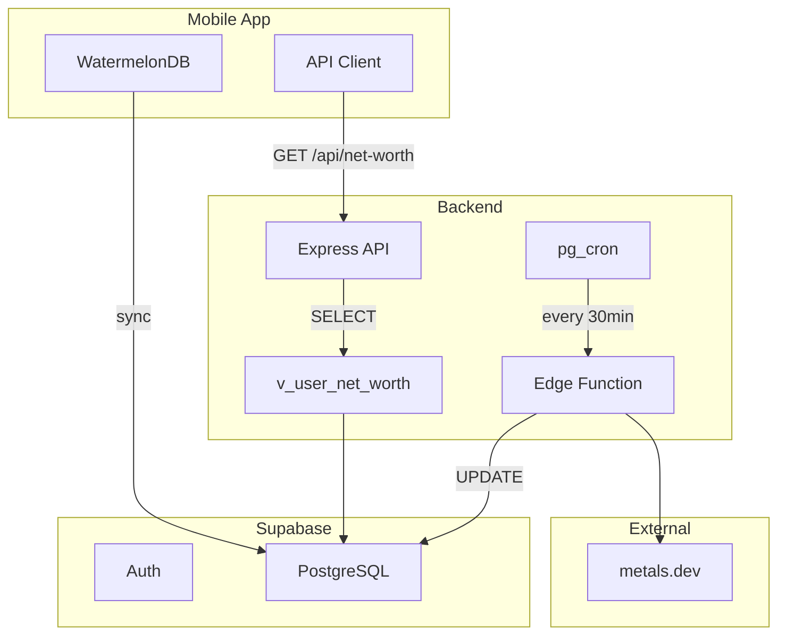

# Astik - Finalized Business Decisions

> **Status:** 🟢 Confirmed  
> **Last Updated:** 2026-01-01  
> **Purpose:** Single source of truth for all confirmed business decisions

---

## 1. User & Authentication

### 1.1 Authentication Methods

| Method              | Status                |
| ------------------- | --------------------- |
| Email/Password      | ✅ Enabled            |
| Google Social Login | ✅ Enabled            |
| Apple Social Login  | ✅ Enabled (iOS only) |
| Facebook Login      | ✅ Enabled            |
| Phone OTP           | ❌ Not planned        |

### 1.2 Guest Mode (Anonymous Authentication)

**Implementation:** Supabase Anonymous Authentication with WatermelonDB
offline-first

**Flow:**

```
┌─────────────────────────────────────────────────────────────────────────┐
│                           USER JOURNEY                                   │
├─────────────────────────────────────────────────────────────────────────┤
│                                                                          │
│  1. FIRST APP LAUNCH                                                    │
│     └─→ signInAnonymously() → Supabase creates "Ghost ID" (user_123)    │
│                                                                          │
│  2. USER ADDS DATA                                                       │
│     └─→ Saved to WatermelonDB (instant) → Syncs to Supabase (background)│
│                                                                          │
│  3. SIGN-UP PROMPT                                                       │
│     └─→ Triggered after 5 transactions                                  │
│     └─→ User can continue indefinitely without signing up               │
│                                                                          │
│  4. ACCOUNT CONVERSION                                                   │
│     └─→ updateUser({ email, password }) → Attaches credentials          │
│     └─→ NO data migration needed (same user_id)                         │
│                                                                          │
│  5. DEVICE LOSS (Guest)                                                  │
│     └─→ Data exists in Supabase but ACCESS IS LOST (no credentials)     │
│                                                                          │
└─────────────────────────────────────────────────────────────────────────┘
```

### 1.3 User Profile Fields

| Field        | Required              | Notes                         |
| ------------ | --------------------- | ----------------------------- |
| `id` (UUID)  | ✅                    | Supabase auth.users           |
| `email`      | Only after conversion | Anonymous users have no email |
| `name`       | 🟡 TBD                | Display name for greeting     |
| `avatar_url` | 🟡 TBD                | From Google profile?          |

---

## 2. Database Architecture

### 2.1 Design Pattern

**Supertype/Subtype (Polymorphic) Pattern**

Separates data into two distinct domains:

- **Accounts Domain:** Liquid, spendable money (transactions flow here)
- **Assets Domain:** Investments, net worth tracking (value calculated from
  market rates)

### 2.2 Accounts Domain (Spendable Money)

#### Table: `accounts`

Parent table for all liquid money containers.

| Column       | Type        | Required | Description                                  |
| ------------ | ----------- | -------- | -------------------------------------------- |
| `id`         | UUID        | ✅       | Primary Key                                  |
| `user_id`    | UUID        | ✅       | FK → auth.users                              |
| `name`       | TEXT        | ✅       | User-defined name (e.g., "Main CIB Account") |
| `type`       | ENUM        | ✅       | `'CASH'`, `'BANK'`, `'DIGITAL_WALLET'`       |
| `balance`    | DECIMAL     | ✅       | Current available money                      |
| `currency`   | CHAR(3)     | ✅       | ISO code: `'EGP'`, `'USD'`, `'EUR'`          |
| `created_at` | TIMESTAMPTZ | ✅       | Auto-generated                               |
| `updated_at` | TIMESTAMPTZ | ✅       | For WatermelonDB sync                        |
| `deleted`    | BOOLEAN     | ✅       | Soft delete for sync (default: false)        |

**Business Rules:**

- One account = one currency
- Same name can exist with different currencies (e.g., "CIB USD", "CIB EGP")
- Balance updated automatically when transactions are added

#### Table: `bank_details`

Child table for accounts where `type = 'BANK'`. 1-to-Many (one bank account can
have multiple cards).

| Column            | Type        | Required | Description                                     |
| ----------------- | ----------- | -------- | ----------------------------------------------- |
| `id`              | UUID        | ✅       | Primary Key                                     |
| `account_id`      | UUID        | ✅       | FK → accounts.id                                |
| `bank_name`       | TEXT        | ✅       | e.g., "HSBC", "National Bank of Egypt"          |
| `card_last_4`     | VARCHAR(4)  | ✅       | For SMS auto-detection                          |
| `sms_sender_name` | TEXT        | ❌       | Optional: e.g., "CIB", "NBE" (for SMS matching) |
| `account_number`  | TEXT        | ❌       | Optional IBAN                                   |
| `created_at`      | TIMESTAMPTZ | ✅       | Auto-generated                                  |
| `updated_at`      | TIMESTAMPTZ | ✅       | For WatermelonDB sync                           |
| `deleted`         | BOOLEAN     | ✅       | Soft delete for sync (default: false)           |

**SMS Matching Logic:**

1. SMS arrives from sender "CIB" with transaction for card "\*\*\*\*1234"
2. Look for `bank_details` where:
   - `card_last_4` = "1234" AND
   - (`sms_sender_name` = "CIB" OR `bank_name` CONTAINS "CIB")
3. If match → create transaction for linked account

### 2.3 Assets Domain (Wealth & Investments)

#### Table: `assets`

Parent table for all investment holdings.

| Column           | Type        | Required | Description                                  |
| ---------------- | ----------- | -------- | -------------------------------------------- |
| `id`             | UUID        | ✅       | Primary Key                                  |
| `user_id`        | UUID        | ✅       | FK → auth.users                              |
| `name`           | TEXT        | ✅       | User-defined name (e.g., "My Wedding Gold")  |
| `type`           | ENUM        | ✅       | `'METAL'`, `'CRYPTO'`, `'REAL_ESTATE'`       |
| `is_liquid`      | BOOLEAN     | ✅       | Can be sold instantly? (emergency fund calc) |
| `purchase_price` | DECIMAL     | ✅       | Cost basis (total paid)                      |
| `purchase_date`  | DATE        | ✅       | When acquired                                |
| `currency`       | CHAR(3)     | ✅       | Currency used to purchase                    |
| `notes`          | TEXT        | ❌       | Optional user notes                          |
| `created_at`     | TIMESTAMPTZ | ✅       | Auto-generated                               |
| `updated_at`     | TIMESTAMPTZ | ✅       | For WatermelonDB sync                        |
| `deleted`        | BOOLEAN     | ✅       | Soft delete for sync                         |

**Note:** `current_value` is NOT stored. It's calculated:

- Metals: `weight_grams * live_market_rate`
- Crypto: 🟡 TBD (future)
- Real Estate: 🟡 TBD (future, possibly manual entry)

#### Table: `asset_metals`

Child table for assets where `type = 'METAL'`.

| Column         | Type        | Required | Description                        |
| -------------- | ----------- | -------- | ---------------------------------- |
| `id`           | UUID        | ✅       | Primary Key                        |
| `asset_id`     | UUID        | ✅       | FK → assets.id                     |
| `metal_type`   | ENUM        | ✅       | `'GOLD'`, `'SILVER'`, `'PLATINUM'` |
| `weight_grams` | DECIMAL     | ✅       | Physical weight                    |
| `purity_karat` | SMALLINT    | ✅       | 24 for pure gold, 21, 18, etc.     |
| `item_form`    | TEXT        | ❌       | "Coin", "Bar", "Jewelry"           |
| `created_at`   | TIMESTAMPTZ | ✅       | Auto-generated                     |

**Valuation Formula:**
`current_value = weight_grams * (purity_karat / 24) * live_gold_price_per_gram`

### 2.4 Historical Snapshots

#### Table: `daily_snapshot_balance`

Stores end-of-day account balances for charts and trends.

| Column               | Type        | Description                          |
| -------------------- | ----------- | ------------------------------------ |
| `id`                 | UUID        | Primary Key                          |
| `user_id`            | UUID        | FK → auth.users                      |
| `snapshot_date`      | DATE        | The date of snapshot                 |
| `total_accounts_egp` | DECIMAL     | Sum of all accounts converted to EGP |
| `breakdown`          | JSONB       | Per-account breakdown                |
| `created_at`         | TIMESTAMPTZ | Auto-generated                       |

**Trigger:** Daily at 11 PM

#### Table: `daily_snapshot_assets`

Stores end-of-day asset valuations.

| Column             | Type        | Description                        |
| ------------------ | ----------- | ---------------------------------- |
| `id`               | UUID        | Primary Key                        |
| `user_id`          | UUID        | FK → auth.users                    |
| `snapshot_date`    | DATE        | The date of snapshot               |
| `total_assets_egp` | DECIMAL     | Sum of all assets converted to EGP |
| `breakdown`        | JSONB       | Per-asset breakdown with values    |
| `created_at`       | TIMESTAMPTZ | Auto-generated                     |

**Trigger:** Daily at 11 PM

### 2.5 Market Rates

#### Table: `market_rates` (existing)

Current live rates (single row, updated every 30 mins).

#### Table: `market_rates_history` (new)

Historical rates for trend calculation.

| Column                | Type        | Description                |
| --------------------- | ----------- | -------------------------- |
| `id`                  | UUID        | Primary Key                |
| `snapshot_date`       | DATE        | Unique per day             |
| `gold_egp_per_gram`   | DECIMAL     | Gold price at end of day   |
| `silver_egp_per_gram` | DECIMAL     | Silver price at end of day |
| `usd_egp`             | DECIMAL     | USD/EGP rate               |
| `eur_egp`             | DECIMAL     | EUR/EGP rate               |
| `created_at`          | TIMESTAMPTZ | Auto-generated             |

**Trigger:** Daily at 11 PM

---

## 3. Multi-Currency Handling

| Scenario                        | Behavior                                                 |
| ------------------------------- | -------------------------------------------------------- |
| One bank, multiple currencies   | Create separate account per currency (same name allowed) |
| Transaction in foreign currency | Transaction stored in account's currency                 |
| Total balance display           | Convert all to EGP using live rates                      |
| Supported currencies            | EGP, USD, EUR                                            |

---

## 4. Sync Strategy

### 4.1 Architecture

```
┌─────────────┐     ┌─────────────┐     ┌─────────────┐
│   Mobile    │ ←───│ WatermelonDB│ ←───│   Supabase  │
│   (UI)      │     │  (Local)    │     │   (Cloud)   │
└─────────────┘     └─────────────┘     └─────────────┘
                          │
                          │ push_changes() / pull_changes()
                          ▼
                    ┌─────────────┐
                    │  Supabase   │
                    │    RPC      │
                    └─────────────┘
```

### 4.2 Sync Columns (All Tables)

- `created_at` (TIMESTAMPTZ)
- `updated_at` (TIMESTAMPTZ)
- `deleted` (BOOLEAN, default false)
- `user_id` (UUID, set from auth.uid())

### 4.3 RLS Policies

All tables: `user_id = auth.uid()` for SELECT, INSERT, UPDATE, DELETE

---

## 5. Transaction Categories

### 5.1 Category Architecture

**Design:** 3-level hierarchical category system with predefined + user-defined
categories.

```
┌─────────────────────────────────────────────────────────────────────────────┐
│                         CATEGORY HIERARCHY                                   │
├─────────────────────────────────────────────────────────────────────────────┤
│                                                                              │
│  Level 1 (Main Category)     Level 2 (Subcategory)    Level 3 (Sub-sub)     │
│  ────────────────────────    ────────────────────     ─────────────────     │
│                                                                              │
│  Food & Drinks           →   Drinks               →   Juice, Soda, etc.     │
│  [SYSTEM, Required]          [SYSTEM, Required]       [USER, Optional]      │
│                                                                              │
│  My Custom Category      →   Custom Sub           →   Custom Detail         │
│  [USER, Editable]            [USER, Editable]         [USER, Editable]      │
│                                                                              │
└─────────────────────────────────────────────────────────────────────────────┘
```

### 5.2 Business Rules

| Rule                                 | Description                                                           |
| ------------------------------------ | --------------------------------------------------------------------- |
| **L1 & L2 Predefined**               | System categories are read-only (cannot edit name/icon/delete)        |
| **L3 User-defined Only**             | No predefined L3 categories; all are user-created                     |
| **User Custom Categories**           | Users can add custom L1, L2, L3 categories                            |
| **User Categories Editable**         | Only user-created categories can have name/icon changed or be deleted |
| **System Categories Locked**         | System category names and icons cannot be modified by users           |
| **Hide Any Level**                   | Users can hide any category (system or custom) from their list        |
| **Transactions Reference Any Level** | Transactions can link to L1, L2, or L3 (user's choice)                |

### 5.3 Table: `categories`

Self-referential table for all category levels.

| Column         | Type        | Required | Description                                                           |
| -------------- | ----------- | -------- | --------------------------------------------------------------------- |
| `id`           | UUID        | ✅       | Primary Key                                                           |
| `user_id`      | UUID        | ❌       | NULL for system categories, set for user-created                      |
| `parent_id`    | UUID        | ❌       | FK → categories.id (NULL for L1)                                      |
| `system_name`  | TEXT        | ✅       | Internal identifier (immutable, lowercase_snake)                      |
| `display_name` | TEXT        | ✅       | User-visible name (editable only for custom)                          |
| `icon`         | TEXT        | ✅       | Icon identifier from predefined set                                   |
| `level`        | SMALLINT    | ✅       | 1, 2, or 3                                                            |
| `nature`       | ENUM        | ⚠️       | `'WANT'`, `'NEED'`, `'MUST'` (required for system, optional for user) |
| `type`         | ENUM        | ❌       | `'EXPENSE'`, `'INCOME'` (NULL for container categories)               |
| `is_system`    | BOOLEAN     | ✅       | true = predefined, false = user-created                               |
| `is_hidden`    | BOOLEAN     | ✅       | User can hide any category (default: false)                           |
| `is_internal`  | BOOLEAN     | ✅       | true = hidden from category picker (system-only, default: false)      |
| `sort_order`   | SMALLINT    | ❌       | Display order within parent                                           |
| `created_at`   | TIMESTAMPTZ | ✅       | Auto-generated                                                        |
| `updated_at`   | TIMESTAMPTZ | ✅       | For WatermelonDB sync                                                 |
| `deleted`      | BOOLEAN     | ✅       | Soft delete for sync (default: false)                                 |

**Constraints:**

- `parent_id` required when `level > 1`
- `user_id` required when `is_system = false`
- Unique: `(user_id, parent_id, system_name)` — prevents duplicates per user

### 5.4 Table: `user_category_settings`

Per-user settings for system categories (visibility and nature override).

| Column        | Type        | Required | Description                                   |
| ------------- | ----------- | -------- | --------------------------------------------- |
| `id`          | UUID        | ✅       | Primary Key                                   |
| `user_id`     | UUID        | ✅       | FK → auth.users                               |
| `category_id` | UUID        | ✅       | FK → categories.id (system category)          |
| `is_hidden`   | BOOLEAN     | ✅       | Hide this system category (default: false)    |
| `nature`      | ENUM        | ❌       | User's override: `'WANT'`, `'NEED'`, `'MUST'` |
| `created_at`  | TIMESTAMPTZ | ✅       | Auto-generated                                |
| `updated_at`  | TIMESTAMPTZ | ✅       | For WatermelonDB sync                         |

**Note:** This table allows users to hide system categories and override their
`nature` value. System category names and icons remain locked. User-created
categories store all settings directly in the `categories` table.

### 5.5 Predefined Categories (Seed Data)

#### Level 1: Main Categories

| system_name       | display_name      | type    | nature | color     | icon |
| ----------------- | ----------------- | ------- | ------ | --------- | ---- |
| `food_drinks`     | Food & Drinks     | EXPENSE | NEED   | `#F59E0B` | 🍔   |
| `transportation`  | Transportation    | EXPENSE | NEED   | `#3B82F6` | 🚌   |
| `vehicle`         | Vehicle           | EXPENSE | WANT   | `#8B5CF6` | 🚗   |
| `shopping`        | Shopping          | EXPENSE | WANT   | `#EC4899` | 🛒   |
| `health_medical`  | Health & Medical  | EXPENSE | MUST   | `#EF4444` | 🏥   |
| `utilities_bills` | Utilities & Bills | EXPENSE | MUST   | `#6366F1` | 📄   |
| `entertainment`   | Entertainment     | EXPENSE | WANT   | `#14B8A6` | 🎉   |
| `charity`         | Charity           | EXPENSE | WANT   | `#F472B6` | ❤️   |
| `education`       | Education         | EXPENSE | NEED   | `#F97316` | 📚   |
| `housing`         | Housing           | EXPENSE | MUST   | `#A855F7` | 🏠   |
| `travel`          | Travel            | EXPENSE | WANT   | `#06B6D4` | ✈️   |
| `income`          | Salary / Income   | INCOME  | —      | `#10B981` | 💰   |
| `debt_loans`      | Debt / Loans      | —       | —      | `#6B7280` | 🤝   |
| `other`           | Other             | EXPENSE | —      | `#9CA3AF` | ❓   |

#### Internal Categories (System-Only)

These categories are hidden from the user's category picker and are only used
for system-generated transactions.

| system_name      | display_name   | type    | icon | Purpose                          |
| ---------------- | -------------- | ------- | ---- | -------------------------------- |
| `asset_purchase` | Asset Purchase | EXPENSE | 📦   | Auto-created when buying assets  |
| `asset_sale`     | Asset Sale     | INCOME  | 💵   | Auto-created when selling assets |

> **Note:** Add `is_internal: BOOLEAN` flag to the `categories` table to mark
> these as hidden from user selection.

#### Level 2: Subcategories

<details>
<summary><b>Food & Drinks</b></summary>

| system_name  | display_name |
| ------------ | ------------ |
| `groceries`  | Groceries    |
| `restaurant` | Restaurant   |
| `coffee_tea` | Coffee & Tea |
| `snacks`     | Snacks       |
| `drinks`     | Drinks       |
| `food_other` | Other        |

</details>

<details>
<summary><b>Transportation</b></summary>

| system_name         | display_name      |
| ------------------- | ----------------- |
| `public_transport`  | Public Transport  |
| `private_transport` | Private Transport |
| `transport_other`   | Other             |

</details>

<details>
<summary><b>Vehicle</b></summary>

| system_name           | display_name | Notes                        |
| --------------------- | ------------ | ---------------------------- |
| `fuel`                | Fuel         |                              |
| `parking`             | Parking      |                              |
| `rental`              | Rental       |                              |
| `license_fees`        | License Fees |                              |
| `vehicle_tax`         | Tax          |                              |
| `traffic_fine`        | Traffic Fine |                              |
| `vehicle_buy`         | Buy          | 🟡 Future: migrate to assets |
| `vehicle_sell`        | Sell         | 🟡 Future: migrate to assets |
| `vehicle_maintenance` | Maintenance  |                              |
| `vehicle_other`       | Other        |                              |

</details>

<details>
<summary><b>Shopping</b></summary>

| system_name              | display_name             |
| ------------------------ | ------------------------ |
| `clothes`                | Clothes                  |
| `electronics_appliances` | Electronics & Appliances |
| `accessories`            | Accessories              |
| `footwear`               | Footwear                 |
| `bags`                   | Bags                     |
| `kids_baby`              | Kids & Baby              |
| `beauty`                 | Beauty                   |
| `home_garden`            | Home & Garden            |
| `pets`                   | Pets                     |
| `sports_fitness`         | Sports & Fitness         |
| `toys_games`             | Toys & Games             |
| `wedding`                | Wedding                  |
| `detergents`             | Detergents               |
| `decorations`            | Decorations              |
| `personal_care`          | Personal Care            |
| `shopping_other`         | Other                    |

</details>

<details>
<summary><b>Health & Medical</b></summary>

| system_name    | display_name |
| -------------- | ------------ |
| `doctor`       | Doctor       |
| `medicine`     | Medicine     |
| `surgery`      | Surgery      |
| `dental`       | Dental       |
| `health_other` | Other        |

</details>

<details>
<summary><b>Utilities & Bills</b></summary>

| system_name           | display_name        |
| --------------------- | ------------------- |
| `electricity`         | Electricity         |
| `water`               | Water               |
| `internet`            | Internet            |
| `phone`               | Phone               |
| `gas`                 | Gas                 |
| `trash`               | Trash               |
| `online_subscription` | Online Subscription |
| `streaming`           | Streaming           |
| `taxes`               | Taxes               |
| `utilities_other`     | Other               |

</details>

<details>
<summary><b>Entertainment</b></summary>

| system_name           | display_name     |
| --------------------- | ---------------- |
| `trips_holidays`      | Trips & Holidays |
| `events`              | Events           |
| `tickets`             | Tickets          |
| `entertainment_other` | Other            |

</details>

<details>
<summary><b>Charity</b></summary>

| system_name     | display_name |
| --------------- | ------------ |
| `donations`     | Donations    |
| `fundraising`   | Fundraising  |
| `charity_gifts` | Gifts        |
| `charity_other` | Other        |

</details>

<details>
<summary><b>Education</b></summary>

| system_name       | display_name |
| ----------------- | ------------ |
| `books`           | Books        |
| `tuition`         | Tuition      |
| `education_fees`  | Fees         |
| `education_other` | Other        |

</details>

<details>
<summary><b>Housing</b></summary>

| system_name           | display_name          | Notes                        |
| --------------------- | --------------------- | ---------------------------- |
| `rent`                | Rent                  |                              |
| `housing_maintenance` | Maintenance & Repairs |                              |
| `housing_tax`         | Tax                   |                              |
| `housing_buy`         | Buy                   | 🟡 Future: migrate to assets |
| `housing_sell`        | Sell                  | 🟡 Future: migrate to assets |
| `housing_other`       | Other                 |                              |

</details>

<details>
<summary><b>Travel</b></summary>

| system_name       | display_name    |
| ----------------- | --------------- |
| `vacation`        | Vacation        |
| `business_travel` | Business Travel |
| `holiday`         | Holiday         |
| `travel_other`    | Other           |

</details>

<details>
<summary><b>Salary / Income</b></summary>

| system_name       | display_name    |
| ----------------- | --------------- |
| `salary`          | Salary          |
| `bonus`           | Bonus           |
| `commission`      | Commission      |
| `refund`          | Refund          |
| `loan_income`     | Loan            |
| `gift_income`     | Gift            |
| `check`           | Check           |
| `rental_income`   | Rental Income   |
| `freelance`       | Freelance       |
| `business_income` | Business Income |
| `income_other`    | Other           |

</details>

<details>
<summary><b>Debt / Loans</b></summary>

| system_name               | display_name              | type    |
| ------------------------- | ------------------------- | ------- |
| `lent_money`              | Lent Money                | EXPENSE |
| `borrowed_money`          | Borrowed Money            | INCOME  |
| `debt_repayment_paid`     | Debt Repayment (Paid)     | EXPENSE |
| `debt_repayment_received` | Debt Repayment (Received) | INCOME  |
| `debt_other`              | Other                     | —       |

</details>

<details>
<summary><b>Other (Fallback)</b></summary>

| system_name     | display_name |
| --------------- | ------------ |
| `uncategorized` | Other        |

</details>

---

## 6. Debts & Loans

### 6.1 Architecture

Debts track money you **lent to** or **borrowed from** someone. They can
optionally have **recurring payments** attached (for installments).

```
┌─────────────────────────────────────────────────────────────────────────────┐
│                         DEBT ARCHITECTURE                                    │
├─────────────────────────────────────────────────────────────────────────────┤
│                                                                              │
│  ┌──────────────┐                    ┌────────────────────────┐             │
│  │    DEBTS     │ ──────────────────→│  RECURRING PAYMENTS    │             │
│  └──────────────┘   can HAVE         └────────────────────────┘             │
│        │                                       │                            │
│        │ linked via                            │ linked via                 │
│        ↓                                       ↓                            │
│  ┌──────────────┐                    ┌────────────────────────┐             │
│  │ TRANSACTIONS │                    │     TRANSACTIONS       │             │
│  └──────────────┘                    └────────────────────────┘             │
│                                                                              │
│  A debt CAN have a recurring payment attached (for installments)             │
│  A recurring payment MAY or MAY NOT be linked to a debt                      │
│                                                                              │
└─────────────────────────────────────────────────────────────────────────────┘
```

### 6.2 Table: `debts`

| Column               | Type        | Required | Description                                                  |
| -------------------- | ----------- | -------- | ------------------------------------------------------------ |
| `id`                 | UUID        | ✅       | Primary Key                                                  |
| `user_id`            | UUID        | ✅       | FK → auth.users                                              |
| `type`               | ENUM        | ✅       | `'LENT'`, `'BORROWED'`                                       |
| `party_name`         | TEXT        | ✅       | Who you lent to / borrowed from                              |
| `original_amount`    | DECIMAL     | ✅       | Initial debt amount                                          |
| `outstanding_amount` | DECIMAL     | ✅       | Remaining balance (updated on repayments)                    |
| `account_id`         | UUID        | ✅       | FK → accounts.id (which account was affected)                |
| `notes`              | TEXT        | ❌       | Optional notes                                               |
| `date`               | DATE        | ✅       | When the debt was created                                    |
| `due_date`           | DATE        | ❌       | When repayment is expected (default: 1 year)                 |
| `status`             | ENUM        | ✅       | `'ACTIVE'`, `'PARTIALLY_PAID'`, `'SETTLED'`, `'WRITTEN_OFF'` |
| `created_at`         | TIMESTAMPTZ | ✅       | Auto-generated                                               |
| `updated_at`         | TIMESTAMPTZ | ✅       | For WatermelonDB sync                                        |
| `deleted`            | BOOLEAN     | ✅       | Soft delete for sync (default: false)                        |

### 6.3 Transaction Linking

Add to `transactions` table:

| Column           | Type | Required | Description                           |
| ---------------- | ---- | -------- | ------------------------------------- |
| `linked_debt_id` | UUID | ❌       | FK → debts.id (for debt transactions) |

### 6.4 Flow: Debt Form

**Option A: Create New Transaction**

1. User opens Debt Form → fills party_name, amount, account, date, due_date
2. System creates debt record + transaction (EXPENSE for lent, INCOME for
   borrowed)
3. Transaction linked via `linked_debt_id`

**Option B: Link Existing Transaction**

1. User opens Debt Form → selects from existing transactions with debt
   categories
2. System creates debt record linked to selected transaction

### 6.5 Repayments

When a repayment transaction is created and linked to a debt:

1. `outstanding_amount` decreases by repayment amount
2. If `outstanding_amount = 0` → `status = 'SETTLED'`
3. If partial → `status = 'PARTIALLY_PAID'`

---

## 7. Recurring Payments

### 7.1 Overview

Recurring payments support scheduled transactions that repeat on a defined
frequency. Users choose whether to auto-create transactions or receive reminder
notifications.

### 7.2 Table: `recurring_payments`

| Column            | Type        | Required | Description                                                               |
| ----------------- | ----------- | -------- | ------------------------------------------------------------------------- |
| `id`              | UUID        | ✅       | Primary Key                                                               |
| `user_id`         | UUID        | ✅       | FK → auth.users                                                           |
| `name`            | TEXT        | ✅       | Name (e.g., "Netflix", "Car Installment")                                 |
| `amount`          | DECIMAL     | ✅       | Payment amount                                                            |
| `type`            | ENUM        | ✅       | `'EXPENSE'`, `'INCOME'`                                                   |
| `category_id`     | UUID        | ✅       | FK → categories.id                                                        |
| `account_id`      | UUID        | ✅       | Which account to debit/credit                                             |
| `frequency`       | ENUM        | ✅       | `'DAILY'`, `'WEEKLY'`, `'MONTHLY'`, `'QUARTERLY'`, `'YEARLY'`, `'CUSTOM'` |
| `frequency_value` | SMALLINT    | ❌       | For CUSTOM: every X days (e.g., 14 = bi-weekly)                           |
| `start_date`      | DATE        | ✅       | When recurring starts                                                     |
| `end_date`        | DATE        | ❌       | NULL = no end date (runs indefinitely)                                    |
| `next_due_date`   | DATE        | ✅       | Next occurrence (auto-calculated)                                         |
| `action`          | ENUM        | ✅       | `'AUTO_CREATE'`, `'NOTIFY'`                                               |
| `status`          | ENUM        | ✅       | `'ACTIVE'`, `'PAUSED'`, `'COMPLETED'`                                     |
| `linked_debt_id`  | UUID        | ❌       | FK → debts.id (for installment debts)                                     |
| `notes`           | TEXT        | ❌       | Optional notes                                                            |
| `created_at`      | TIMESTAMPTZ | ✅       | Auto-generated                                                            |
| `updated_at`      | TIMESTAMPTZ | ✅       | For WatermelonDB sync                                                     |
| `deleted`         | BOOLEAN     | ✅       | Soft delete (default: false)                                              |

### 7.3 Transaction Linking

Add to `transactions` table:

| Column                | Type | Required | Description                                            |
| --------------------- | ---- | -------- | ------------------------------------------------------ |
| `linked_recurring_id` | UUID | ❌       | FK → recurring_payments.id (auto-created transactions) |

### 7.4 Status Flow

```
ACTIVE ──→ PAUSED ──→ ACTIVE (can resume)
   │
   └──→ COMPLETED (when end_date reached or manually completed)
```

### 7.5 Action Behavior

**AUTO_CREATE:**

1. Background job checks `next_due_date <= today` AND `status = 'ACTIVE'`
2. Creates transaction with `linked_recurring_id`
3. Updates `next_due_date` based on frequency
4. If `linked_debt_id` → updates debt's `outstanding_amount`

**NOTIFY:**

1. Send local notification on due date (timing configurable in user settings)
2. User clicks → opens transaction form pre-filled
3. User confirms → creates transaction, updates `next_due_date`

### 7.6 Examples

| Name            | Type    | Frequency | Action      | Linked Debt? |
| --------------- | ------- | --------- | ----------- | ------------ |
| Netflix         | EXPENSE | MONTHLY   | AUTO_CREATE | No           |
| Salary          | INCOME  | MONTHLY   | AUTO_CREATE | No           |
| Car Installment | EXPENSE | QUARTERLY | AUTO_CREATE | Yes          |
| Rent            | EXPENSE | MONTHLY   | NOTIFY      | No           |

---

## 8. Transfers

### 8.1 Overview

Transfers move money between the user's own accounts. They are stored as a
single record (not two transactions).

### 8.2 Table: `transfers`

| Column             | Type        | Required | Description                                   |
| ------------------ | ----------- | -------- | --------------------------------------------- |
| `id`               | UUID        | ✅       | Primary Key                                   |
| `user_id`          | UUID        | ✅       | FK → auth.users                               |
| `from_account_id`  | UUID        | ✅       | FK → accounts.id (source)                     |
| `to_account_id`    | UUID        | ✅       | FK → accounts.id (destination)                |
| `amount`           | DECIMAL     | ✅       | Amount transferred (source currency)          |
| `currency`         | CHAR(3)     | ✅       | Currency of source account                    |
| `exchange_rate`    | DECIMAL     | ❌       | Rate used if cross-currency (NULL if same)    |
| `converted_amount` | DECIMAL     | ❌       | Amount in destination currency (if different) |
| `notes`            | TEXT        | ❌       | Optional notes                                |
| `date`             | DATE        | ✅       | When the transfer occurred                    |
| `created_at`       | TIMESTAMPTZ | ✅       | Auto-generated                                |
| `updated_at`       | TIMESTAMPTZ | ✅       | For WatermelonDB sync                         |
| `deleted`          | BOOLEAN     | ✅       | Soft delete for sync (default: false)         |

### 8.3 Cross-Currency Transfer Example

```
Transfer: $100 USD → EGP account
- amount: 100
- currency: USD
- exchange_rate: 50.00
- converted_amount: 5000
```

### 8.4 Business Rules

- Transfer only between user's **own accounts**
- Source account balance **decreases** by `amount`
- Destination account balance **increases** by `converted_amount` (or `amount`
  if same currency)
- Transfers are **NOT transactions** (separate table, not in spending reports)

---

## 9. Budgets

### 9.1 Overview

Budgets help users track and limit their spending. Two types supported:

- **Category Budget:** Limit spending on a specific category
- **Global Budget:** Limit total spending across all categories

### 9.2 Table: `budgets`

| Column            | Type        | Required | Description                                              |
| ----------------- | ----------- | -------- | -------------------------------------------------------- |
| `id`              | UUID        | ✅       | Primary Key                                              |
| `user_id`         | UUID        | ✅       | FK → auth.users                                          |
| `name`            | TEXT        | ✅       | User-defined name (e.g., "Food Budget", "Monthly Limit") |
| `type`            | ENUM        | ✅       | `'CATEGORY'`, `'GLOBAL'`                                 |
| `category_id`     | UUID        | ❌       | FK → categories.id (required if type = CATEGORY)         |
| `amount`          | DECIMAL     | ✅       | Budget limit                                             |
| `currency`        | CHAR(3)     | ✅       | Budget currency (default: EGP)                           |
| `period`          | ENUM        | ✅       | `'WEEKLY'`, `'MONTHLY'`, `'CUSTOM'`                      |
| `period_start`    | DATE        | ❌       | For CUSTOM: start date                                   |
| `period_end`      | DATE        | ❌       | For CUSTOM: end date                                     |
| `alert_threshold` | SMALLINT    | ✅       | Percentage at which to alert (e.g., 80, 90) - Custom     |
| `status`          | ENUM        | ✅       | `'ACTIVE'`, `'PAUSED'`                                   |
| `created_at`      | TIMESTAMPTZ | ✅       | Auto-generated                                           |
| `updated_at`      | TIMESTAMPTZ | ✅       | For WatermelonDB sync                                    |
| `deleted`         | BOOLEAN     | ✅       | Soft delete for sync (default: false)                    |

### 9.3 Business Rules

- **Category Budget:** Sums expense transactions matching `category_id`
  (including subcategories)
- **Global Budget:** Sums all expense transactions in period
- Alert triggered when `spent / amount >= alert_threshold / 100`
- Multiple budgets can exist (one global + multiple category budgets)

### 9.4 Period Calculation

| Period  | Behavior                                                         |
| ------- | ---------------------------------------------------------------- |
| WEEKLY  | Sunday to Saturday                                               |
| MONTHLY | 1st to last day of month                                         |
| CUSTOM  | User-defined `period_start` to `period_end` (one-time or repeat) |

---

## 10. Net Worth & Dashboard

### 10.1 Net Worth Calculation

```
Net Worth = Total Accounts (EGP) + Total Assets (EGP)
```

### 10.2 Real-Time Calculation via VIEW

Net Worth is **calculated on-the-fly** using a PostgreSQL VIEW for accuracy.

**View: `v_user_net_worth`**

| Column            | Type        | Description                                 |
| ----------------- | ----------- | ------------------------------------------- |
| `user_id`         | UUID        | User ID from auth.users                     |
| `total_accounts`  | DECIMAL     | Sum of all account balances (converted EGP) |
| `total_assets`    | DECIMAL     | Sum of all asset valuations (in EGP)        |
| `total_net_worth` | DECIMAL     | `total_accounts + total_assets`             |
| `calculated_at`   | TIMESTAMPTZ | Current timestamp (always NOW())            |

**Currency Conversion Logic:**

- Accounts in USD: `balance × usd_egp` from `market_rates`
- Accounts in EUR: `balance × eur_egp` from `market_rates`
- Accounts in EGP: `balance` directly
- Gold assets: `weight_grams × (purity_karat/24) × gold_egp_per_gram`
- Silver assets: `weight_grams × (purity_karat/24) × silver_egp_per_gram`

### 10.3 Daily Snapshots for Historical Data

**Table: `daily_snapshot_net_worth`** (renamed from `user_net_worth_summary`)

| Column            | Type        | Description                              |
| ----------------- | ----------- | ---------------------------------------- |
| `id`              | UUID        | Primary Key                              |
| `user_id`         | UUID        | FK → auth.users (unique)                 |
| `total_accounts`  | DECIMAL     | Sum of all account balances (in EGP)     |
| `total_assets`    | DECIMAL     | Sum of all asset current values (in EGP) |
| `total_net_worth` | DECIMAL     | `total_accounts + total_assets`          |
| `updated_at`      | TIMESTAMPTZ | When snapshot was created                |

**Snapshot Trigger:** Daily at 11 PM Cairo time (via pg_cron)

### 10.4 Monthly Percentage Change

**Formula:** Compare current net worth with snapshot from **30 days ago**

```
percentage_change = ((current - snapshot_30_days_ago) / snapshot_30_days_ago) × 100
```

Data source: `daily_snapshot_balance` + `daily_snapshot_assets` tables

---

## 11. Transaction Schema (Consolidated)

### 11.1 Table: `transactions`

Final consolidated schema based on all business decisions:

| Column                | Type        | Required | Description                                                |
| --------------------- | ----------- | -------- | ---------------------------------------------------------- |
| `id`                  | UUID        | ✅       | Primary Key                                                |
| `user_id`             | UUID        | ✅       | FK → auth.users                                            |
| `account_id`          | UUID        | ✅       | FK → accounts.id                                           |
| `amount`              | DECIMAL     | ✅       | Transaction amount (always positive)                       |
| `currency`            | CHAR(3)     | ✅       | Same as account currency                                   |
| `type`                | ENUM        | ✅       | `'EXPENSE'`, `'INCOME'`                                    |
| `category_id`         | UUID        | ✅       | FK → categories.id                                         |
| `merchant`            | TEXT        | ❌       | Merchant/payee name                                        |
| `note`                | TEXT        | ❌       | User notes                                                 |
| `date`                | DATE        | ✅       | Transaction date                                           |
| `source`              | ENUM        | ✅       | `'MANUAL'`, `'VOICE'`, `'SMS'`, `'RECURRING'`              |
| `is_draft`            | BOOLEAN     | ✅       | True if pending user confirmation (default: false)         |
| `linked_debt_id`      | UUID        | ❌       | FK → debts.id (for debt transactions)                      |
| `linked_asset_id`     | UUID        | ❌       | FK → assets.id (for asset purchase/sale)                   |
| `linked_recurring_id` | UUID        | ❌       | FK → recurring_payments.id (for auto-created transactions) |
| `created_at`          | TIMESTAMPTZ | ✅       | Auto-generated                                             |
| `updated_at`          | TIMESTAMPTZ | ✅       | For WatermelonDB sync                                      |
| `deleted`             | BOOLEAN     | ✅       | Soft delete for sync (default: false)                      |

### 11.2 Business Rules

- **Transactions only affect `accounts`** (not assets directly)
- `amount` is always positive; `type` determines direction
- Account `balance` updated automatically on transaction save
- `source = 'RECURRING'` when auto-created by recurring payments

---

## 12. User Profiles

### 12.1 Overview

The `profiles` table stores user identity and preferences, synced to
WatermelonDB for offline access.

### 12.2 Table: `profiles`

| Column                  | Type        | Required | Description                                       |
| ----------------------- | ----------- | -------- | ------------------------------------------------- |
| `id`                    | UUID        | ✅       | Primary Key (same as auth.users.id)               |
| `user_id`               | UUID        | ✅       | FK → auth.users (unique)                          |
| `first_name`            | TEXT        | ❌       | From Google or manual sign-up                     |
| `last_name`             | TEXT        | ❌       | From Google or manual sign-up                     |
| `display_name`          | TEXT        | ❌       | For greeting ("Good Morning, Mohamed")            |
| `avatar_url`            | TEXT        | ❌       | From Google profile or custom                     |
| `preferred_currency`    | CHAR(3)     | ✅       | Default: 'EGP'                                    |
| `theme`                 | ENUM        | ✅       | `'LIGHT'`, `'DARK'`, `'SYSTEM'` (default: SYSTEM) |
| `sms_detection_enabled` | BOOLEAN     | ✅       | Toggle SMS auto-detection (default: false)        |
| `onboarding_completed`  | BOOLEAN     | ✅       | Track first-time setup (default: false)           |
| `notification_settings` | JSONB       | ❌       | Per-notification-type toggles                     |
| `created_at`            | TIMESTAMPTZ | ✅       | Auto-generated                                    |
| `updated_at`            | TIMESTAMPTZ | ✅       | For WatermelonDB sync                             |
| `deleted`               | BOOLEAN     | ✅       | Soft delete for sync (default: false)             |

### 12.3 Profile Creation Flow

```
1. User opens app → signInAnonymously()
2. System creates profile with:
   - user_id = auth.uid()
   - preferred_currency = 'EGP'
   - theme = 'SYSTEM'
   - sms_detection_enabled = false
   - onboarding_completed = false

3. User signs up with Google:
   - first_name, last_name, display_name, avatar_url populated from Google

4. User signs up with email:
   - User enters first_name, last_name in sign-up form
   - display_name = first_name
```

---

## 13. Notifications

### 13.1 Overview

Local notifications only (no push for MVP). SMS auto-detection triggers
transaction confirmations.

### 13.2 Notification Types

| Type                    | Trigger                                         | MVP? |
| ----------------------- | ----------------------------------------------- | ---- |
| **SMS Transaction**     | Auto-detected transaction from bank/wallet SMS  | ✅   |
| **Recurring Reminder**  | Due date for `action = 'NOTIFY'` recurring      | ✅   |
| **Budget Alert**        | Spending hits `alert_threshold` percentage      | ✅   |
| **Low Balance Warning** | Account balance below user threshold (post-MVP) | ❌   |

### 13.3 SMS Sources for Auto-Detection

- Bank SMS (purchase, ATM withdrawal, branch withdrawal)
- Digital wallet SMS (Vodafone Cash, Orange Money)
- InstaPay SMS

### 13.4 User Settings (in `profiles.notification_settings`)

```json
{
  "sms_transaction_confirmation": true,
  "recurring_reminders": true,
  "budget_alerts": true,
  "low_balance_warnings": false
}
```

---

## 14. Digital Wallets

### 14.1 MVP Approach

Digital wallets use the base `accounts` table with `type = 'DIGITAL_WALLET'`. No
extra fields needed for MVP.

### 14.2 Post-MVP Extension

If needed, create `wallet_details` child table:

| Column         | Type | Description                       |
| -------------- | ---- | --------------------------------- |
| `account_id`   | UUID | FK → accounts.id                  |
| `phone_number` | TEXT | Wallet phone number               |
| `provider`     | TEXT | e.g., "Vodafone Cash", "InstaPay" |

**Schema is extensible** - follows same pattern as `bank_details`.

---

## 15. Data Sync Strategy

### 15.1 Conflict Resolution

**Strategy:** Last Write Wins (LWW)

- Simpler implementation
- Acceptable trade-off for personal finance app
- `updated_at` timestamp determines winner

### 15.2 Sync Tables

| Table                      | Syncs? | Direction          |
| -------------------------- | ------ | ------------------ |
| `accounts`                 | ✅     | Bidirectional      |
| `bank_details`             | ✅     | Bidirectional      |
| `transactions`             | ✅     | Bidirectional      |
| `assets`                   | ✅     | Bidirectional      |
| `asset_metals`             | ✅     | Bidirectional      |
| `categories`               | ✅     | User-created only  |
| `budgets`                  | ✅     | Bidirectional      |
| `debts`                    | ✅     | Bidirectional      |
| `recurring_payments`       | ✅     | Bidirectional      |
| `transfers`                | ✅     | Bidirectional      |
| `profiles`                 | ✅     | Bidirectional      |
| `user_category_settings`   | ✅     | Bidirectional      |
| `market_rates`             | ❌     | Read-only from API |
| `daily_snapshot_*`         | ❌     | Server-generated   |
| `daily_snapshot_net_worth` | ❌     | Server-generated   |

### 15.3 API Layer Architecture

Server-computed data is accessed via the Express API layer, not direct Supabase
queries from the mobile app.

**API Endpoints:**

| Endpoint            | Method | Auth     | Description                     |
| ------------------- | ------ | -------- | ------------------------------- |
| `/api/rates`        | GET    | Optional | Get current market rates        |
| `/api/rates/update` | POST   | Cron     | Update rates (internal only)    |
| `/api/net-worth`    | GET    | Required | Get user's calculated net worth |

**Data Access Pattern:**



**Why API Layer for Server Data:**

- Mobile uses JWT from Supabase Auth for authentication
- API validates JWT and queries database with service role
- Keeps third-party API keys (metals.dev) secure on server
- Provides consistent interface for computed data

### 15.4 Edge Functions

| Function            | Trigger     | Purpose                      |
| ------------------- | ----------- | ---------------------------- |
| `fetch-metal-rates` | pg_cron 30m | Fetch rates from metals.dev  |
| `parse-transaction` | HTTP (app)  | Parse voice input via OpenAI |

**Cron Schedule (via pg_cron + pg_net):**

- `daily-snapshots`: Daily at 11 PM Cairo (9 PM UTC)
- `fetch-metal-rates`: Every 30 minutes

---

## 16. Metals/Gold

### 16.1 Gold Transaction Flow (MVP)

1. User navigates to Gold/Assets page
2. Creates new metal asset with:
   - Name, metal_type, weight_grams, purity_karat
   - **Optional:** "Deduct from account" checkbox + account selection
3. If deducting:
   - System creates transaction: `type=EXPENSE`, `category=asset_purchase`
   - `linked_asset_id` points to created asset
   - `asset_purchase` category is internal (hidden from user)
4. Asset created with `purchase_price`

### 16.2 Gold Valuation Formula

```
current_value = weight_grams × (purity_karat / 24) × gold_price_per_gram
```

| Karat | Purity | Example (10g at EGP 4,000/g for 24K) |
| ----- | ------ | ------------------------------------ |
| 24K   | 100%   | 10 × 1.00 × 4,000 = 40,000 EGP       |
| 21K   | 87.5%  | 10 × 0.875 × 4,000 = 35,000 EGP      |
| 18K   | 75%    | 10 × 0.75 × 4,000 = 30,000 EGP       |

### 16.3 Post-MVP Enhancement

- User-facing "Investment" category
- Transaction form → Investment category → Prompt to create asset

---

## 17. Future Features (Post-MVP)

| Feature                    | Priority | Notes                                  |
| -------------------------- | -------- | -------------------------------------- |
| Low Balance Warning        | Medium   | Per-account threshold in profiles      |
| Emergency Fund Calculation | Medium   | `is_liquid` accounts + assets          |
| Vehicle/Housing as Assets  | Low      | Migrate buy/sell categories            |
| Crypto Assets              | Low      | `asset_crypto` child table             |
| Real Estate Assets         | Low      | `asset_real_estate` child table        |
| Investment Category        | Medium   | User-facing with asset creation prompt |
| Digital Wallet Details     | Low      | `wallet_details` child table           |

---

## 18. Complete Schema Summary

All tables finalized for implementation:

| Table                      | Section | Status    |
| -------------------------- | ------- | --------- |
| `profiles`                 | 12      | ✅ Ready  |
| `accounts`                 | 2.2     | ✅ Ready  |
| `bank_details`             | 2.2     | ✅ Ready  |
| `assets`                   | 2.3     | ✅ Ready  |
| `asset_metals`             | 2.3     | ✅ Ready  |
| `categories`               | 5       | ✅ Ready  |
| `user_category_settings`   | 5.4     | ✅ Ready  |
| `transactions`             | 11      | ✅ Ready  |
| `debts`                    | 6       | ✅ Ready  |
| `recurring_payments`       | 7       | ✅ Ready  |
| `transfers`                | 8       | ✅ Ready  |
| `budgets`                  | 9       | ✅ Ready  |
| `daily_snapshot_net_worth` | 10      | ✅ Ready  |
| `daily_snapshot_balance`   | 2.4     | ✅ Ready  |
| `daily_snapshot_assets`    | 2.4     | ✅ Ready  |
| `market_rates`             | 2.5     | ✅ Exists |
| `market_rates_history`     | 2.5     | ✅ Ready  |
| `v_user_net_worth` (VIEW)  | 10      | ✅ Ready  |

---

## 19. Transaction Edit Rules

### 19.1 Balance Trigger Removal

Supabase database triggers for balance management (`adjust_balance_on_insert`,
`adjust_balance_on_update`, `adjust_balance_on_delete`) have been **removed**.
All balance adjustments are now performed **client-side** within WatermelonDB
write operations.

**Rationale:** Triggers caused double-counting during sync — WatermelonDB
already adjusts balances locally, then sync pushes the transaction to Supabase
where triggers fire again, applying the effect twice.

### 19.2 Cross-Currency Account Swap Policy

When editing a transaction or transfer and changing the account to one with a
different currency, the **same numeric amount** is used in the new account's
currency. No automatic currency conversion is performed.

**Example:** A transaction of EGP 500 moved to a USD account becomes USD 500.

### 19.3 Bidirectional Transaction ↔ Transfer Conversion

Transactions can be converted to transfers and vice versa. The conversion is
**atomic** and follows these steps:

1. **Revert** the original record's balance effects on all affected accounts
2. **Soft-delete** the original record (`deleted = true`)
3. **Create** the new record (transaction or transfer)
4. **Apply** the new record's balance effects

Linked relationships (`linkedRecurringId`, `linkedDebtId`, `linkedAssetId`)
remain on the soft-deleted record as an **audit trail**. A warning is shown to
the user before conversion if linked relationships exist.

### 19.4 Discard Confirmation Policy

The discard confirmation dialog is shown **every time** the user navigates back
with unsaved changes — there is no "don't show again" option. This prevents
accidental data loss since financial data is sensitive.

---

## 20. SMS Transaction Sync

### 20.1 Architecture

SMS transaction detection uses a **unified native tier** via an Expo config
plugin (`withSmsBroadcastReceiver.js`) that generates Kotlin files at prebuild:

- **SmsBroadcastReceiver.kt** — catches `SMS_RECEIVED` in all app states
- **SmsEventModule.kt** — emits `DeviceEventEmitter` events when app is alive
- **SmsHeadlessTaskService.kt** — bridges to HeadlessJS when app is killed
- **SmsEventPackage.kt** — registers the native module with React Native

### 20.2 Detection Strategy

| App State  | Mechanism                          | JS Entry Point                 |
| ---------- | ---------------------------------- | ------------------------------ |
| Foreground | BroadcastReceiver → SmsEventModule | `sms-live-listener-service.ts` |
| Background | BroadcastReceiver → SmsEventModule | `sms-live-listener-service.ts` |
| Killed     | BroadcastReceiver → HeadlessJS     | `sms-headless-task.ts`         |

### 20.3 User Preferences

- **Live SMS Detection** (opt-in, off by default): Toggle in Settings to enable
  real-time detection of incoming financial SMS
- **Auto-confirm** (opt-in, off by default): If enabled, detected transactions
  are saved silently. If disabled, a notification with Confirm/Discard actions
  is shown.

### 20.4 Edge-Case Decisions

- **10K+ inbox**: Batch processing with
  `InteractionManager.runAfterInteractions` yield every 3 batches to prevent UI
  freezing
- **Force-close during scan**: `scanInProgress` flag in AsyncStorage; cleaned up
  on next launch. No partial DB writes during scan phase.
- **Permission revocation**: `useSmsPermission` hook rechecks on `AppState`
  change to `"active"` to detect revocation via Android Settings
- **Review page conflict**: Live-detected transactions are queued while the
  review page is active; flushed on dismiss

### 20.5 Account Resolution

Uses a 3-step **Chain of Responsibility** in `sms-account-resolver.ts`:

1. Match sender name + card last 4 digits from `bank_details`
2. Match sender name only from `bank_details`
3. Fall back to user's default account

---

## 21. Next Steps

1. ✅ Business discovery complete
2. ⏳ Generate SQL migration file
3. ⏳ Update WatermelonDB models
4. ⏳ Proceed to implementation
