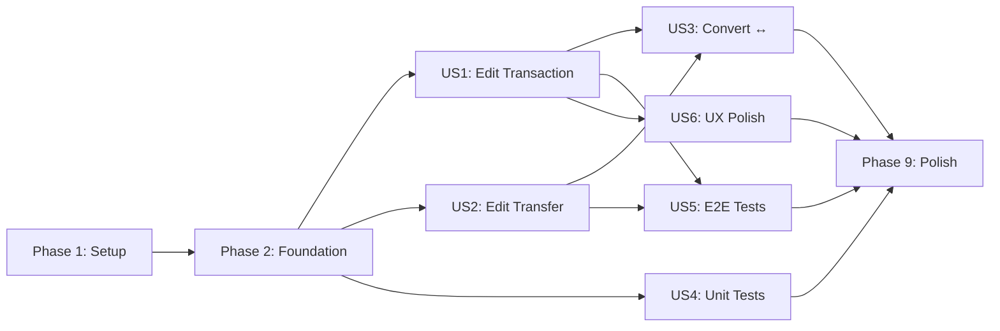

# Tasks: Finalize Transactions Module

**Input**: Design documents from `/specs/004-finalize-transactions/`  
**Prerequisites**: plan.md ✅, spec.md ✅, research.md ✅

**Tests**: Included — spec explicitly requires unit tests (US4, ≥80% coverage)
and E2E tests (US5, ≥8 flows).

**Organization**: Tasks grouped by user story for independent implementation and
testing.

## Format: `[ID] [P?] [Story] Description`

- **[P]**: Can run in parallel (different files, no dependencies)
- **[Story]**: US1–US6 mapping to spec user stories

---

## Phase 1: Setup (Shared Infrastructure)

**Purpose**: Migration and shared components required before any editing work

- [ ] T001 Create `supabase/migrations/024_drop_balance_triggers.sql` to DROP
      `update_account_balance_on_transaction`, `recalculate_account_balance`
      trigger, and `on_transaction_balance_update` trigger. Keep
      `recalculate_account_balance()` and `recalculate_all_account_balances()`
      functions as manual utilities.
- [ ] T002 Run `npm run db:push` to apply the trigger removal migration to
      remote Supabase
- [ ] T003 [P] Create `useTransactionById` hook in
      `apps/mobile/hooks/useTransactionById.ts` — WatermelonDB `.observe()` on a
      single transaction by ID, returning `{ transaction, isLoading }`
- [ ] T004 [P] Create `useTransferById` hook in
      `apps/mobile/hooks/useTransferById.ts` — WatermelonDB `.observe()` on a
      single transfer by ID, returning `{ transfer, isLoading }`

**Checkpoint**: Triggers removed, observation hooks ready

---

## Phase 2: Foundational (Blocking Prerequisites)

**Purpose**: Service-layer extensions and generic modal — blocks US1/US2/US3

**⚠️ CRITICAL**: No user story screen work can begin until this phase completes

- [ ] T005 Extend `updateTransaction` in
      `apps/mobile/services/transaction-service.ts` — add `counterparty`, `type`
      (EXPENSE ↔ INCOME with ±2×amount balance logic), and `accountId`
      (cross-currency allowed, revert old account + apply new account) to the
      update payload and balance-adjustment logic
- [ ] T006 [P] Extend `updateTransfer` in
      `apps/mobile/services/transfer-service.ts` — add `fromAccountId` and
      `toAccountId` to update payload with revert-and-apply balance logic for
      account changes
- [ ] T007 [P] Create `convertTransactionToTransfer` function in
      `apps/mobile/services/transaction-service.ts` — atomic `database.write()`:
      soft-delete transaction, revert its balance effect, create transfer, debit
      fromAccount, credit toAccount. Accepts
      `ConvertToTransferPayload { transactionId, toAccountId, notes? }`
- [ ] T008 [P] Create `convertTransferToTransaction` function in
      `apps/mobile/services/transfer-service.ts` — atomic `database.write()`:
      soft-delete transfer, revert both account balances, create transaction
      with user-chosen accountId (defaults to fromAccountId), debit/credit based
      on type. Accepts
      `ConvertToTransactionPayload { transferId, type, categoryId, accountId }`
- [ ] T009 Create `ConfirmationModal` component in
      `apps/mobile/components/modals/ConfirmationModal.tsx` — generic reusable
      bottom sheet with `variant: 'danger' | 'warning'`, `title`, `description`,
      `confirmLabel`, `cancelLabel`, `onConfirm`, `onCancel`, optional `icon`
      (Ionicons) and `children` slot. Tailwind + dark mode.
- [ ] T010 Refactor `DeleteConfirmationModal` in
      `apps/mobile/components/modals/DeleteConfirmationModal.tsx` to delegate to
      `ConfirmationModal` with `variant="danger"`
- [ ] T011 [P] Create `RecurringWarningBanner` component in
      `apps/mobile/components/transactions/RecurringWarningBanner.tsx` — info
      banner shown when editing a transaction linked to a recurring payment,
      with text "Only this instance will be edited" and a navigation link to the
      recurring template's edit page

**Checkpoint**: Foundation ready — all services extended, modals created

---

## Phase 3: User Story 1 — Edit Transaction (Priority: P1) 🎯 MVP

**Goal**: Users can tap a transaction in the list to open an Edit screen, modify
any field (amount, category, note, date, counterparty, type, account), and save.

**Independent Test**: Tap a transaction → edit screen opens with pre-populated
values → change amount → save → verify balance changed correctly in the list.

### Implementation

- [ ] T012 [US1] Create `edit-transaction.tsx` route in `apps/mobile/app/` —
      receive transaction ID via route params, use `useTransactionById` to
      observe, pre-populate form with current values. Include type selector tabs
      (EXPENSE/INCOME/TRANSFER), account selector, category picker, calculator
      keypad, counterparty input, date picker, note input.
- [ ] T013 [US1] Wire navigation in `apps/mobile/app/(tabs)/transactions.tsx` —
      replace the `handlePress` TODO with
      `router.push('/edit-transaction?id=...')` for transactions. Detect if the
      item is a transfer and route to `/edit-transfer` instead.
- [ ] T014 [US1] Implement save logic in `edit-transaction.tsx` — on save:
      validate with existing zod schema, call `updateTransaction` service with
      changed fields only, show success toast, navigate back. Handle type change
      to INCOME/EXPENSE via `updateTransaction`. Handle type change to TRANSFER
      via `convertTransactionToTransfer` service.
- [ ] T015 [US1] Implement discard changes detection in `edit-transaction.tsx` —
      compare current form state with original values. If any field changed and
      user presses back, show `ConfirmationModal` with `variant="warning"`,
      title "Discard Changes?", confirm label "Discard".
- [ ] T016 [US1] Implement delete from edit screen in `edit-transaction.tsx` —
      delete button in keypad area triggers `ConfirmationModal` with
      `variant="danger"`, calls `deleteTransaction` service on confirm.
- [ ] T017 [US1] Show `RecurringWarningBanner` in `edit-transaction.tsx` when
      the transaction has a non-null `linkedRecurringId`.
- [ ] T018 [US1] Show linked-relationships warning in `edit-transaction.tsx`
      when user switches type to "Transfer" and the transaction has
      `linkedDebtId`, `linkedAssetId`, or `linkedRecurringId` — display a
      `ConfirmationModal` listing the affected linkages. Allow proceed or
      cancel.

**Checkpoint**: Edit Transaction fully functional — tap any transaction, edit
all fields, save/discard/delete. Balance accuracy verified.

---

## Phase 4: User Story 2 — Edit Transfer (Priority: P1)

**Goal**: Users can tap a transfer in the list to open an Edit Transfer screen,
modify amount, from/to accounts, date, notes, and save.

**Independent Test**: Tap a transfer → edit screen opens → change amount → save
→ verify both account balances changed correctly.

### Implementation

- [ ] T019 [US2] Create `edit-transfer.tsx` route in `apps/mobile/app/` —
      receive transfer ID via route params, use `useTransferById` to observe,
      pre-populate form with current values. Include type selector tabs
      (EXPENSE/INCOME/TRANSFER with TRANSFER pre-selected), from/to account
      selectors, amount + calculator keypad, date picker, notes input.
- [ ] T020 [US2] Implement save logic in `edit-transfer.tsx` — on save: validate
      fields, call `updateTransfer` with changed fields only. Handle type change
      to EXPENSE/INCOME via `convertTransferToTransaction` (default account =
      fromAccountId, user can change).
- [ ] T021 [US2] Implement discard changes detection in `edit-transfer.tsx` —
      same pattern as edit-transaction (compare form state, show warning modal
      on back).
- [ ] T022 [US2] Implement delete from edit screen in `edit-transfer.tsx` —
      delete button triggers danger modal, calls `deleteTransfer` service.

**Checkpoint**: Edit Transfer fully functional — tap any transfer, edit all
fields, save/discard/delete.

---

## Phase 5: User Story 3 — Convert Transaction ↔ Transfer (Priority: P2)

**Goal**: Users can convert a transaction to a transfer and vice versa using the
type selector tabs in the edit screens.

**Independent Test**: Open edit transaction → switch type to Transfer → fill
to-account → save → verify old transaction soft-deleted and new transfer exists
with correct balances.

### Implementation

- [ ] T023 [US3] Implement type-switch UI in `edit-transaction.tsx` — when user
      selects "Transfer" tab: hide category picker, show From/To account
      selectors (from = current account), show notes field. Animate transition.
- [ ] T024 [US3] Implement type-switch UI in `edit-transfer.tsx` — when user
      selects "Expense" or "Income" tab: hide From/To selectors, show single
      account selector (default = fromAccountId, user changeable), show category
      picker. Animate transition.
- [ ] T025 [US3] Wire conversion save in `edit-transaction.tsx` — if type
      changed to "Transfer", call `convertTransactionToTransfer` instead of
      `updateTransaction`. Include linked-relationships warning (T018).
- [ ] T026 [US3] Wire conversion save in `edit-transfer.tsx` — if type changed
      to "Expense" or "Income", call `convertTransferToTransaction`.

**Checkpoint**: Bidirectional conversion works — Transaction ↔ Transfer with
correct balance adjustments and data integrity.

---

## Phase 6: User Story 4 — Unit Tests (Priority: P2)

**Goal**: ≥80% coverage for all transaction/transfer service functions.

**Independent Test**: `npm test -- --coverage` shows ≥80% on service files.

### Implementation

- [ ] T027 [P] [US4] Create `transaction-service.test.ts` in
      `apps/mobile/__tests__/services/` — test cases: `createTransaction`
      (EXPENSE decreases balance, INCOME increases), `updateTransaction` (amount
      delta, type change ±2×amount, account swap revert+apply, counterparty
      update), `deleteTransaction` (balance reverts, soft-delete),
      `batchDeleteDisplayTransactions` (atomic multi-delete),
      `convertTransactionToTransfer` (soft-delete + create + balances)
- [ ] T028 [P] [US4] Create `transfer-service.test.ts` in
      `apps/mobile/__tests__/services/` — test cases: `createTransfer` (from
      debited, to credited), `updateTransfer` (amount delta, account swap
      revert+apply), `deleteTransfer` (both balances revert),
      `convertTransferToTransaction` (soft-delete + create + balance)
- [ ] T029 [P] [US4] Create `transaction-validation.test.ts` in
      `apps/mobile/__tests__/validation/` — test cases: empty amount → error,
      zero amount → error, negative amount → error, missing accountId → error,
      missing categoryId → error, valid payload → success, transfer with same
      from/to → error

**Checkpoint**: All service tests pass, coverage ≥80%.

---

## Phase 7: User Story 5 — E2E Testing (Priority: P3)

**Goal**: 8 Maestro flows covering real user interactions.

**Independent Test**: `maestro test apps/mobile/e2e/maestro/` passes all flows.

### Implementation

- [ ] T030 [US5] Set up Maestro CLI and configure for Monyvi dev build in
      `apps/mobile/e2e/maestro/` — create `.maestro/` config, document setup in
      README
- [ ] T031 [P] [US5] Write `create-transaction.yaml` in
      `apps/mobile/e2e/maestro/` — create expense, verify in list
- [ ] T032 [P] [US5] Write `edit-transaction.yaml` — tap transaction, change
      amount, save, verify updated amount in list
- [ ] T033 [P] [US5] Write `edit-category-quick.yaml` — tap category in list,
      select new category, verify change
- [ ] T034 [P] [US5] Write `edit-amount-quick.yaml` — tap amount in list, enter
      new amount, verify change
- [ ] T035 [P] [US5] Write `swap-account.yaml` — open edit, change account,
      save, verify both account balances
- [ ] T036 [P] [US5] Write `change-type.yaml` — open edit, switch
      EXPENSE→INCOME, save, verify balance adjustment
- [ ] T037 [P] [US5] Write `delete-transaction.yaml` — open edit, tap delete,
      confirm, verify removal from list
- [ ] T038 [P] [US5] Write `search-filter.yaml` — filter by type, verify correct
      filtering; search by counterparty, verify results

**Checkpoint**: All 8 E2E flows pass on Android emulator.

---

## Phase 8: User Story 6 — UX Polish (Priority: P4)

**Goal**: Premium visual finish matching mockups.

**Independent Test**: Visual review passes — keypad matches mockup, selectors in
row, animations smooth.

### Implementation

- [ ] T039 [P] [US6] Update `CalculatorKeypad.tsx` in
      `apps/mobile/components/add-transaction/` — match mockup styling exactly
      (button sizes, spacing, border radius, colors). Add delete button slot
      inside keypad area.
- [ ] T040 [P] [US6] Update Account & Category horizontal row layout in
      `edit-transaction.tsx` and `edit-transfer.tsx` — selectors side-by-side in
      a single row (FR-017)
- [ ] T041 [P] [US6] Add haptic feedback to save, delete, and edit operations in
      both edit screens using `expo-haptics`
- [ ] T042 [US6] Add transition animations between transaction list and edit
      screens using `react-native-reanimated` shared element transitions

---

## Phase 9: Polish & Cross-Cutting Concerns

**Purpose**: Final cleanup across all stories

- [ ] T043 Extract shared form components from `add-transaction.tsx` and
      `edit-transaction.tsx` into reusable pieces (if duplication found during
      Phase 3 implementation)
- [ ] T044 Update `business-decisions.md` with new edit rules: trigger removal
      rationale, cross-currency swap policy, bidirectional conversion policy,
      discard-always-on policy
- [ ] T045 Run full lint check (`npm run lint`) and fix any issues across all
      modified/new files
- [ ] T046 Run TypeScript compilation check (`npx tsc --noEmit`) and fix any
      type errors

---

## Dependencies & Execution Order

### Phase Dependencies

- **Phase 1 (Setup)**: No dependencies — start immediately
- **Phase 2 (Foundational)**: T005 depends on T001/T002 (triggers dropped).
  T009/T010/T011 can start in parallel.
- **Phase 3 (US1)**: Depends on Phase 2 completion (services + modals ready)
- **Phase 4 (US2)**: Depends on Phase 2. Can run in parallel with Phase 3.
- **Phase 5 (US3)**: Depends on Phase 3 + Phase 4 (edit screens must exist)
- **Phase 6 (US4)**: Depends on Phase 2 (services must be written to test)
- **Phase 7 (US5)**: Depends on Phase 3 + Phase 4 (screens must exist to E2E)
- **Phase 8 (US6)**: Depends on Phase 3 (edit screens must exist to polish)
- **Phase 9 (Polish)**: Depends on all prior phases

### User Story Dependencies

### Parallel Opportunities

- T003 + T004 (observation hooks) can run in parallel with T001/T002 (migration)
- T006 + T007 + T008 + T011 can run in parallel within Phase 2
- US1 and US2 can run in parallel after Phase 2
- US4 (unit tests) can run in parallel with US1/US2 after Phase 2
- All E2E test flows (T031–T038) can run in parallel
- All US6 polish tasks (T039–T042) can run in parallel

---

## Implementation Strategy

### MVP First (US1 Only)

1. Complete Phase 1: Setup (triggers + hooks)
2. Complete Phase 2: Foundation (services + modals)
3. Complete Phase 3: US1 — Edit Transaction
4. **STOP and VALIDATE**: Tap any transaction, edit, save, verify balances
5. Deploy to testing device

### Incremental Delivery

1. Setup + Foundation → Core ready
2. US1 (Edit Transaction) → Test independently → **MVP!**
3. US2 (Edit Transfer) → Test independently
4. US3 (Conversions) → Test bidirectional conversion
5. US4 (Unit Tests) → Verify ≥80% coverage
6. US5 (E2E Tests) → Full automation
7. US6 (Polish) → Visual review
8. Polish → Ship 🚀

---

## Summary

| Metric                     | Value                        |
| -------------------------- | ---------------------------- |
| **Total tasks**            | 46                           |
| **Phase 1 (Setup)**        | 4 tasks                      |
| **Phase 2 (Foundation)**   | 7 tasks                      |
| **US1 (Edit Transaction)** | 7 tasks                      |
| **US2 (Edit Transfer)**    | 4 tasks                      |
| **US3 (Convert ↔)**        | 4 tasks                      |
| **US4 (Unit Tests)**       | 3 tasks                      |
| **US5 (E2E Tests)**        | 9 tasks                      |
| **US6 (UX Polish)**        | 4 tasks                      |
| **Polish**                 | 4 tasks                      |
| **Parallel opportunities** | 6 groups identified          |
| **MVP scope**              | Phase 1 + 2 + US1 (18 tasks) |
