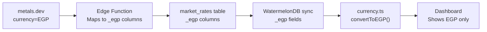
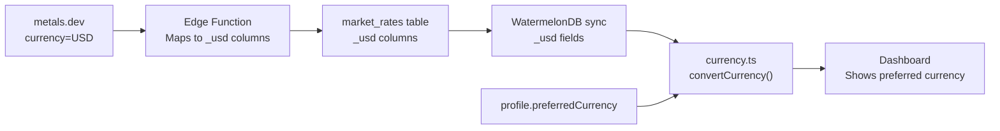
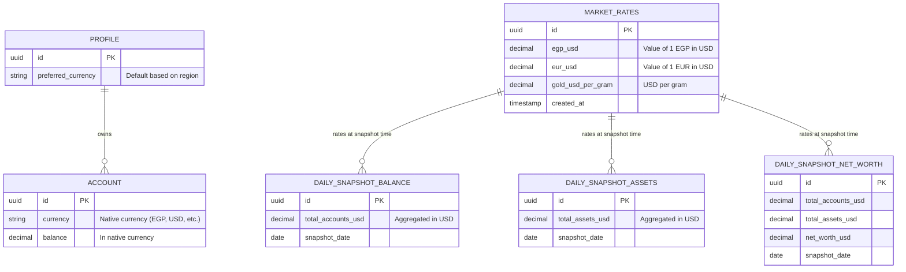

# Data Model: Multi-Currency Architecture

**Branch**: `006-multi-currency` | **Date**: 2026-02-20  
**Spec**: [spec.md](file:///e:/Work/My%20Projects/Astik/specs/006-multi-currency/spec.md)

---

## 1. Core Concept: USD as Universal Base

All exchange rates are stored as **"value of 1 unit of currency X in USD"**.
Metal prices are stored as **"USD per gram"**.

### API Response Semantics (Verified)

When `currency=USD`, metals.dev returns:

- `currencies.EGP = 0.0210523309` → 1 EGP is worth **$0.021 USD**
- `currencies.EUR = 1.1767955605` → 1 EUR is worth **$1.18 USD**
- `currencies.GBP = 1.3458170334` → 1 GBP is worth **$1.35 USD**
- `currencies.BTC = 67304.2623789365` → 1 BTC is worth **$67,304 USD**
- `currencies.USD = 1` → 1 USD is worth **$1 USD** (identity)

Each value answers: **"how many USD is 1 unit of this currency worth?"**

### Conversion Formula

To convert an amount from currency A to currency B:

```
amount_in_B = amount_in_A × (rate_A / rate_B)
```

Where `rate_X` = the stored value for currency X (= value of 1 unit of X in
USD).

**Example**: Convert 1000 EGP → EUR

- `rate_EGP = 0.0210523309` (1 EGP = $0.021)
- `rate_EUR = 1.1767955605` (1 EUR = $1.18)
- Result: `1000 × (0.0210523309 / 1.1767955605) = 17.89 EUR` ✅

**Example**: Convert 100 USD → EGP

- `rate_USD = 1` (1 USD = $1)
- `rate_EGP = 0.0210523309` (1 EGP = $0.021)
- Result: `100 × (1 / 0.0210523309) = 4,750.07 EGP` ✅

**Reversibility check**: `1000 EGP → 17.89 EUR → ? EGP`

- `17.89 × (1.1767955605 / 0.0210523309) = 1000.00 EGP` ✅

---

## 2. Schema Changes: `market_rates` Table

### Column Rename Mapping (EGP → USD base)

> [!IMPORTANT] The database will be **truncated** before applying the migration.
> No data conversion formulas are needed — the columns are simply renamed, and
> fresh data from the updated edge function (with `currency=USD`) will populate
> them. CNH (offshore yuan) is **dropped** — CNY (onshore yuan) covers China.

| Current Column (EGP base) | New Column (USD base) | New Value Semantics              |
| ------------------------- | --------------------- | -------------------------------- |
| `usd_egp`                 | `egp_usd`             | Value of 1 EGP in USD (≈ 0.021)  |
| `eur_egp`                 | `eur_usd`             | Value of 1 EUR in USD (≈ 1.18)   |
| `gbp_egp`                 | `gbp_usd`             | Value of 1 GBP in USD (≈ 1.35)   |
| `aed_egp`                 | `aed_usd`             | Value of 1 AED in USD (≈ 0.27)   |
| `aud_egp`                 | `aud_usd`             | ...                              |
| `bhd_egp`                 | `bhd_usd`             | ...                              |
| `btc_egp`                 | `btc_usd`             | Value of 1 BTC in USD (≈ 67,304) |
| `cad_egp`                 | `cad_usd`             | ...                              |
| `chf_egp`                 | `chf_usd`             | ...                              |
| `cny_egp`                 | `cny_usd`             | ...                              |
| `dkk_egp`                 | `dkk_usd`             | ...                              |
| `dzd_egp`                 | `dzd_usd`             | ...                              |
| `hkd_egp`                 | `hkd_usd`             | ...                              |
| `inr_egp`                 | `inr_usd`             | ...                              |
| `iqd_egp`                 | `iqd_usd`             | ...                              |
| `isk_egp`                 | `isk_usd`             | ...                              |
| `jod_egp`                 | `jod_usd`             | ...                              |
| `jpy_egp`                 | `jpy_usd`             | ...                              |
| `kpw_egp`                 | `kpw_usd`             | ...                              |
| `krw_egp`                 | `krw_usd`             | ...                              |
| `kwd_egp`                 | `kwd_usd`             | ...                              |
| `lyd_egp`                 | `lyd_usd`             | ...                              |
| `mad_egp`                 | `mad_usd`             | ...                              |
| `myr_egp`                 | `myr_usd`             | ...                              |
| `nok_egp`                 | `nok_usd`             | ...                              |
| `nzd_egp`                 | `nzd_usd`             | ...                              |
| `omr_egp`                 | `omr_usd`             | ...                              |
| `qar_egp`                 | `qar_usd`             | ...                              |
| `rub_egp`                 | `rub_usd`             | ...                              |
| `sar_egp`                 | `sar_usd`             | ...                              |
| `sek_egp`                 | `sek_usd`             | ...                              |
| `sgd_egp`                 | `sgd_usd`             | ...                              |
| `tnd_egp`                 | `tnd_usd`             | ...                              |
| `try_egp`                 | `try_usd`             | ...                              |
| `zar_egp`                 | `zar_usd`             | ...                              |

### Metal Columns

| Current Column           | New Column               | New Value Semantics     |
| ------------------------ | ------------------------ | ----------------------- |
| `gold_egp_per_gram`      | `gold_usd_per_gram`      | USD per gram (≈ 160.43) |
| `silver_egp_per_gram`    | `silver_usd_per_gram`    | USD per gram (≈ 2.51)   |
| `platinum_egp_per_gram`  | `platinum_usd_per_gram`  | USD per gram (≈ 66.52)  |
| `palladium_egp_per_gram` | `palladium_usd_per_gram` | USD per gram (≈ 54.24)  |

### Unchanged Columns

| Column               | Type      | Notes                         |
| -------------------- | --------- | ----------------------------- |
| `id`                 | UUID      | Primary key                   |
| `timestamp_metal`    | TEXT      | API timestamp for metal rates |
| `timestamp_currency` | TEXT      | API timestamp for FX rates    |
| `created_at`         | TIMESTAMP | Row creation time             |
| `updated_at`         | TIMESTAMP | Row update time               |

---

## 3. Schema Changes: Snapshot Tables

> [!NOTE] Snapshot tables will be **truncated** as part of the migration. The
> cron job will repopulate them with USD-based values going forward.

### `daily_snapshot_balance`

| Current Column       | New Column           |
| -------------------- | -------------------- |
| `total_accounts_egp` | `total_accounts_usd` |

### `daily_snapshot_assets`

| Current Column     | New Column         |
| ------------------ | ------------------ |
| `total_assets_egp` | `total_assets_usd` |

### `daily_snapshot_net_worth`

| Current Column       | New Column           |
| -------------------- | -------------------- |
| `total_accounts_egp` | `total_accounts_usd` |
| `total_assets_egp`   | `total_assets_usd`   |
| `net_worth_egp`      | `net_worth_usd`      |

---

## 4. WatermelonDB Model Mapping

### `MarketRate` Model (After Migration)

```typescript
// BaseMarketRate fields (auto-generated after db:migrate)
@field("egp_usd") egpUsd!: number;     // was: @field("usd_egp") usdEgp
@field("eur_usd") eurUsd!: number;     // was: @field("eur_egp") eurEgp
@field("gbp_usd") gbpUsd!: number;     // was: @field("gbp_egp") gbpEgp
// ... same pattern for all 35 remaining currencies (CNH dropped)

@field("gold_usd_per_gram") goldUsdPerGram!: number;     // was: goldEgpPerGram
@field("silver_usd_per_gram") silverUsdPerGram!: number;  // was: silverEgpPerGram
@field("platinum_usd_per_gram") platinumUsdPerGram!: number;
@field("palladium_usd_per_gram") palladiumUsdPerGram!: number;
```

### Conversion Logic (`MarketRate.getRate()`)

```typescript
/**
 * Get the exchange rate to convert from one currency to another.
 * All rates are stored as "value of 1 unit of X in USD".
 *
 * Formula: rate = rateA / rateB
 *   where rateX = value of 1 unit of X in USD
 *
 * Examples (using actual API values):
 *   getRate('USD', 'EGP') → 1 / 0.021 = 47.50 (1 USD buys 47.50 EGP)
 *   getRate('EGP', 'USD') → 0.021 / 1 = 0.021 (1 EGP buys $0.021)
 *   getRate('EGP', 'EUR') → 0.021 / 1.177 = 0.0179 (1 EGP buys 0.018 EUR)
 *   getRate('EUR', 'EGP') → 1.177 / 0.021 = 55.90 (1 EUR buys 55.90 EGP)
 *   getRate('GBP', 'EUR') → 1.346 / 1.177 = 1.143 (1 GBP buys 1.14 EUR)
 */
```

---

## 5. Edge Function Data Flow

### Current Flow (EGP base)



### New Flow (USD base)



---

## 6. Entity Relationship Summary


