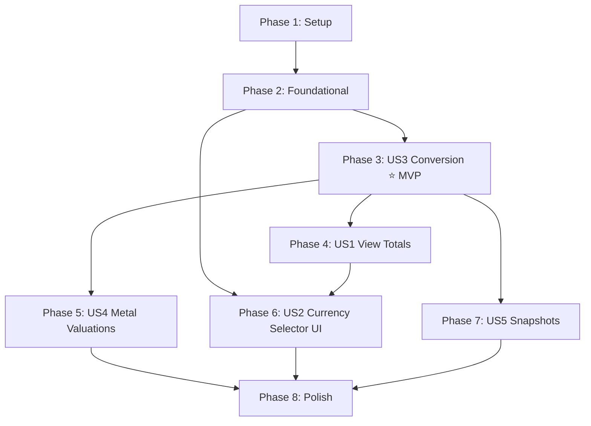

# Tasks: Multi-Currency Architecture

**Input**: Design documents from `/specs/006-multi-currency/`  
**Prerequisites**: plan.md, spec.md, research.md, data-model.md

**Tests**: Unit tests are included for the core conversion logic (Phase 3) as
specified in the verification plan.

**Organization**: Tasks are grouped by user story to enable independent
implementation and testing.

## Format: `[ID] [P?] [Story] Description`

- **[P]**: Can run in parallel (different files, no dependencies)
- **[Story]**: Which user story this task belongs to (e.g., US1, US2)
- Exact file paths included in descriptions

---

## Phase 1: Setup (Shared Infrastructure)

**Purpose**: Install dependencies and create the database migration file

- [ ] T001 Install `expo-localization` via `npx expo install expo-localization`
      in `apps/mobile/`
- [ ] T002 Write SQL migration file
      `supabase/migrations/026_multi_currency_usd_base.sql` with: (1) TRUNCATE
      all data tables CASCADE, (2) DROP `cnh_egp` column, (3) rename all 36
      `_egp` currency columns → `_usd`, (4) rename 4 metal `_egp_per_gram` →
      `_usd_per_gram`, (5) rename snapshot table columns `_egp` → `_usd`, (6)
      recreate snapshot SQL functions with `_usd` column references
- [ ] T003 Run `npm run db:migrate` to apply migration and regenerate
      WatermelonDB schema, models, types, and local migrations

**Checkpoint**: Database schema is updated. All auto-generated files
(`schema.ts`, `base-market-rate.ts`, `supabase-types.ts`, snapshot base models)
now reference `_usd` columns. TypeScript will report compile errors for all
remaining `_egp` references — this is expected and guides the remaining work.

---

## Phase 2: Foundational (Blocking Prerequisites)

**Purpose**: Core infrastructure that MUST be complete before ANY user story can
be implemented

**⚠️ CRITICAL**: No user story work can begin until this phase is complete

- [ ] T004 Update edge function `supabase/functions/fetch-metal-rates/index.ts`:
      change API URL `currency=EGP` → `currency=USD`, rename `MarketRatesRow`
      interface fields from `_egp` → `_usd`, update column mapping to use
      `data.currencies.EGP` (value of 1 EGP in USD), remove CNH mapping, keep
      `data.currencies.USD` unmapped (implicit = 1)
- [ ] T005 Refactor `MarketRate.getRate()` in
      `packages/db/src/models/MarketRate.ts` to support any-to-any conversion
      via USD base using formula `rateA / rateB`, add private `getUsdValue()`
      helper, handle USD as implicit rate of 1
- [ ] T006 [P] Create `packages/logic/src/utils/region.ts` with
      `REGION_TO_CURRENCY` mapping (35 country→currency + 24 Eurozone→EUR) and
      `getDefaultCurrencyForRegion()` function

**Checkpoint**: Foundation ready — edge function fetches USD-based rates,
MarketRate model converts any-to-any, region detection is available. User story
implementation can now begin.

---

## Phase 3: User Story 3 - Accurate Cross-Currency Conversion (Priority: P1) 🎯 MVP

**Goal**: Replace all EGP-hardcoded conversion functions with generic
currency-agnostic conversion via USD base

**Independent Test**: Convert EUR→JPY and verify the result matches
`amount × (eurUsd / jpyUsd)` within ±0.01%. Convert A→B→A and verify roundtrip
returns original amount.

### Implementation for User Story 3

- [ ] T007 [US3] Replace EGP-specific functions in
      `packages/logic/src/utils/currency.ts`: remove `currencyToEGP()`,
      `egpToCurrency()`, `convertToEGP()`; add generic
      `convertCurrency(amount, sourceCurrency, targetCurrency, marketRates)`
      that delegates to `marketRates.getRate()`
- [ ] T008 [US3] Write unit tests in
      `packages/logic/__tests__/utils/currency.test.ts` (or
      `apps/mobile/__tests__/` if no jest config in logic pkg): test identity
      conversion, USD→EGP, EGP→USD, EUR→JPY cross, A→B→A reversibility, zero
      amount, missing rate error

**Checkpoint**: Core conversion logic is complete and tested.
`convertCurrency()` is the single entry point for all currency conversion
throughout the app.

---

## Phase 4: User Story 1 - View Totals in Preferred Currency (Priority: P1)

**Goal**: All aggregated financial data (total balance, net worth, total assets)
displays in the user's preferred currency

**Independent Test**: Create accounts in EGP/USD/EUR, set preferred currency to
USD, verify dashboard total shows correctly converted USD amount.

### Implementation for User Story 1

- [ ] T009 [US1] Update `packages/logic/src/analytics/asset-breakdown.ts`:
      replace `convertToEGP()` import with `convertCurrency()`, add
      `preferredCurrency: CurrencyType` parameter to
      `calculateAssetBreakdown()`, convert all account balances to preferred
      currency instead of EGP
- [ ] T010 [P] [US1] Update
      `packages/logic/src/net-worth/net-worth-calculations.ts`: add `currency`
      field to `NetWorthData` interface, update calculation functions to accept
      and use `preferredCurrency` parameter
- [ ] T011 [US1] Update dashboard hooks/screens in `apps/mobile/` to read
      `profile.preferredCurrency` and pass it to `calculateAssetBreakdown()` and
      net worth calculation functions. Update `formatCurrency()` calls to use
      preferred currency for aggregated totals

**Checkpoint**: Dashboard shows totals in preferred currency. Individual account
balances still show in their native currency.

---

## Phase 5: User Story 4 - Metal Valuations in Preferred Currency (Priority: P2)

**Goal**: Precious metal asset valuations display in the user's preferred
currency instead of hardcoded EGP

**Independent Test**: Add a 10g gold asset, set preferred currency to USD,
verify value shows `10 × goldUsdPerGram`. Switch to EGP, verify value changes.

### Implementation for User Story 4

- [ ] T012 [US4] Update `packages/logic/src/utils/metal.ts`: rename field
      references `goldEgpPerGram` → `goldUsdPerGram` (etc.), add
      `targetCurrency: CurrencyType = 'USD'` parameter to `getMetalPrice()`,
      convert from USD to target currency when needed
- [ ] T013 [US4] Update metal/asset display components in `apps/mobile/` to pass
      `preferredCurrency` to `getMetalPrice()` and format output with correct
      currency

**Checkpoint**: Metal valuations display in user's preferred currency. Gold,
silver, platinum, palladium all convert correctly.

---

## Phase 6: User Story 2 - Change Preferred Display Currency (Priority: P1)

**Goal**: Users can change their preferred currency via settings and dashboard,
with all aggregated values updating reactively

**Independent Test**: Change currency in settings from EGP to USD, navigate to
dashboard, verify all totals show in USD. Close and reopen app, verify currency
persists.

### Implementation for User Story 2

- [ ] T014 [US2] Create currency picker component in
      `apps/mobile/src/components/` that displays the 36 supported currencies
      with search/filter, currency symbol, and country name
- [ ] T015 [US2] Add currency selection section to settings/profile screen in
      `apps/mobile/` that persists selection to `profile.preferredCurrency` in
      WatermelonDB
- [ ] T016 [US2] Add currency picker dropdown to dashboard top navigation in
      `apps/mobile/` showing current preferred currency with flag/icon, reactive
      update on selection
- [ ] T017 [US2] Wire onboarding/profile creation flow in `apps/mobile/` to call
      `getDefaultCurrencyForRegion()` from `region.ts` to set initial
      `preferred_currency` based on device locale

**Checkpoint**: Users can change their preferred currency from settings or
dashboard. All aggregated values reactively update. Default currency is
auto-detected from device region on first launch.

---

## Phase 7: User Story 5 - Historical Snapshots in User's Currency (Priority: P3)

**Goal**: Daily snapshot displays convert `_usd` stored values to the user's
preferred currency for trend charts

**Independent Test**: View trend chart, change preferred currency, verify
historical data points change proportionally.

### Implementation for User Story 5

- [ ] T018 [US5] Update snapshot display hooks/components in `apps/mobile/` to
      read `_usd` fields from `daily_snapshot_balance`, `daily_snapshot_assets`,
      `daily_snapshot_net_worth` and convert to preferred currency using
      `convertCurrency()` with current market rates
- [ ] T019 [US5] Update daily snapshot cron SQL functions (already renamed in
      T002) to ensure they aggregate account balances to USD correctly when
      generating new snapshots

**Checkpoint**: Historical trend charts display in the user's preferred
currency. New snapshots are generated in USD and converted client-side for
display.

---

## Phase 8: Polish & Cross-Cutting Concerns

**Purpose**: Verification, cleanup, and deployment

- [ ] T020 Run TypeScript compilation check `npx tsc --noEmit` across the entire
      project — zero `_egp` references should remain
- [ ] T021 Deploy updated edge function to Supabase and verify it returns `_usd`
      fields with correct USD-based values
- [ ] T022 [P] Update project documentation: `docs/agent/project-memory.md` and
      `docs/agent/session-history.md` with multi-currency architecture changes
- [ ] T023 End-to-end manual verification on Android emulator: (1) fresh app
      launch with EG locale → default EGP, (2) create accounts in EGP/USD/EUR,
      (3) verify dashboard totals in EGP, (4) change to USD in settings → totals
      update, (5) add gold asset → value in USD, (6) view trend chart in USD

---

## Dependencies & Execution Order

### Phase Dependencies

- **Setup (Phase 1)**: No dependencies — start immediately
- **Foundational (Phase 2)**: Depends on Phase 1 completion — BLOCKS all user
  stories
- **US3 (Phase 3)**: Depends on Phase 2 — conversion logic is MVP foundation
- **US1 (Phase 4)**: Depends on Phase 3 (needs `convertCurrency()`)
- **US4 (Phase 5)**: Depends on Phase 3 (needs `convertCurrency()` and updated
  `MarketRate`)
- **US2 (Phase 6)**: Can start after Phase 2 for UI work, but needs Phase 4
  complete for full testing
- **US5 (Phase 7)**: Depends on Phase 2 (schema) and Phase 3 (conversion)
- **Polish (Phase 8)**: Depends on all phases complete

### User Story Dependencies



### Parallel Opportunities

- **Phase 2**: T004 and T006 can run in parallel (different files)
- **Phase 3**: T007 and T008 are sequential (tests need the function)
- **Phase 4**: T009 and T010 can run in parallel (different files)
- **Phase 5**: T012 and T013 are sequential (component needs updated function)
- **Phase 6**: T014, T015, T016, T017 — T014 first (component), then
  T015/T016/T017 in parallel
- **Phase 8**: T020, T021, T022 can all run in parallel

---

## Parallel Example: Phase 4 (User Story 1)

```bash
# These can run in parallel (different files):
Task T009: "Update asset-breakdown.ts with convertCurrency() and preferredCurrency param"
Task T010: "Update net-worth-calculations.ts with currency field"

# Then sequentially:
Task T011: "Update dashboard hooks/screens to pass preferredCurrency" (depends on T009, T010)
```

---

## Implementation Strategy

### MVP First (User Story 3 Only)

1. Complete Phase 1: Setup (install deps, write migration, run db:migrate)
2. Complete Phase 2: Foundational (edge function, MarketRate model, region util)
3. Complete Phase 3: US3 Conversion (replace EGP utils, write tests)
4. **STOP and VALIDATE**: Run unit tests, verify TypeScript compiles
5. At this point, conversion infrastructure is solid — proceed to displays

### Incremental Delivery

1. Setup + Foundational → Foundation ready
2. Add US3 (Conversion) → Test with unit tests → Core working (MVP!)
3. Add US1 (Display) → Dashboard shows preferred currency
4. Add US4 (Metals) → Metal valuations convert correctly
5. Add US2 (Selector UI) → Users can change currency
6. Add US5 (Snapshots) → Historical data converts
7. Polish → Deploy and verify

---

## Notes

- [P] tasks = different files, no dependencies
- [Story] label maps task to specific user story for traceability
- Tests are included for US3 (conversion logic) as specified in the plan
- `npm run db:migrate` combines `db:push` + schema/type generation
- Run `npx tsc --noEmit` after each phase to catch remaining `_egp` references
- Commit after each phase or logical group of tasks
