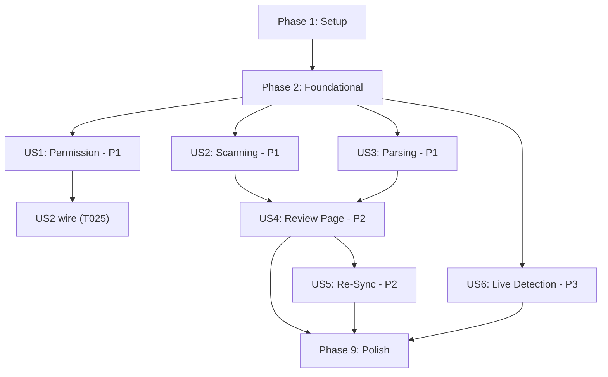

# Tasks: SMS Transaction Sync

**Input**: Design documents from `/specs/007-sms-transaction-sync/`  
**Prerequisites**: plan.md (✅), spec.md v3 (✅)  
**Tests**: Unit tests included (parser + service)  
**Organization**: Tasks grouped by user story for independent implementation

## Format: `[ID] [P?] [Story] Description`

- **[P]**: Can run in parallel (different files, no dependencies)
- **[Story]**: Which user story this task belongs to (e.g., US1, US2, US3)
- Include exact file paths in descriptions

---

## Phase 1: Setup (Shared Infrastructure)

**Purpose**: Install dependencies, configure permissions, create migration

- [x] T001 Install `react-native-get-sms-android` and `expo-crypto` dependencies
      in `apps/mobile/package.json`
- [x] T002 [P] Add `android.permission.READ_SMS` to Android manifest in
      `apps/mobile/app.json` or `app.config.js` (already present)
- [x] T003 [P] Create database migration
      `supabase/migrations/028_add_sms_body_hash.sql` — add `sms_body_hash TEXT`
      column and partial index on `transactions` table
- [x] T004 Run `npm run db:push` to apply migration to remote Supabase, then
      `npm run db:sync-local` to regenerate WatermelonDB schema/types/migrations
      in `packages/db/src/`
- [x] T005 Add `sms_body_hash` field to `BaseTransaction` model in
      `packages/db/src/models/base/base-transaction.ts` (auto-generated by
      db:sync-local)

---

## Phase 2: Foundational (Blocking Prerequisites)

**Purpose**: Core types, interfaces, and shared utilities that ALL user stories
depend on

**⚠️ CRITICAL**: No user story work can begin until this phase is complete

- [x] T006 Add `ParsedSmsTransaction` interface and `SmsMessage` interface to
      `packages/logic/src/types.ts`
- [x] T007 [P] Create `SmsParserStrategy` interface in
      `packages/logic/src/parsers/sms-parser-strategy.ts` — defines the Strategy
      pattern contract with
      `parse(smsBody: string, sender: string):     ParsedSmsTransaction | null`
- [x] T008 [P] Create SHA-256 hashing utility in
      `packages/logic/src/parsers/sms-hash.ts` —
      `computeSmsHash(body: string):     Promise<string>` using `expo-crypto`
- [x] T009 [P] Create `FinancialSender` typed registry in
      `packages/logic/src/parsers/financial-sender-registry.ts` — define sender
      patterns, display names, default categories, and regex templates for:
      Instapay, NBE, CIB, Vodafone Cash, Fawry, Etisalat Cash, Orange Cash, BM,
      QNB, HSBC Egypt
- [x] T010 [P] Create category mapper in
      `packages/logic/src/parsers/sms-category-mapper.ts` — maps sender
      identity + keywords to category `system_name` values using existing L1/L2
      hierarchy
- [x] T011 Create `RegexSmsParser` implementation in
      `packages/logic/src/parsers/regex-sms-parser.ts` — implements
      `SmsParserStrategy`, iterates sender registry, matches patterns, extracts
      structured data (depends on T007, T009, T010)
- [x] T012 Create SMS reader service in
      `apps/mobile/services/sms-reader-service.ts` — wraps
      `react-native-get-sms-android` with typed `readSmsInbox()` and
      `getSmsCount()` functions, platform check for iOS
- [x] T013 Create barrel exports in `packages/logic/src/parsers/index.ts` —
      re-export all parser modules

**Checkpoint**: Foundation ready — all shared parsing/reading infrastructure in
place

---

## Phase 3: User Story 1 — Permission Request on First Launch (P1) 🎯 MVP

**Goal**: Display a permission explanation modal on first dashboard visit after
onboarding. User can grant READ_SMS or decline.

**Independent Test**: Complete onboarding → arrive at dashboard → permission
prompt appears → "Allow" shows native dialog → "Not Now" dismisses. On iOS,
Settings shows informational message.

**Relates to**: FR-001, FR-013, FR-017

### Tests for User Story 1

- [ ] T014 [P] [US1] Write unit tests for `useSmsPermission` hook in
      `apps/mobile/__tests__/hooks/useSmsPermission.test.ts` — test
      `undetermined`, `granted`, `denied`, `blocked` states, iOS fallback

### Implementation for User Story 1

- [x] T015 [P] [US1] Create `useSmsPermission` hook in
      `apps/mobile/hooks/useSmsPermission.ts` — manages READ_SMS permission
      state (`undetermined | granted | denied | blocked`), wraps
      `PermissionsAndroid`, iOS returns `denied` + `isAndroid: false`,
      `requestPermission()`, `openSettings()`
- [x] T016 [P] [US1] Create `useSmsSync` hook in
      `apps/mobile/hooks/useSmsSync.ts` — first-launch auto-trigger logic:
      checks `onboarding_completed` + AsyncStorage flag for prompt shown,
      exposes `shouldShowPrompt` boolean
- [x] T017 [US1] Create `SmsPermissionPrompt` component in
      `apps/mobile/components/sms-sync/SmsPermissionPrompt.tsx` — premium
      modal/bottom sheet with privacy messaging, "Allow" button (triggers native
      dialog), "Not Now" button (sets AsyncStorage flag), reanimated entry
      animation (depends on T015)
- [x] T018 [US1] Integrate first-launch SMS trigger into dashboard in
      `apps/mobile/app/(tabs)/index.tsx` — use `useSmsSync` hook, render
      `SmsPermissionPrompt` when `shouldShowPrompt` is true, no visual change to
      dashboard layout (depends on T016, T017)
- [x] T019 [US1] Add "Sync SMS Transactions" option to Settings in
      `apps/mobile/app/settings.tsx` — SMS icon + label + chevron row, triggers
      permission flow on tap, iOS shows informational message instead (depends
      on T015)

**Checkpoint**: Permission flow works end-to-end. User can grant/decline from
dashboard and Settings. iOS shows graceful fallback.

---

## Phase 4: User Story 2 — SMS Scanning with Progress UI (P1) 🎯 MVP

**Goal**: After granting permission, scan SMS inbox with animated progress UI
showing live counters. Navigate to review page on completion.

**Independent Test**: Grant permission → scanning starts → progress UI shows
animated counter → "Messages scanned: X / Total" + "Transactions found: Y"
update live → green checkmark on completion → auto-redirect to review.

**Relates to**: FR-002, FR-003, FR-004, FR-010, FR-015

### Tests for User Story 2

- [ ] T020 [P] [US2] Write unit tests for `sms-sync-service` in
      `apps/mobile/__tests__/services/sms-sync-service.test.ts` — mock SMS inbox
      → verify parsed transactions, progress callback intervals, empty inbox →
      empty result

### Implementation for User Story 2

- [x] T021 [US2] Create `sms-sync-service` in
      `apps/mobile/services/sms-sync-service.ts` — orchestrates scan → parse →
      dedup pipeline via `scanAndParseSms(onProgress)`, uses
      `sms-reader-service` + `RegexSmsParser` + `sms-hash` + WatermelonDB dedup
      lookup (depends on T011, T012, T008)
- [x] T022 [US2] Create `useSmsScan` hook in `apps/mobile/hooks/useSmsScan.ts` —
      manages `isScanning`, `progress`, `result`, `error` state, exposes
      `startScan()` which calls `scanAndParseSms` (depends on T021)
- [x] T023 [US2] Create `SmsScanProgress` component in
      `apps/mobile/components/sms-sync/SmsScanProgress.tsx` — animated circular
      progress (reanimated), live "Messages scanned" + "Transactions found"
      counters, green checkmark success animation, empty state with dashboard
      return button (depends on T022)
- [x] T024 [US2] Create scan progress route in `apps/mobile/app/sms-scan.tsx` —
      Expo Router page wrapping `SmsScanProgress` + `useSmsScan`, auto-navigates
      to review page on scan completion (depends on T023)
- [x] T025 [US2] Wire permission grant → scan navigation: update
      `SmsPermissionPrompt` in
      `apps/mobile/components/sms-sync/SmsPermissionPrompt.tsx` to navigate to
      `sms-scan` route after successful permission grant, update Settings tap to
      also navigate to scan route (depends on T024)

**Checkpoint**: Full flow from permission grant → scan with live progress →
success animation works.

---

## Phase 5: User Story 3 — Message Parsing for Egyptian Entities (P1) 🎯 MVP

**Goal**: Parse financial SMS from 10 Egyptian senders with correct amount,
date, merchant, type, and category extraction.

**Independent Test**: Feed sample SMS strings from each supported sender →
verify correct structured output. Unknown SMS → gracefully skipped.

**Relates to**: FR-005, FR-006, FR-007, FR-014

### Tests for User Story 3

- [ ] T026 [P] [US3] Write comprehensive parser unit tests in
      `apps/mobile/__tests__/parsers/regex-sms-parser.test.ts` — test all 10
      senders (Instapay sent/received, CIB debit, Vodafone Cash, NBE, Fawry,
      Etisalat Cash, Orange Cash, BM, QNB, HSBC), comma-separated amounts,
      Arabic text, non-financial SMS rejection, malformed SMS rejection, correct
      type (EXPENSE/INCOME), category mapping accuracy

### Implementation for User Story 3

- [x] T027 [US3] Populate complete regex templates in
      `packages/logic/src/parsers/financial-sender-registry.ts` — add detailed
      regex patterns with named capture groups for each of the 10 senders, test
      against real Egyptian bank SMS formats (depends on T009, builds on the
      registry structure from Phase 2)
- [x] T028 [US3] Handle edge cases in `RegexSmsParser` in
      `packages/logic/src/parsers/regex-sms-parser.ts` — Arabic amount
      formatting, comma separators, mixed Arabic/English, currency
      prefix/suffix, promotional SMS rejection via strict patterns (depends on
      T027)

**Checkpoint**: Parser correctly extracts transactions from all 10 sender types
with ≥90% accuracy. Non-financial SMS are skipped.

---

## Phase 6: User Story 4 — Transaction Review Page (P2)

**Goal**: Display parsed transactions in a review page with bulk selection,
category correction, date grouping, and save/discard actions.

**Independent Test**: Complete a scan with ≥3 transactions across ≥2 dates →
review page shows grouped list with checkboxes (all checked by default) →
select/deselect works → category correction opens selector → "Save Selected"
persists only checked transactions → "Discard All" returns to dashboard.

**Relates to**: FR-008, FR-009

### Implementation for User Story 4

- [x] T029 [P] [US4] Create `SmsTransactionItem` component in
      `apps/mobile/components/sms-sync/SmsTransactionItem.tsx` — checkbox,
      amount (color-coded: green income/red expense), sender name, detected
      category, date, counterparty, tap-to-expand for original SMS, category
      edit icon
- [x] T030 [US4] Create `SmsTransactionReview` component in
      `apps/mobile/components/sms-sync/SmsTransactionReview.tsx` — FlatList of
      `SmsTransactionItem`, summary bar ("X transactions found. Y selected."),
      "Select All" / "Deselect All" toggle, "Save Selected" button, "Discard
      All" button, date-grouped sections (depends on T029)
- [x] T031 [US4] Add `batchCreateSmsTransactions` function to
      `apps/mobile/services/batch-sms-transactions.ts` — batch WatermelonDB
      write for confirmed transactions: resolves `categorySystemName` →
      `category_id`, sets `source: 'SMS'` (depends on T005)
- [x] T032 [US4] Create review route at `apps/mobile/app/sms-review.tsx` — Expo
      Router page wrapping `SmsTransactionReview`, account picker, calls
      `batchCreateSmsTransactions` on save, navigates to tabs on completion
      (depends on T030, T031)
- [x] T033 [US4] Create shared state for parsed transactions — React Context in
      `apps/mobile/context/SmsScanContext.tsx` to pass `ParsedSmsTransaction[]`
      from scan page to review page (depends on T021)
- [x] T034 [US4] Integrate category correction in `SmsTransactionReview` — tap
      on category label opens existing category selector modal, updates the
      `categorySystemName` on the selected `ParsedSmsTransaction` before save
      (depends on T030)

**Checkpoint**: Full flow from scan completion → review with selection → save →
transactions appear in main list with source = SMS.

---

## Phase 7: User Story 5 — Re-Sync & Incremental Scanning (P2)

**Goal**: Allow re-sync from Settings with incremental scanning (only new SMS)
and full re-scan (dedup via SHA-256 hash). Track sync state.

**Independent Test**: Perform initial sync → re-sync from Settings → only new
messages processed. Full re-scan → no duplicates created. Previously discarded
transactions reappear.

**Relates to**: FR-011, FR-012

### Implementation for User Story 5

- [ ] T035 [US5] Add sync state tracking — store `hasSynced` boolean and
      `lastSyncTimestamp` in profile or AsyncStorage. Update
      `apps/mobile/hooks/useSmsSync.ts` to check/set these values.
- [ ] T036 [US5] Implement incremental scanning in
      `apps/mobile/services/sms-sync-service.ts` — pass `minDate` from
      `lastSyncTimestamp` to `readSmsInbox()` for default re-sync, skip
      `minDate` for full re-scan, update `lastSyncTimestamp` after successful
      sync (depends on T035)
- [ ] T037 [US5] Add re-sync UI options to Settings in
      `apps/mobile/app/settings.tsx` — "Sync New Messages" (incremental,
      default) and "Full Re-scan" option, both trigger scan → review flow
      (depends on T036)

**Checkpoint**: Re-sync works incrementally by default. Full re-scan finds no
duplicates. Discarded transactions reappear on full re-scan.

---

## Phase 8: User Story 6 — Live SMS Transaction Detection (P3)

**Goal**: Listen for incoming financial SMS in real-time, show notification with
Confirm/Discard actions. User-configurable preference ("Ask me each time" vs
"Auto-confirm").

**Independent Test**: Send test SMS from known sender while app is running →
notification appears with transaction summary → "Confirm" saves → "Discard"
ignores. Toggle to "Auto-confirm" → SMS silently saved.

**Relates to**: FR-016

### Implementation for User Story 6

- [ ] T038 [US6] Install `@maniac-tech/react-native-expo-read-sms` for live
      incoming SMS listening in `apps/mobile/package.json`
- [ ] T039 [US6] Create live SMS listener service in
      `apps/mobile/services/sms-live-listener-service.ts` — wraps
      `@maniac-tech/react-native-expo-read-sms` `startReadSMS`, parses incoming
      SMS via `RegexSmsParser`, emits parsed transaction events (depends on
      T011)
- [ ] T040 [US6] Create live detection notification handler — show local
      notification with transaction summary (amount, merchant, type), "Confirm"
      and "Discard" action buttons, auto-save if preference is "Auto-confirm"
      (depends on T039)
- [ ] T041 [US6] Add live detection preference to Settings in
      `apps/mobile/app/settings.tsx` — "Ask me each time" (default) /
      "Auto-confirm" toggle, store preference in profile or AsyncStorage
      (depends on T040)
- [ ] T042 [US6] Integrate live listener lifecycle — start/stop listener based
      on permission + `sms_detection_enabled` profile flag, handle app
      background/foreground transitions (depends on T039)

**Checkpoint**: Live SMS detection works for incoming messages. Notification
with confirm/discard appears. Auto-confirm saves silently.

---

## Phase 9: Polish & Cross-Cutting Concerns

**Purpose**: Edge cases, performance, documentation

- [ ] T043 Handle 10,000+ SMS inbox — implement batch processing in
      `sms-sync-service.ts` to avoid UI freezing during large inbox scans
      (FR-015)
- [ ] T044 [P] Handle app force-close during scan — ensure scan state doesn't
      corrupt in `sms-sync-service.ts`, next attempt starts fresh
- [ ] T045 [P] Handle permission revocation — detect revoked READ_SMS permission
      in `useSmsPermission` hook, show explanation when user tries to sync from
      Settings
- [ ] T046 [P] Handle live detection + review page conflict — queue incoming
      transactions when user is on review page in `sms-live-listener-service.ts`
- [ ] T047 Rebuild dev client with new native dependencies — run
      `npx expo prebuild` and build new dev client APK for testing
- [ ] T048 [P] Update `docs/agent/project-memory.md` with SMS sync feature
      status and `docs/business/business-decisions.md` with SMS-related business
      decisions

---

## Dependencies & Execution Order

### Phase Dependencies

- **Setup (Phase 1)**: No dependencies — can start immediately
- **Foundational (Phase 2)**: Depends on Setup completion — BLOCKS all user
  stories
- **US1 Permission (Phase 3)**: Depends on Phase 2
- **US2 Scanning (Phase 4)**: Depends on Phase 2 (uses parser + reader)
- **US3 Parsing (Phase 5)**: Depends on Phase 2 (refines parser templates)
- **US4 Review (Phase 6)**: Depends on US2 (receives scan results)
- **US5 Re-Sync (Phase 7)**: Depends on US2 + US4 (full flow must work first)
- **US6 Live Detection (Phase 8)**: Depends on Phase 2 only (independent
  architecture)
- **Polish (Phase 9)**: Depends on all desired user stories being complete

### User Story Dependencies



### Parallel Opportunities

#### Within Phase 2 (Foundational)

```text
Parallel group 1: T007 + T008 + T009 + T010  (different files, no deps)
Sequential:       T011 (depends on T007, T009, T010)
Sequential:       T012 (can parallel with T011)
```

#### Within Phase 3 (US1)

```text
Parallel group 1: T014 + T015 + T016  (different files)
Sequential:       T017 (depends on T015)
Sequential:       T018 (depends on T016, T017)
Parallel:         T019 (depends on T015 only)
```

#### Across Phases (after Phase 2)

```text
US1 (Phase 3) can run in parallel with US3 (Phase 5)
US2 (Phase 4) can run in parallel with US3 (Phase 5)
US6 (Phase 8) can run in parallel with US1-US5 (after Phase 2)
```

---

## Implementation Strategy

### MVP First (User Stories 1 + 2 + 3: Phases 1–5)

1. Complete Phase 1: Setup
2. Complete Phase 2: Foundational (CRITICAL — blocks all stories)
3. Complete Phase 3: US1 — Permission flow
4. Complete Phase 4: US2 — Scan with progress UI
5. Complete Phase 5: US3 — Parser accuracy for 10 senders
6. **STOP and VALIDATE**: Test permission → scan → progress → parser output
7. At this point the core pipeline works but without review/save

### Incremental Delivery

1. Setup + Foundational → Foundation ready
2. Add US1 + US2 + US3 → Scan pipeline works → **MVP!**
3. Add US4 → Review + save → Full core feature complete
4. Add US5 → Re-sync & dedup → Ongoing companion
5. Add US6 → Live detection → Premium feature
6. Each story adds value without breaking previous stories

---

## Summary

| Metric                     | Count                               |
| -------------------------- | ----------------------------------- |
| **Total tasks**            | 48                                  |
| **Phase 1 (Setup)**        | 5                                   |
| **Phase 2 (Foundational)** | 8                                   |
| **US1 (Permission)**       | 6                                   |
| **US2 (Scanning)**         | 6                                   |
| **US3 (Parsing)**          | 3                                   |
| **US4 (Review Page)**      | 6                                   |
| **US5 (Re-Sync)**          | 3                                   |
| **US6 (Live Detection)**   | 5                                   |
| **Polish**                 | 6                                   |
| **Parallelizable [P]**     | 15                                  |
| **MVP scope**              | Phases 1–5 (US1+US2+US3) = 28 tasks |

---

## Notes

- [P] tasks = different files, no dependencies
- [Story] label maps task to specific user story for traceability
- Each user story is independently completable and testable
- Commit after each task or logical group
- Stop at any checkpoint to validate story independently
- US3 (Parsing) is technically foundational but organized as a separate story
  because parser template refinement is iterative and benefits from real SMS
  testing
