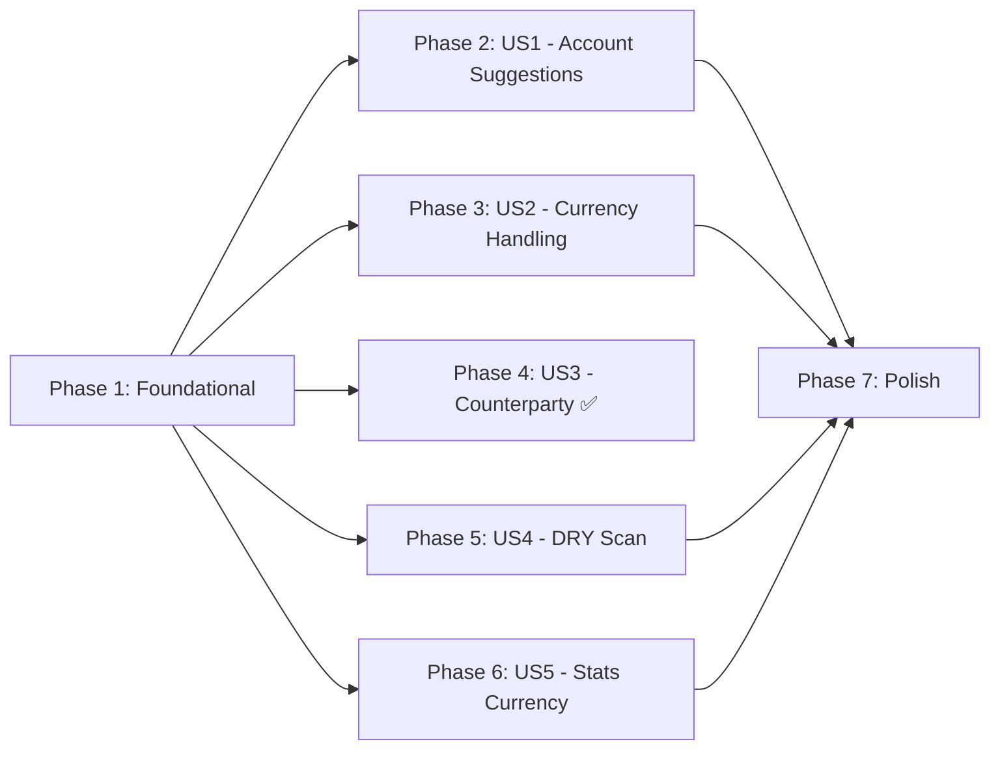

# Tasks: 008 – Resolve Codebase TODOs

**Input**: Design documents from `/specs/008-resolve-todos/`  
**Prerequisites**: plan.md ✅, spec.md ✅, research.md ✅, data-model.md ✅

## Format: `[ID] [P?] [Story] Description`

- **[P]**: Can run in parallel (different files, no dependencies)
- **[Story]**: Which user story this task belongs to (e.g., US1, US2, US3)
- Include exact file paths in descriptions

---

## Phase 1: Foundational (Shared Changes)

**Purpose**: Changes that affect multiple user stories and must be done first to
avoid merge conflicts and ensure consistency across all subsequent phases.

- [x] T001 [P] Rename `merchant` → `counterparty` in parse-sms schema, types,
      required array, and prompt in `supabase/functions/parse-sms/index.ts`
- [x] T002 [P] Rename `merchant` → `counterparty` in parse-voice schema, types,
      required array, and prompt in `supabase/functions/parse-voice/index.ts`
- [x] T003 Rename `merchant` → `counterparty` in `AiSmsTransaction` interface
      and `mapAiTransactions` mapping in
      `apps/mobile/services/ai-sms-parser-service.ts`

**Checkpoint**: `counterparty` rename complete across all three files. This
unblocks US3 acceptance testing and is a prerequisite for US1 schema changes.

---

## Phase 2: User Story 1 – AI Suggests Accounts From SMS Scan (Priority: P1) 🎯 MVP

**Goal**: Extend the parse-sms pipeline so the AI returns account suggestions
alongside transactions, and the SMS review screen consumes them.

**Independent Test**: Initiate SMS scan → verify AI response includes
`accountSuggestions` array → review screen shows AI-generated account cards
instead of client-side grouping.

### Edge Function Changes

- [ ] T004 [US1] Extend `ParseSmsRequest` interface to accept
      `existingAccounts`, `categories`, and `supportedCurrencies` in
      `supabase/functions/parse-sms/index.ts`
- [ ] T005 [US1] Add `AiAccountSuggestion` interface and extend `AiResponse`
      with `accountSuggestions` array in `supabase/functions/parse-sms/index.ts`
- [ ] T006 [US1] Convert `RESPONSE_SCHEMA` constant to
      `buildResponseSchema(currencies: string[])` factory that includes
      `accountSuggestions` and dynamic currency enum in
      `supabase/functions/parse-sms/index.ts`
- [ ] T007 [US1] Convert `SYSTEM_PROMPT` constant to
      `buildSystemPrompt(categoryTree: string, existingAccounts?: ...)` factory
      that injects client-provided categories and accounts in
      `supabase/functions/parse-sms/index.ts`
- [ ] T008 [US1] Update main handler to extract client context from body, pass
      to builders, and return `accountSuggestions` in response in
      `supabase/functions/parse-sms/index.ts`
- [ ] T009 [US1] Remove resolved TODO comments (L84-88, L109, L116) in
      `supabase/functions/parse-sms/index.ts`

### Client Service Changes

- [ ] T010 [US1] Extend `invokeParseChunk` to accept and send
      `existingAccounts`, `categories`, and `supportedCurrencies` in request
      body in `apps/mobile/services/ai-sms-parser-service.ts`
- [ ] T011 [US1] Add `AiAccountSuggestion` interface (client-side) and
      `AiParseResult` composite return type in
      `apps/mobile/services/ai-sms-parser-service.ts`
- [ ] T012 [US1] Extend `parseAiResponse` to validate and extract
      `accountSuggestions` from edge function response in
      `apps/mobile/services/ai-sms-parser-service.ts`
- [ ] T013 [US1] Extend `parseSmsWithAi` to accept context params (accounts,
      categories, currencies), thread through chunks, and return `AiParseResult`
      in `apps/mobile/services/ai-sms-parser-service.ts`

### UI Integration

- [ ] T014 [US1] Update SMS scan caller(s) (`useSmsScan` or `sms-scan.tsx`) to
      pass existing accounts, formatted category tree, and supported currencies
      to `parseSmsWithAi` in `apps/mobile/app/sms-scan.tsx` and related hook(s)
- [ ] T015 [US1] Replace `buildInitialState` client-side grouping with
      AI-provided `accountSuggestions` in `apps/mobile/app/sms-review.tsx`

**Checkpoint**: Full SMS scan produces AI account suggestions. Review screen
shows AI-generated cards with one default. No duplicate suggestions for existing
accounts.

---

## Phase 3: User Story 2 – Unsupported Currency Handling (Priority: P1)

**Goal**: Expand supported currencies from 7 to all 36 from `CurrencyType`, and
ensure unsupported currencies are silently skipped.

**Independent Test**: Send SMS with QAR/BHD → verify parsed. Send SMS with
currency "XYZ" → verify skipped.

- [ ] T016 [US2] Replace hardcoded `VALID_CURRENCIES` (7 items) with full
      36-currency set derived from `CurrencyType` in
      `apps/mobile/services/ai-sms-parser-service.ts`
- [ ] T017 [P] [US2] Expand hardcoded currency enum from 7 to all 36
      `CurrencyType` values in `supabase/functions/parse-voice/index.ts`
- [ ] T018 [US2] Remove the TODO comment about dynamic currencies (L53) in
      `apps/mobile/services/ai-sms-parser-service.ts`

> [!NOTE] For parse-sms, the currency enum is already dynamic (from T006). This
> phase only needs the static expansion for parse-voice and the client
> validation set.

**Checkpoint**: All 36 supported currencies are recognized. Messages with
unsupported currencies are silently filtered out.

---

## Phase 4: User Story 3 – Counterparty Naming Consistency (Priority: P2)

**Goal**: Already completed in Phase 1 (T001-T003). This phase is for
verification only.

**Independent Test**: Inspect AI response → field is `counterparty`. Client
mapping works without errors.

> [!TIP] No additional tasks needed — T001, T002, T003 fully satisfy US3
> acceptance scenarios. Verification happens during Phase 6 (Polish).

**Checkpoint**: US3 acceptance scenarios pass.

---

## Phase 5: User Story 4 – DRY SMS Scan Retry Logic (Priority: P2)

**Goal**: Extract duplicated scan initiation code into a single reusable
function.

**Independent Test**: Start scan → force failure → Retry → both should exercise
the same `initiateScan` function.

- [ ] T019 [US4] Extract `initiateScan` callback from duplicated logic
      (auto-start L50-78 + retry L84-101) in `apps/mobile/app/sms-scan.tsx`
- [ ] T020 [US4] Extract `topCategories` useMemo body to a pure
      `getTopCategories()` helper function called from
      `apps/mobile/app/sms-scan.tsx`
- [ ] T021 [US4] Remove resolved TODO comments in `apps/mobile/app/sms-scan.tsx`

**Checkpoint**: Both initial scan and retry use the same `initiateScan`
function. `topCategories` is computed by a pure helper.

---

## Phase 6: User Story 5 – Multi-Currency Stats Display (Priority: P3)

**Goal**: Replace hardcoded `DEFAULT_DISPLAY_CURRENCY = "EGP"` with the user's
preferred currency in all stats components.

**Independent Test**: Change preferred currency to USD in settings → stats views
show USD formatting.

- [ ] T022 [US5] Remove `DEFAULT_DISPLAY_CURRENCY` export from
      `apps/mobile/components/stats/drilldown/types.ts`
- [ ] T023 [P] [US5] Replace `DEFAULT_DISPLAY_CURRENCY` with
      `usePreferredCurrency()` in `apps/mobile/components/stats/QuickStats.tsx`
- [ ] T024 [P] [US5] Replace `DEFAULT_DISPLAY_CURRENCY` with
      `usePreferredCurrency()` in
      `apps/mobile/components/stats/MonthlyExpenseChart.tsx`
- [ ] T025 [P] [US5] Replace `DEFAULT_DISPLAY_CURRENCY` with
      `usePreferredCurrency()` in
      `apps/mobile/components/stats/CategoryDrilldownCard.tsx`

**Checkpoint**: All stats views display amounts in the user's preferred currency
instead of hardcoded EGP.

---

## Phase 7: Polish & Verification

**Purpose**: Cross-cutting verification and cleanup

- [ ] T026 [P] Run TypeScript type-check: `npx nx run mobile:type-check`
- [ ] T027 [P] Run ESLint: `npx nx lint mobile`
- [ ] T028 Deploy edge functions: `npx supabase functions deploy parse-sms` and
      `npx supabase functions deploy parse-voice`
- [ ] T029 Manual E2E test: Full SMS scan → verify AI account suggestions,
      preferred currency in stats, counterparty field, retry logic
- [ ] T030 Remove any remaining TODO comments that were resolved by this feature

---

## Dependencies & Execution Order

### Phase Dependencies

### User Story Dependencies

| Story                     | Depends On          | Can Parallel With |
| ------------------------- | ------------------- | ----------------- |
| US1 (Account Suggestions) | Phase 1             | US4, US5          |
| US2 (Currency Handling)   | Phase 1             | US1, US4, US5     |
| US3 (Counterparty)        | — (done in Phase 1) | All               |
| US4 (DRY Scan)            | Phase 1             | US1, US2, US5     |
| US5 (Stats Currency)      | Phase 1             | US1, US2, US4     |

### Parallel Opportunities

- **Phase 1**: T001 and T002 are parallel (different files)
- **Phase 3**: T017 is parallel with T016 (different files)
- **Phase 5**: All three tasks are sequential (same file: `sms-scan.tsx`)
- **Phase 6**: T023, T024, T025 are all parallel (different files)
- **Phase 7**: T026 and T027 are parallel

---

## Implementation Strategy

### MVP First (US1 + US2 + US3)

1. Complete Phase 1 (Foundational: counterparty rename)
2. Complete Phase 2 (US1: AI account suggestions) — **this is the high-value
   delivery**
3. Complete Phase 3 (US2: currency handling)
4. **STOP and VALIDATE**: Deploy edge functions, run manual E2E test
5. Deploy if stable

### Incremental Delivery

1. Phase 1 → Counterparty rename done (US3 ✅)
2. Phase 2 → AI suggestions work (US1 ✅) → Deploy & test
3. Phase 3 → Full currency support (US2 ✅) → Deploy & test
4. Phase 5 → DRY scan logic (US4 ✅) → No deployment needed
5. Phase 6 → Stats use preferred currency (US5 ✅) → Test on device
6. Phase 7 → Final polish & verification

---

## Summary

| Metric                 | Value                                         |
| ---------------------- | --------------------------------------------- |
| Total tasks            | 30                                            |
| Phase 1 (Foundational) | 3 tasks                                       |
| Phase 2 (US1 - MVP)    | 12 tasks                                      |
| Phase 3 (US2)          | 3 tasks                                       |
| Phase 4 (US3)          | 0 tasks (done in Phase 1)                     |
| Phase 5 (US4)          | 3 tasks                                       |
| Phase 6 (US5)          | 4 tasks                                       |
| Phase 7 (Polish)       | 5 tasks                                       |
| Parallel opportunities | 8 tasks can run in parallel                   |
| Suggested MVP scope    | Phase 1 + Phase 2 + Phase 3 (US1 + US2 + US3) |

---

## Notes

- [P] tasks = different files, no dependencies
- [Story] label maps task to specific user story for traceability
- Each user story is independently testable after its phase completes
- Commit after each task or logical group
- Edge functions must be deployed before manual E2E testing
- No database migrations needed — only code changes
