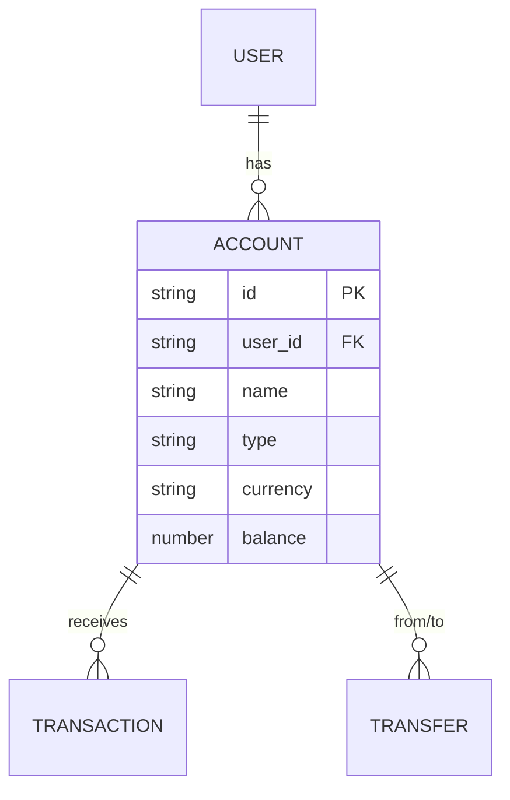

# Data Model: Default Cash Account

**Branch**: `009-default-cash-account` | **Date**: 2026-02-26

## Entities

### Account (existing — no schema changes needed)

The Cash account uses the existing `accounts` table with no modifications.

| Field        | Type                     | Value for Cash Account            | Notes                                  |
| ------------ | ------------------------ | --------------------------------- | -------------------------------------- |
| `id`         | `string`                 | Auto-generated (WatermelonDB)     | Primary key                            |
| `user_id`    | `string`                 | Current user's ID                 | Foreign key                            |
| `name`       | `string`                 | `"Cash"`                          | Display name                           |
| `type`       | `AccountType` (`"CASH"`) | `"CASH"`                          | Enum: `CASH \| BANK \| DIGITAL_WALLET` |
| `currency`   | `CurrencyType`           | From `detectCurrencyFromDevice()` | E.g., `"EGP"`                          |
| `balance`    | `number`                 | `0`                               | Initial zero balance                   |
| `deleted`    | `boolean`                | `false`                           | Soft-delete flag                       |
| `created_at` | `timestamp`              | Auto-set                          | Sync column                            |
| `updated_at` | `timestamp`              | Auto-set                          | Sync column                            |

### AsyncStorage Flags (transient, not synced)

| Key                    | Type             | Purpose                            | Lifecycle                              |
| ---------------------- | ---------------- | ---------------------------------- | -------------------------------------- |
| `showCashAccountToast` | `"true" \| null` | Trigger playful toast on Dashboard | Set on creation, cleared after display |

## Relationships



## Identification & Querying

Cash account is identified by `type = "CASH"` (not by name). The query:

```
Q.where("type", "CASH"), Q.where("user_id", userId), Q.where("deleted", Q.notEq(true))
```

Returns all CASH accounts. First result is used for ATM routing.

## Uniqueness Rules

- **Auto-creation uniqueness**: System creates at most one Cash account per
  user. The `ensureCashAccount` function checks for existing `type = "CASH"`
  before creating.
- **Manual creation**: Users MAY create additional CASH accounts. No database
  constraint prevents this.
- **No unique index**: We intentionally do NOT add a unique index on
  `(user_id, type)` because multiple CASH accounts are allowed.
