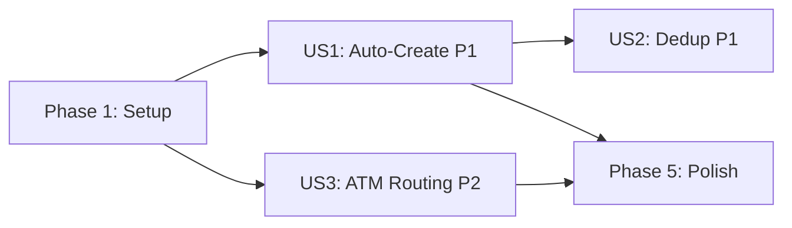

# Tasks: Default Cash Account

**Input**: Design documents from `/specs/009-default-cash-account/`
**Prerequisites**: plan.md ✅, spec.md ✅, research.md ✅, data-model.md ✅

**Tests**: Not explicitly requested — test tasks omitted.

**Organization**: Tasks grouped by user story for independent implementation.

## Format: `[ID] [P?] [Story] Description`

- **[P]**: Can run in parallel (different files, no dependencies)
- **[Story]**: Which user story (US1, US2, US3)
- Exact file paths included

---

## Phase 1: Setup (Shared Infrastructure)

**Purpose**: Extract shared utilities and create the account service foundation

- [ ] T001 [P] Extract `detectCurrencyFromDevice` into
      `packages/logic/src/utils/currency-detection.ts` and export from barrel
      `packages/logic/src/index.ts`
- [ ] T002 [P] Update `apps/mobile/hooks/usePreferredCurrency.ts` to import
      `detectCurrencyFromDevice` from `@astik/logic` and delete the local copy
- [ ] T003 Create `apps/mobile/services/account-service.ts` with
      `ensureCashAccount(userId)` and `findCashAccount(userId)` functions
- [ ] T004 Re-export `ensureCashAccount` and `findCashAccount` from
      `apps/mobile/services/index.ts`

**Checkpoint**: Currency detection utility available in `@astik/logic`, account
service ready for integration.

---

## Phase 2: User Story 1 — Cash Account Auto-Created on First Launch (Priority: P1) 🎯 MVP

**Goal**: New users get a Cash account automatically when they complete (or
skip) onboarding. A playful toast notification confirms it.

**Independent Test**: Complete onboarding as a new user → verify Cash account
appears on Dashboard → verify toast is shown.

### Implementation for User Story 1

- [ ] T005 [US1] Wire `ensureCashAccount` into `handleFinish()` in
      `apps/mobile/app/onboarding.tsx` — fire-and-forget after
      `AsyncStorage.setItem("hasOnboarded", "true")`, set
      `AsyncStorage("showCashAccountToast", "true")` if created
- [ ] T006 [US1] Wire `ensureCashAccount` into `initializeApp()` in
      `apps/mobile/app/index.tsx` — after `ensureAuthenticated()`, as retry
      fallback (FR-005/FR-008), set toast flag if created
- [ ] T007 [US1] Add toast trigger on Dashboard tab mount — check
      `AsyncStorage("showCashAccountToast")`, show toast via `useToast()` with
      message "💰 Cash wallet ready! Because who leaves the house without pocket
      money?", clear flag after display. Duration ≥ 3s.

**Checkpoint**: User Story 1 complete. New users see Cash account + toast after
onboarding.

---

## Phase 3: User Story 2 — Returning User Not Duplicated (Priority: P1)

**Goal**: Existing users with a Cash account do not get a duplicate when the app
re-launches or re-triggers `ensureCashAccount`.

**Independent Test**: Clear `hasOnboarded` flag but keep DB → re-onboard →
verify only one Cash account exists, no toast shown.

### Implementation for User Story 2

- [ ] T008 [US2] Verify idempotency logic in `ensureCashAccount` inside
      `apps/mobile/services/account-service.ts` — query `type = "CASH"` +
      `user_id` + `deleted != true` before creating, return `{ created: false }`
      if exists
- [ ] T009 [US2] Ensure toast flag is NOT set when `ensureCashAccount` returns
      `{ created: false }` — verify in both `apps/mobile/app/onboarding.tsx` and
      `apps/mobile/app/index.tsx`

**Checkpoint**: User Story 2 complete. No duplicate accounts, no false toasts.

---

## Phase 4: User Story 3 — ATM Withdrawals Use the Cash Account (Priority: P2)

**Goal**: SMS batch processing routes ATM withdrawals to the existing Cash
account instead of lazily creating one. If no Cash account exists, withdrawals
are skipped with a user message.

**Independent Test**: Scan SMS with ATM withdrawals → verify transfer
destination is the Cash account. Delete Cash account → scan again → verify ATM
withdrawals skipped + message shown.

### Implementation for User Story 3

- [ ] T010 [US3] Delete `findOrCreateCashAccount()` function (lines 83-114) from
      `apps/mobile/services/batch-sms-transactions.ts`
- [ ] T011 [US3] Replace ATM withdrawal routing (lines 188-193) in
      `apps/mobile/services/batch-sms-transactions.ts` — import
      `findCashAccount`, call it instead of `findOrCreateCashAccount`, handle
      `null` by skipping ATM withdrawals
- [ ] T012 [US3] Update `BatchSaveResult` interface in
      `apps/mobile/services/batch-sms-transactions.ts` — add
      `skippedAtmCount: number` and `atmSkipReason?: string` fields
- [ ] T013 [US3] Update the component that calls `batchCreateSmsTransactions` to
      display a user-facing message when `skippedAtmCount > 0` — show info toast
      or alert explaining withdrawals were skipped due to missing Cash account

**Checkpoint**: ATM withdrawal routing uses existing Cash account. No lazy
creation. Skips with message when missing.

---

## Phase 5: Polish & Cross-Cutting Concerns

**Purpose**: Cleanup and documentation

- [ ] T014 [P] Update `docs/business/business-decisions.md` with Cash account
      auto-creation rule (Constitution II)
- [ ] T015 Remove unused `ExistingBankAccount` interface from
      `apps/mobile/utils/build-initial-account-state.ts` if no longer referenced
      after `findOrCreateCashAccount` removal

---

## Dependencies & Execution Order

### Phase Dependencies

- **Setup (Phase 1)**: No dependencies — start immediately
- **US1 (Phase 2)**: Depends on Phase 1 (T003 account service)
- **US2 (Phase 3)**: Logically verified alongside US1 — same `ensureCashAccount`
  function
- **US3 (Phase 4)**: Depends on Phase 1 (T003 `findCashAccount`). Independent of
  US1/US2.
- **Polish (Phase 5)**: After all user stories complete

### User Story Dependencies

### Parallel Opportunities

- **T001 + T002**: Different files, can run in parallel
- **US1 and US3**: Independent after Phase 1. Can be worked in parallel.
- **T014 + T015**: Different files, can run in parallel

---

## Implementation Strategy

### MVP First (User Story 1 Only)

1. Complete Phase 1: Setup (T001-T004)
2. Complete Phase 2: US1 (T005-T007)
3. **STOP and VALIDATE**: Onboard as new user, verify Cash account + toast
4. Delivers core value — users get Cash account from day one

### Incremental Delivery

1. Setup → Foundation ready
2. US1 → Cash auto-creation working → **MVP** ✅
3. US2 → Dedup verified (mostly inherent to US1 implementation)
4. US3 → ATM routing cleanup → **Full feature** ✅
5. Polish → Documentation + cleanup

---

## Notes

- No schema migrations needed — `accounts` table already supports
  `type = "CASH"`
- `ensureCashAccount` is designed to never throw (catches errors, returns result
  object) for retry safety
- Toast flag pattern matches existing app patterns (`hasOnboarded`,
  `hasCompletedSmsSync`)
- Total tasks: **15** (4 setup + 3 US1 + 2 US2 + 4 US3 + 2 polish)
