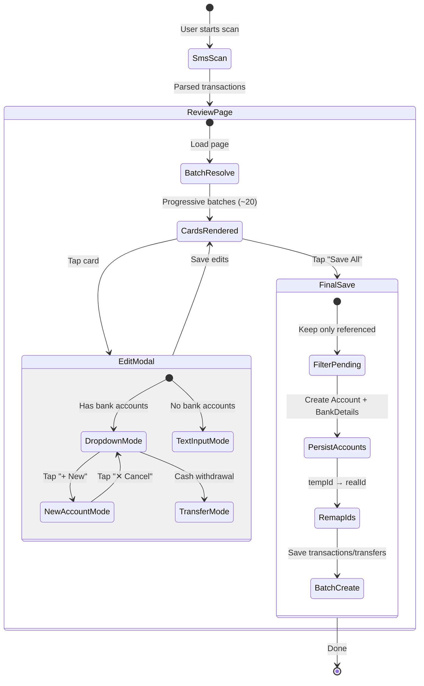

# Data Model: Refactor SMS Transaction Flow

**Branch**: `013-refactor-sms-flow` | **Date**: 2026-03-02

## New Types

### PendingAccount

In-memory account created during the review session. Not persisted until final
save.

```typescript
interface PendingAccount {
  /** Temporary UUID generated client-side */
  readonly tempId: string;
  /** User-entered account name */
  readonly name: string;
  /** Currency inherited from the transaction */
  readonly currency: CurrencyType;
  /** Always BANK for SMS-created accounts */
  readonly type: "BANK";
  /** SMS sender address (for bank_details.sms_sender_name) */
  readonly senderAddress: string;
  /** Card last 4 digits from SMS body (for bank_details.card_last_4) */
  readonly cardLast4?: string;
}
```

**Lifecycle**: Created in edit modal → stored in `SmsTransactionReview` state →
filtered to referenced-only on save → persisted via `persistPendingAccounts()`.

### TransactionEdits (Updated)

Extended from the existing `TransactionEdits` interface.

```typescript
interface TransactionEdits {
  readonly amount?: number;
  readonly counterparty?: string;
  readonly categorySystemName?: string;
  readonly type?: TransactionType;
  readonly accountId?: string;
  readonly accountName?: string;
  /** For transfers (cash withdrawals) */
  readonly toAccountId?: string;
  readonly toAccountName?: string;
}
```

### PersistResult

Returned by `persistPendingAccounts()`.

```typescript
interface PersistResult {
  /** Maps PendingAccount.tempId → real WatermelonDB Account.id */
  readonly tempToRealIdMap: ReadonlyMap<string, string>;
  /** Number of accounts + bank_details created */
  readonly createdCount: number;
  /** Errors encountered during creation */
  readonly errors: readonly string[];
}
```

---

## Existing Entities (No Changes)

| Entity      | Table          | Notes                                                                             |
| ----------- | -------------- | --------------------------------------------------------------------------------- |
| Account     | `accounts`     | Used as-is. PendingAccounts become real accounts on save.                         |
| BankDetails | `bank_details` | Created for each persisted PendingAccount with `sms_sender_name` + `card_last_4`. |
| Transaction | `transactions` | Created by `batchCreateSmsTransactions`. No schema changes.                       |
| Transfer    | `transfers`    | Created for cash withdrawals. No schema changes.                                  |
| Category    | `categories`   | Looked up by system_name. No changes.                                             |
| MarketRate  | `market_rates` | Read via `useMarketRates` for currency conversion. No changes.                    |

---

## State Flow Diagram


