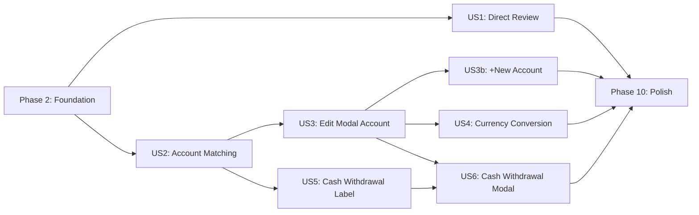

# Tasks: Refactor SMS Transaction Flow

**Input**: Design documents from `/specs/013-refactor-sms-flow/`
**Prerequisites**: plan.md ✅, spec.md ✅, data-model.md ✅

**Tests**: Unit tests for `matchAccountCore` and validation. No E2E tests
requested.

**Organization**: Tasks grouped by user story (US1–US6) to enable independent
implementation and testing.

## Format: `[ID] [P?] [Story] Description`

- **[P]**: Can run in parallel (different files, no dependencies)
- **[Story]**: Which user story this task belongs to (e.g., US1, US2)
- File paths relative to `apps/mobile/` unless stated otherwise

---

## Phase 1: Setup ✅

**Purpose**: No new project setup needed — this is a refactor of existing code.
Phase 1 covers only the shared types and interfaces that ALL user stories depend
on.

- [x] T001 Define `MatchInput` interface and `matchAccountCore()` pure function
      signature in `services/sms-account-matcher.ts`
- [x] T002 [P] Define `PendingAccount` and `PersistResult` interfaces in
      `services/pending-account-service.ts`
- [x] T003 [P] Extend `TransactionEdits` interface with `accountId`,
      `accountName`, `toAccountId`, `toAccountName` in
      `components/sms-sync/SmsTransactionEditModal.tsx`

---

## Phase 2: Foundational (Blocking Prerequisites) ✅

**Purpose**: Core infrastructure that MUST be complete before ANY user story.
Consolidates matching logic and removes deprecated code.

**⚠️ CRITICAL**: No user story work can begin until this phase is complete.

- [x] T004 Move `isSenderMatch()` from `services/sms-account-resolver.ts` to
      `services/sms-account-matcher.ts`
- [x] T005 [P] Move `extractCardLast4()` and `CARD_LAST_4_PATTERNS` from
      `services/sms-account-resolver.ts` to `services/sms-account-matcher.ts`
- [x] T006 Implement `matchAccountCore()` in `services/sms-account-matcher.ts` —
      5-step resolution chain using `senderAddress` only: (1) card+sender, (2)
      sender alone, (3) bank registry, (4) default account, (5) first bank
      account fallback
- [x] T007 Update `fetchAccountsWithDetails()` in
      `services/sms-account-matcher.ts` to accept optional `accountType` filter
      param
- [x] T008 Refactor `matchTransaction()` in `services/sms-account-matcher.ts` to
      map `ParsedSmsTransaction` → `MatchInput` and delegate to
      `matchAccountCore()`
- [x] T009 Refactor `resolveAccountForSms()` in
      `services/sms-account-resolver.ts` to thin wrapper: fetch accounts via
      `fetchAccountsWithDetails()`, extract `cardLast4`, build `MatchInput`,
      call `matchAccountCore()`
- [x] T010 [P] Write unit tests for `matchAccountCore()` in
      `__tests__/services/sms-account-matcher.test.ts` — test all 5 steps + edge
      cases (no accounts, all deleted, multiple matches)
- [x] T011 Remove `createAccountsFromSmsSetup()` and `AccountSetupResult` type
      from `services/batch-sms-transactions.ts`
- [x] T012 Remove `SenderAccountMap` type export from
      `services/batch-sms-transactions.ts`
- [x] T013 Remove `senderAccountMap`, `setSenderAccountMap`, `defaultAccountId`,
      `setDefaultAccountId` from `context/SmsScanContext.tsx`
- [x] T014 Update `batchCreateSmsTransactions()` signature in
      `services/batch-sms-transactions.ts` to accept
      `transactionAccountMap: Map<number, string>` instead of
      `SenderAccountMap + defaultAccountId`
- [x] T015 Run existing `sms-sync-service.test.ts` regression suite and fix any
      import/type errors caused by removals

**Checkpoint**: Foundation ready — matching logic consolidated, deprecated code
removed, core API signatures updated.

---

## Phase 3: User Story 1 — Direct Review After Scan (Priority: P1) 🎯 MVP

**Goal**: Remove AccountSetupStep. User goes directly from scan to review.

**Independent Test**: Trigger an SMS scan → verify the user navigates directly
to the review list without seeing any account-setup screen.

### Implementation for User Story 1

- [x] T016 [US1] Remove AccountSetupStep navigation from scan completion flow in
      `app/sms-scan.tsx` — navigate directly to `sms-review`
- [x] T017 [US1] Remove any AccountSetupStep component imports and references
      from `app/sms-scan.tsx` and `app/sms-review.tsx`
- [x] T018 [US1] Clean up any remaining references to the account setup wizard
      in `hooks/useSmsScan.ts` or `hooks/useSmsSync.ts`

**Checkpoint**: User goes directly from scan → review. No account setup screen.

---

## Phase 4: User Story 2 — Account Matching Per Transaction Card (Priority: P1) ✅

**Goal**: Each transaction card shows a matched account name via batched
resolution.

**Independent Test**: Create a user with 2+ bank accounts, scan SMS, verify each
card displays the correct matched account name progressively.

### Implementation for User Story 2

- [x] T019 [US2] Implement `matchTransactionsBatched()` in
      `services/sms-account-matcher.ts` — fetches accounts once, processes ~20
      txns/batch, calls `matchAccountCore()` for each, yields results via
      `onBatchComplete` callback
- [x] T020 [US2] Replace `runMatching()` in
      `components/sms-sync/SmsTransactionReview.tsx` with
      `matchTransactionsBatched()` using `BATCH_SIZE = 20`, update
      `accountMatches` state progressively as each batch completes
- [x] T021 [US2] Update `SmsTransactionItem` props and rendering in
      `components/sms-sync/SmsTransactionItem.tsx` — when no match found
      (`matchReason === "none"`), display `senderDisplayName` instead of empty
      account name

**Checkpoint**: Cards populate progressively with matched account names.

---

## Phase 5: User Story 3 — Edit Modal: Account Selection ✅ (Priority: P1)

**Goal**: Edit modal shows account dropdown (when accounts exist) or text input
(when none exist), with auto-selected matched account.

**Independent Test**: Open edit modal for a matched transaction → verify
dropdown with correct pre-selected account. Test with zero bank accounts →
verify text input + helper message.

### Implementation for User Story 3

- [x] T022 [US3] Add `bankAccounts`, `cashAccounts`, and current `accountMatch`
      props to `SmsTransactionEditModal` interface in
      `components/sms-sync/SmsTransactionEditModal.tsx`
- [x] T023 [US3] Implement account dropdown mode in `SmsTransactionEditModal` —
      when `bankAccounts.length > 0`: show tappable dropdown with account list,
      auto-select the matched account
- [x] T024 [US3] Implement text input mode in `SmsTransactionEditModal` — when
      `bankAccounts.length === 0`: show text input pre-populated with
      `senderDisplayName`, helper message. On modal save, create a
      `PendingAccount` with the typed name (same flow as US3b `+ New`)
- [x] T025 [US3] Fetch and pass `bankAccounts` and `cashAccounts` from
      `SmsTransactionReview.tsx` to `SmsTransactionEditModal` — use
      `fetchAccountsWithDetails()` with `accountType` filter
- [x] T026 [US3] Add zero-amount validation in
      `validation/transaction-validation.ts` — reject save if `amount === 0`
      with error "Amount cannot be zero" (FR-016)

**Checkpoint**: Edit modal correctly shows dropdown or text input based on
account availability.

---

## Phase 6: User Story 3b — Edit Modal: Create New Account ✅ (Priority: P1)

**Goal**: `+ New` toggle creates in-memory accounts. Persisted only on final
Save.

**Independent Test**: Tap `+ New` → type "QNB" → save modal → open another
transaction's modal → verify "QNB" in dropdown.

### Implementation for User Story 3b

- [x] T027 [US3b] Implement `+ New` pill button and `✕ Cancel` pill in
      `SmsTransactionEditModal` — toggles between dropdown and text input with
      emerald focus border
- [x] T028 [US3b] Add duplicate name validation in `SmsTransactionEditModal` —
      case-insensitive check against existing accounts + pending accounts; show
      error if duplicate
- [x] T029 [US3b] Add `pendingAccounts` state
      (`useState<readonly PendingAccount[]>`) to `SmsTransactionReview.tsx` and
      pass `onCreatePendingAccount` callback to edit modal
- [x] T030 [US3b] When text-input account is saved in modal, create a
      `PendingAccount` (with `tempId`, `senderAddress`, `cardLast4`, currency,
      type BANK) and add to `pendingAccounts` state
- [x] T031 [US3b] Merge `pendingAccounts` into the account dropdown list in
      `SmsTransactionEditModal` so they appear for subsequent transactions
- [x] T032 [US3b] Implement `persistPendingAccounts()` in
      `services/pending-account-service.ts` — batch create Account + BankDetails
      in WatermelonDB, return `Map<tempId, realAccountId>`
- [x] T033 [US3b] Update `handleSave()` in `SmsTransactionReview.tsx` — filter
      pending accounts to referenced-only, call `persistPendingAccounts()`,
      remap tempId → realId, then call `batchCreateSmsTransactions()`

**Checkpoint**: In-memory accounts created via `+ New`, visible in dropdowns,
persisted only on final save.

---

## Phase 7: User Story 4 — Edit Modal: Currency Conversion ✅ (Priority: P2)

**Goal**: Show read-only conversion notice when account currency ≠ transaction
currency.

**Independent Test**: Select a USD account for an EGP transaction → verify
conversion notice with rate appears below amount field.

### Implementation for User Story 4

- [x] T034 [US4] Import and use `useMarketRates` hook in
      `SmsTransactionEditModal` to get exchange rates
- [x] T035 [US4] Add currency conversion notice component below amount field in
      `SmsTransactionEditModal` — shows "≈ {converted} {targetCurrency} at rate
      {rate}" when currencies differ; hidden when same currency
- [x] T036 [US4] Handle missing exchange rate — show warning "Exchange rate
      unavailable" instead of conversion when rate is null

**Checkpoint**: Currency conversion notice appears/disappears correctly based on
account selection.

---

## Phase 8: User Story 5 — Cash Withdrawal Label ✅ (Priority: P2)

**Goal**: Cash withdrawal cards show "Cash Withdrawal" label instead of account
name.

**Independent Test**: Scan an ATM withdrawal SMS → verify card shows "Cash
Withdrawal" label in blue.

### Implementation for User Story 5

- [x] T037 [US5] Add cash withdrawal detection logic in `SmsTransactionItem.tsx`
      — check `transaction.isAtmWithdrawal`
- [x] T038 [US5] Render "Cash Withdrawal" label text styled in blue (#3B82F6) on
      the card when cash withdrawal is detected, replacing the account name

**Checkpoint**: Cash withdrawal cards display "Cash Withdrawal" label.

---

## Phase 9: User Story 6 — Cash Withdrawal Edit Modal ✅ (Priority: P2)

**Goal**: Edit modal for cash withdrawals shows Transfer-only tab with From/To
accounts.

**Independent Test**: Open edit modal for cash withdrawal → verify only
"Transfer" tab visible, From = bank account dropdown, To = cash account
dropdown.

### Implementation for User Story 6

- [x] T039 [US6] Add `isAtmWithdrawal` prop to `SmsTransactionEditModal` and
      conditionally hide Income/Expense type tabs, showing only Transfer
- [x] T040 [US6] Implement From/To account layout in `SmsTransactionEditModal`
      for cash withdrawals — directional arrow between From (bank accounts
      dropdown) and To (cash accounts dropdown)
- [x] T041 [US6] Implement "To" field logic: if cash accounts exist in
      withdrawal currency → dropdown with first auto-selected; if none → text
      input with "Cash" + helper message "We'll create a cash account in
      {currency} for you."
- [x] T042 [US6] Update `handleSave()` for cash withdrawals in
      `SmsTransactionReview.tsx` — if no cash account exists, call
      `ensureCashAccount()` before creating the transfer record

**Checkpoint**: Cash withdrawal edit modal shows correct Transfer layout with
From/To accounts.

---

## Phase 10: Polish & Cross-Cutting Concerns ✅

**Purpose**: Cleanup, regression testing, documentation.

- [x] T043 [P] Remove dead code: AccountSetupStep, SenderAccountMapper,
      AccountCard component files, related types, and unused imports
- [ ] T044 [P] Run full `sms-sync-service.test.ts` +
      `sms-account-matcher.test.ts` regression suite
- [ ] T045 [P] Update `docs/agent/session-history.md` and
      `docs/agent/project-memory.md` with feature completion notes

---

## Dependencies & Execution Order

### Phase Dependencies

- **Setup (Phase 1)**: No dependencies — can start immediately
- **Foundational (Phase 2)**: Depends on Setup — BLOCKS all user stories
- **User Story 1 (Phase 3)**: Depends on Foundational — can start immediately
  after Phase 2
- **User Story 2 (Phase 4)**: Depends on Foundational + `matchAccountCore()`
  from Phase 2
- **User Story 3 (Phase 5)**: Depends on User Story 2 (needs `accountMatches`
  data in review page)
- **User Story 3b (Phase 6)**: Depends on User Story 3 (extends the edit modal
  account field)
- **User Story 4 (Phase 7)**: Depends on User Story 3 (adds to the edit modal
  account field)
- **User Story 5 (Phase 8)**: Depends on User Story 2 only (card-level change)
- **User Story 6 (Phase 9)**: Depends on User Story 3 + 5 (uses edit modal
  account dropdown + cash withdrawal detection)
- **Polish (Phase 10)**: Depends on all user stories

### User Story Dependencies



### Parallel Opportunities

- **Phase 1**: T001, T002, T003 — all create interfaces in different files
- **Phase 2**: T004 + T005 (move functions), T010 (tests) can run in parallel
  with each other
- **After Foundation**: US1 and US2 can run in parallel (different files)
- **After US3**: US3b and US4 can run in parallel (different features in same
  modal, but touch same file — sequential recommended)
- **After US2**: US5 can run in parallel with US3 (different files)

---

## Parallel Example: Foundation Phase

```bash
# Launch parallel moves:
Task T004: "Move isSenderMatch() to sms-account-matcher.ts"
Task T005: "Move extractCardLast4() to sms-account-matcher.ts"

# Then sequential core implementation:
Task T006: "Implement matchAccountCore()"      # depends on T004+T005
Task T007: "Update fetchAccountsWithDetails()"  # parallel with T006
Task T008: "Refactor matchTransaction()"        # depends on T006
Task T009: "Refactor resolveAccountForSms()"    # depends on T006
Task T010: "Write matchAccountCore tests"       # parallel with T008+T009
```

---

## Implementation Strategy

### MVP First (User Stories 1–3b)

1. Complete Phase 1: Setup (types/interfaces)
2. Complete Phase 2: Foundation (matching consolidation, cleanup)
3. Complete Phase 3: US1 — Direct Review (remove setup step)
4. Complete Phase 4: US2 — Account Matching (batched resolution)
5. Complete Phase 5: US3 — Edit Modal Account Selection
6. Complete Phase 6: US3b — Create New Account
7. **STOP and VALIDATE**: Core flow complete and testable

### Incremental Delivery

1. Foundation + US1 + US2 → Cards show matched accounts (MVP!)
2. Add US3 + US3b → Edit modal with full account management
3. Add US4 → Currency conversion (polish)
4. Add US5 + US6 → Cash withdrawal support
5. Polish → Cleanup dead code + docs

---

## Notes

- [P] tasks = different files, no dependencies on incomplete tasks
- [Story] label maps task to specific user story for traceability
- All service changes use WatermelonDB (offline-first, Constitution Principle I)
- NativeWind shadow bug: use inline `style` for shadow on
  `TouchableOpacity`/`Pressable`
- Commit after each task or logical group
- Stop at any checkpoint to validate story independently
