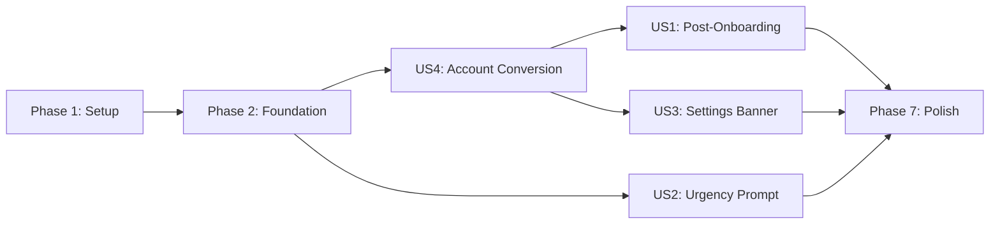

# Tasks: Optional Sign-Up Prompt

**Input**: Design documents from `/specs/014-signup-prompt/` **Prerequisites**:
plan.md ✅, spec.md ✅, research.md ✅

**Tests**: Unit tests included for `useSignUpPrompt` hook and `auth-service`
(spec verification plan requires them).

**Organization**: Tasks grouped by user story. US4 (Social Account Conversion)
is foundational since all UI surfaces depend on it.

## Format: `[ID] [P?] [Story] Description`

- **[P]**: Can run in parallel (different files, no dependencies)
- **[Story]**: Which user story (US1–US4) this task belongs to
- Exact file paths included

---

## Phase 1: Setup (Dependencies & Configuration)

**Purpose**: Install new packages and create shared constants

- [x] T001 Install OAuth dependencies via
      `npx expo install expo-auth-session expo-web-browser expo-crypto` in
      `apps/mobile/`
- [x] T002 [P] Create auth constants and AsyncStorage keys in
      `apps/mobile/constants/storage-keys.ts`

---

## Phase 2: Foundational (Auth Infrastructure)

**Purpose**: Core auth capabilities that ALL user stories depend on. MUST
complete before any UI story.

**⚠️ CRITICAL**: US1, US2, and US3 all depend on this phase.

- [x] T003 Add `isAnonymous` flag to AuthContext interface and provider in
      `apps/mobile/context/AuthContext.tsx`
- [x] T004 Add `linkIdentityWithProvider()` wrapper function in
      `apps/mobile/services/supabase.ts`
- [x] T005 Create OAuth flow orchestration service in
      `apps/mobile/services/auth-service.ts`
- [x] T006 [P] Create reusable `SocialLoginButtons` component in
      `apps/mobile/components/sign-up/SocialLoginButtons.tsx`
- [x] T007 Register `sign-up` route in the Stack navigator in
      `apps/mobile/app/_layout.tsx`

**Checkpoint**: Auth infrastructure ready — `isAnonymous` detectable,
`linkIdentity` callable, OAuth flow orchestrated, social buttons reusable.

---

## Phase 3: User Story 4 - Social Account Conversion (Priority: P1) 🎯 MVP

**Goal**: When an anonymous user signs up via Google, Facebook, or Apple, the
system links the identity to the existing anonymous user, preserving all data.

**Independent Test**: Sign up with each provider as anonymous user → verify all
data still accessible and `is_anonymous` becomes `false`.

### Implementation for User Story 4

- [x] T008 [US4] Create full-screen sign-up page with trust badges, social login
      buttons, and skip action in `apps/mobile/app/sign-up.tsx`
- [x] T009 [US4] Handle OAuth success callback — show toast "Account secured ✓"
      and navigate to `/(tabs)` in `apps/mobile/app/sign-up.tsx`
- [x] T010 [US4] Handle OAuth error scenarios (network failure, cancelled OAuth,
      duplicate account) with clear error messages in
      `apps/mobile/app/sign-up.tsx`

### Tests for User Story 4

- [ ] T011 [P] [US4] Unit test `linkIdentityWithProvider` calls Supabase
      `linkIdentity` with correct provider in
      `apps/mobile/__tests__/services/auth-service.test.ts`
- [ ] T012 [P] [US4] Unit test error handling for network failure and duplicate
      account in `apps/mobile/__tests__/services/auth-service.test.ts`

**Checkpoint**: Core account conversion works end-to-end from the sign-up
screen. Can sign up via Google/Facebook/Apple, data is preserved.

---

## Phase 4: User Story 1 - Post-Onboarding Sign-Up Prompt (Priority: P1)

**Goal**: After completing onboarding (carousel → currency picker → wallet
creation), anonymous users see a full-screen sign-up page. They can sign up or
skip. Shown only once.

**Independent Test**: Complete onboarding as anonymous user → sign-up screen
appears → tap "I'll do it later" → main tabs → relaunch → sign-up screen does
NOT reappear.

### Implementation for User Story 1

- [x] T013 [US1] Modify `handleGoToApp` in onboarding to route anonymous users
      to `/sign-up?source=onboarding` instead of `/(tabs)` in
      `apps/mobile/app/onboarding.tsx`
- [x] T014 [US1] Add `source` parameter handling in sign-up screen — skip
      navigates to `/(tabs)` in `apps/mobile/app/sign-up.tsx`
- [x] T015 [US1] Ensure sign-up screen is NOT shown if user is already
      authenticated (non-anonymous) after onboarding in
      `apps/mobile/app/onboarding.tsx`

**Checkpoint**: Post-onboarding sign-up prompt works. Anonymous users see it
once after wallet creation. Skip goes to main tabs.

---

## Phase 5: User Story 3 - Settings Sign-Up Access (Priority: P2)

**Goal**: Anonymous users see a green gradient banner at the top of Settings
that navigates to the sign-up screen. Authenticated users see account info
instead.

**Independent Test**: Open Settings as anonymous user → gradient banner visible
→ tap "Sign Up" → navigates to sign-up screen. After converting, banner
disappears.

### Implementation for User Story 3

- [x] T016 [P] [US3] Create `SignUpBanner` gradient component with shield icon,
      "Secure Your Account" heading, and "Sign Up" button in
      `apps/mobile/components/sign-up/SignUpBanner.tsx`
- [x] T017 [US3] Integrate `SignUpBanner` at the top of Settings ScrollView,
      conditional on `isAnonymous` from `useAuth()` in
      `apps/mobile/app/settings.tsx`
- [x] T018 [US3] Add authenticated user profile info row in Settings (shows
      email/provider after conversion) in `apps/mobile/app/settings.tsx`

**Checkpoint**: Settings banner works for anonymous users and hides for
authenticated users. Profile info visible after conversion.

---

## Phase 6: User Story 2 - Re-Engagement Urgency Prompt (Priority: P2)

**Goal**: After 50+ transactions OR 10+ days (whichever first), show a bottom
sheet with urgency messaging and real user stats on cold app launch. Dismissible
with cooldown or permanently.

**Independent Test**: Create 50+ transactions as anonymous user → force-close →
relaunch → urgency bottom sheet appears with correct stats → "Skip for now"
dismisses → relaunch → no sheet (within cooldown) → add 50 more → relaunch →
sheet reappears.

### Implementation for User Story 2

- [x] T019 [US2] Create `useSignUpPrompt` hook with threshold checks, cooldown
      logic, permanent dismiss, and stats query in
      `apps/mobile/hooks/useSignUpPrompt.ts`
- [x] T020 [P] [US2] Create `SignUpPromptSheet` bottom sheet with urgency
      messaging, real stats display, social login buttons, "Skip for now" and
      "Never show this again" actions in
      `apps/mobile/components/sign-up/SignUpPromptSheet.tsx`
- [x] T021 [US2] Mount `SignUpPromptSheet` in tab layout with cold-launch-only
      trigger using `useRef` guard in `apps/mobile/app/(tabs)/_layout.tsx`

### Tests for User Story 2

- [ ] T022 [P] [US2] Unit test `useSignUpPrompt` — anonymous user below
      thresholds returns `shouldShowPrompt = false` in
      `apps/mobile/__tests__/hooks/useSignUpPrompt.test.ts`
- [ ] T023 [P] [US2] Unit test `useSignUpPrompt` — anonymous user at 50+ txns
      returns `shouldShowPrompt = true` in
      `apps/mobile/__tests__/hooks/useSignUpPrompt.test.ts`
- [ ] T024 [P] [US2] Unit test `useSignUpPrompt` — after cooldown dismiss,
      prompt hidden until cooldown expires in
      `apps/mobile/__tests__/hooks/useSignUpPrompt.test.ts`
- [ ] T025 [P] [US2] Unit test `useSignUpPrompt` — permanent dismiss returns
      `shouldShowPrompt = false` forever in
      `apps/mobile/__tests__/hooks/useSignUpPrompt.test.ts`
- [ ] T026 [P] [US2] Unit test `useSignUpPrompt` — authenticated user always
      returns `shouldShowPrompt = false` in
      `apps/mobile/__tests__/hooks/useSignUpPrompt.test.ts`

**Checkpoint**: Urgency prompt triggers correctly based on thresholds, respects
cooldowns and permanent dismiss, shows accurate stats.

---

## Phase 7: Polish & Cross-Cutting Concerns

**Purpose**: Final QA, edge cases, and documentation

- [ ] T027 [P] Verify platform-conditional rendering — Android shows 2 buttons,
      iOS shows 3 in `apps/mobile/components/sign-up/SocialLoginButtons.tsx`
- [ ] T028 [P] Add loading states and disabled states to social login buttons
      during OAuth flow in
      `apps/mobile/components/sign-up/SocialLoginButtons.tsx`
- [ ] T029 Verify dark mode styling across all new components (sign-up screen,
      banner, bottom sheet) using NativeWind dark variants
- [ ] T030 Run full test suite `npm test -w @astik/mobile` to ensure no
      regressions
- [ ] T031 Update session history in `docs/agent/session-history.md`

---

## Dependencies & Execution Order

### Phase Dependencies

- **Setup (Phase 1)**: No dependencies — start immediately
- **Foundational (Phase 2)**: Depends on Phase 1 (packages installed)
- **US4 (Phase 3)**: Depends on Phase 2 — core conversion capability
- **US1 (Phase 4)**: Depends on Phase 3 (sign-up screen exists)
- **US3 (Phase 5)**: Depends on Phase 3 (sign-up screen exists); can run in
  parallel with US1
- **US2 (Phase 6)**: Depends on Phase 2 only (uses SocialLoginButtons from Phase
  2, not full sign-up screen)
- **Polish (Phase 7)**: Depends on all user stories complete

### User Story Dependencies

### Parallel Opportunities

- T002 can run in parallel with T001
- T006 can run in parallel with T003–T005
- T011 and T012 can run in parallel during US4
- US1 and US3 can run in parallel (both only need sign-up screen from US4)
- US2 is independent of US1 and US3
- T022–T026 can all run in parallel (separate test cases)
- T027–T029 can all run in parallel in Polish phase

---

## Implementation Strategy

### MVP First (US4 + US1 Only)

1. Complete Phase 1: Setup (install packages)
2. Complete Phase 2: Foundation (auth infra)
3. Complete Phase 3: US4 (account conversion works)
4. Complete Phase 4: US1 (post-onboarding prompt)
5. **STOP and VALIDATE**: Test sign-up end-to-end from onboarding
6. Deploy development build for testing

### Incremental Delivery

1. Setup + Foundation → Auth infra ready
2. Add US4 → Core conversion → Can sign up ✓
3. Add US1 → Post-onboarding prompt → First users convert ✓
4. Add US3 → Settings access → Self-service sign-up ✓
5. Add US2 → Urgency prompt → Re-engagement ✓
6. Polish → Production-ready

---

## Notes

- [P] tasks = different files, no dependencies
- [Story] label maps task to specific user story
- Each user story independently testable at its checkpoint
- Commit after each task or logical group
- OAuth flows require a development build (not Expo Go) for deep linking
- Supabase dashboard needs Google, Facebook, and Apple OAuth providers
  configured before testing
