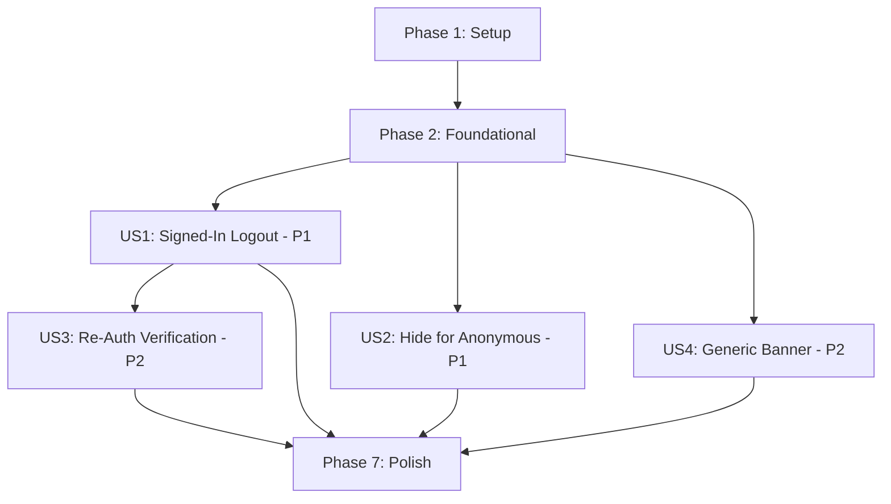

# Tasks: Logout Flow

**Input**: Design documents from `/specs/015-logout-flow/` **Prerequisites**:
plan.md ✅, spec.md ✅, research.md ✅, data-model.md ✅

**Tests**: Unit tests requested in plan.md (8 test cases for
`logout-service.test.ts`).

**Organization**: Tasks grouped by user story for independent implementation.

## Format: `[ID] [P?] [Story] Description`

- **[P]**: Can run in parallel (different files, no dependencies)
- **[Story]**: Which user story this task belongs to (e.g., US1, US2, US3, US4)

---

## Phase 1: Setup

**Purpose**: Install dependencies and create foundational constants

- [x] T001 Install `@react-native-community/netinfo` dependency in
      `apps/mobile/package.json`
- [x] T002 Add `LOGOUT_IN_PROGRESS_KEY` and `CLEARABLE_USER_KEYS` array to
      `apps/mobile/constants/storage-keys.ts`

---

## Phase 2: Foundational (Core Logout Service)

**Purpose**: Core logout orchestration that ALL user stories depend on

**⚠️ CRITICAL**: No user story work can begin until this phase is complete

- [x] T003 Create `apps/mobile/services/logout-service.ts` with
      `performLogout(db)` function implementing: await active sync → network
      check → sync → retry on failure → reset DB → clear AsyncStorage (preserve
      `hasOnboarded`) → signOut → signInAnonymously → manage
      `logout_in_progress` flag
- [x] T004 Add `completeInterruptedLogout(db)` function to
      `apps/mobile/services/logout-service.ts` for force-close recovery (check
      flag → if present, run reset → clear → signOut → signInAnonymously →
      remove flag)
- [x] T005 Write unit tests for logout service in
      `apps/mobile/__tests__/services/logout-service.test.ts` covering: happy
      path, offline error, sync retry success, sync double failure,
      force-proceed, AsyncStorage cleanup, force-close recovery, and DB reset
      failure graceful handling

**Checkpoint**: Logout service fully implemented and tested — UI integration can
now begin

---

## Phase 3: User Story 1 — Signed-In User Logs Out (Priority: P1) 🎯 MVP

**Goal**: Signed-in users can tap Logout in the drawer, see a confirmation
modal, and complete the full logout sequence (sync → reset → anonymous session)

**Independent Test**: Sign in with Google, add data, tap Logout in drawer,
confirm, verify app resets to clean anonymous state

- [x] T006 [US1] Remove stray `debugger;` statements from
      `apps/mobile/context/AuthContext.tsx` (lines 67, 78). Keep existing
      `signOut` callback as-is — the new logout flow uses `performLogout`
      directly
- [x] T007 [US1] Add logout confirmation modal and loading state to
      `apps/mobile/components/navigation/AppDrawer.tsx` — import
      `ConfirmationModal` (warning variant, `log-out-outline` icon), call
      `performLogout(db)` on confirm, show second warning modal on sync failure
      with "Proceed Anyway" / "Cancel" options
- [x] T008 [US1] Run existing auth tests to verify no regressions:
      `cd apps/mobile && npx jest __tests__/services/auth-service.test.ts`

**Checkpoint**: Signed-in users can fully log out via the navigation drawer with
confirmation and sync

---

## Phase 4: User Story 2 — Hide Logout for Anonymous Users (Priority: P1)

**Goal**: Anonymous users never see the Logout option

**Independent Test**: Open app as fresh anonymous user → verify Logout is not
visible in drawer or settings

- [x] T009 [US2] Conditionally render Logout button in
      `apps/mobile/components/navigation/AppDrawer.tsx` — only show when
      `!isAnonymous` from `useAuth()`
- [x] T010 [P] [US2] Add Logout row to the General section in
      `apps/mobile/app/settings.tsx` — conditionally visible only for
      `!isAnonymous`, red/destructive styling with `log-out-outline` icon, same
      confirmation modal flow as drawer

**Checkpoint**: Anonymous users never see Logout; signed-in users see it in both
drawer and settings

---

## Phase 5: User Story 3 — Re-Authentication After Logout (Priority: P2)

**Goal**: Users who logged out can re-link the same social identity and recover
their data

**Independent Test**: Log out → use auth banner to link same Google account →
verify data reappears after sync

> **Note**: This story requires no new code changes. The existing `linkIdentity`
> flow from feature #80 already handles re-authentication. This phase is
> verification-only.

- [x] T011 [US3] Manual verification: log out → re-authenticate with same Google
      account → confirm data syncs back (no code changes needed — relies on
      existing `linkIdentity` flow)

**Checkpoint**: Re-authentication flow verified end-to-end

---

## Phase 6: User Story 4 — Generic Auth Banner Messaging (Priority: P2)

**Goal**: All anonymous users see "Connect Your Account" messaging instead of
"Sign Up"

**Independent Test**: As any anonymous user → go to Settings → verify banner
says "Connect Your Account"

- [x] T012 [US4] Update title and subtitle in
      `apps/mobile/components/sign-up/SignUpBanner.tsx` — change "Secure Your
      Account" → "Connect Your Account", change subtitle to "Link your Google
      account to back up and sync your data across devices."

**Checkpoint**: Banner messaging is generic and works for both new and returning
anonymous users

---

## Phase 7: Force-Close Recovery & Polish

**Purpose**: Edge case handling and cross-cutting concerns

- [x] T013 Add force-close recovery check in `apps/mobile/app/_layout.tsx` —
      call `completeInterruptedLogout(db)` during app initialization after
      database is ready
- [x] T014 Manual verification: full end-to-end test of all 7 scenarios from the
      verification plan (anonymous visibility, signed-in visibility, full logout
      flow, data preservation, re-auth, offline guard, banner messaging)

---

## Dependencies & Execution Order

### Phase Dependencies

- **Phase 1 (Setup)**: No dependencies — start immediately
- **Phase 2 (Foundational)**: Depends on Phase 1 — BLOCKS all user stories
- **Phase 3 (US1)**: Depends on Phase 2 — core logout flow
- **Phase 4 (US2)**: Depends on Phase 2 — can run in PARALLEL with Phase 3
- **Phase 5 (US3)**: Depends on Phase 3 completion (needs working logout to test
  re-auth)
- **Phase 6 (US4)**: No dependencies on other stories — can run in PARALLEL with
  Phase 3/4
- **Phase 7 (Polish)**: Depends on all previous phases

### User Story Dependencies



### Parallel Opportunities

- **T009 + T010**: Can run in parallel (different files)
- **US1 + US2 + US4**: Can all start after Phase 2 completes (independent
  concerns)

---

## Parallel Example: After Phase 2

```text
# These can all run concurrently after foundational phase:
Task T007: Logout confirmation modal in AppDrawer.tsx (US1)
Task T009: Conditional logout visibility in AppDrawer.tsx (US2) — SAME FILE as T007, must sequence
Task T010: Logout row in settings.tsx (US2) — [P] different file
Task T012: Banner messaging in SignUpBanner.tsx (US4) — [P] different file
```

> **Note**: T007 and T009 touch the same file (`AppDrawer.tsx`), so they should
> be combined or sequenced within their phases. T010 and T012 are independent
> files and can run in parallel.

---

## Implementation Strategy

### MVP First (User Stories 1 + 2)

1. Complete Phase 1: Setup (install NetInfo, add storage keys)
2. Complete Phase 2: Foundational (logout service + tests)
3. Complete Phase 3: US1 — core logout from drawer
4. Complete Phase 4: US2 — hide for anonymous, add to settings
5. **STOP and VALIDATE**: Test full logout flow manually

### Incremental Delivery

1. Setup + Foundational → Service layer ready
2. Add US1 → Core logout works from drawer (MVP!)
3. Add US2 → Anonymous guard + settings logout
4. Add US4 → Generic banner messaging
5. Add US3 → Verify re-auth (no code changes)
6. Add Polish → Force-close recovery + final validation

---

## Notes

- [P] tasks = different files, no dependencies
- [Story] label maps task to specific user story for traceability
- Total tasks: **14**
- Tests included: Yes (T005 — 8 unit test cases, T008 — regression check)
- No schema migrations needed
- Single new dependency: `@react-native-community/netinfo`
