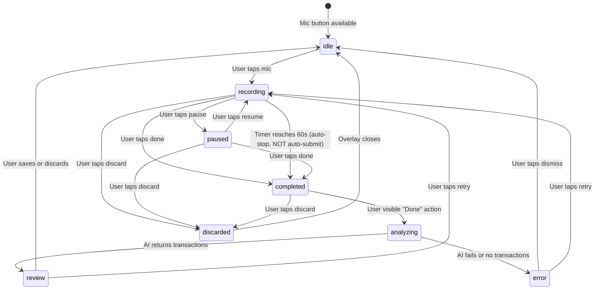

# Data Model: Voice Transaction Flow

**Branch**: `020-voice-transaction-flow` | **Date**: 2026-03-23

## Entities

### 1. Voice Recording Session (ephemeral — not persisted to DB)

| Field        | Type                                                              | Description                              |
| ------------ | ----------------------------------------------------------------- | ---------------------------------------- |
| `uri`        | `string`                                                          | Temporary file URI of the recorded audio |
| `durationMs` | `number`                                                          | Recording duration in milliseconds       |
| `status`     | `"idle" \| "recording" \| "paused" \| "completed" \| "discarded"` | Current session state                    |
| `mimeType`   | `string`                                                          | Audio MIME type (e.g., `audio/m4a`)      |

**Lifecycle**: Created when recording starts → completed when "Done" tapped →
discarded when "X" tapped or timeout. Never persisted to database.

---

### 2. ParseVoiceRequest (client → edge function)

| Field               | Type                                | Required | Description                                 |
| ------------------- | ----------------------------------- | -------- | ------------------------------------------- |
| `audio`             | `File (multipart)`                  | Yes      | The recorded audio file                     |
| `language`          | `string`                            | No       | Language hint (`"ar"` or `"en"`)            |
| `categories`        | `string`                            | No       | Category tree (falls back to embedded tree) |
| `accounts`          | `Array<{id: string, name: string}>` | No       | User's accounts for AI matching             |
| `preferredCurrency` | `string`                            | Yes      | User's default currency (e.g., `"EGP"`)     |

---

### 3. ParseVoiceResponse (edge function → client)

| Field          | Type                 | Description                                   |
| -------------- | -------------------- | --------------------------------------------- |
| `transactions` | `VoiceTransaction[]` | Parsed transactions                           |
| `transcript`   | `string`             | AI-generated text interpretation of the audio |

---

### 4. VoiceTransaction (AI response item)

| Field                | Type                    | Description                     |
| -------------------- | ----------------------- | ------------------------------- |
| `amount`             | `number`                | Transaction amount (positive)   |
| `type`               | `"EXPENSE" \| "INCOME"` | Transaction type                |
| `counterparty`       | `string`                | Merchant/person/entity name     |
| `categorySystemName` | `string`                | Category from the provided tree |
| `description`        | `string`                | Short English description       |
| `accountId`          | `string \| null`        | Matched account ID or null      |

**Note**: `currency` is NOT returned by AI — set client-side from
`preferredCurrency`.

---

### 5. ParsedSmsTransaction (existing — reused by voice)

No changes to this existing type. The `ai-voice-parser-service.ts` maps
`VoiceTransaction` → `ParsedSmsTransaction[]` for consumption by
`TransactionReview`.

---

## State Transitions

## No Database Schema Changes

This feature does NOT require any new tables or columns. Voice recordings are
ephemeral. Parsed transactions are saved using the existing `transactions` table
via the same save flow as SMS transactions.
