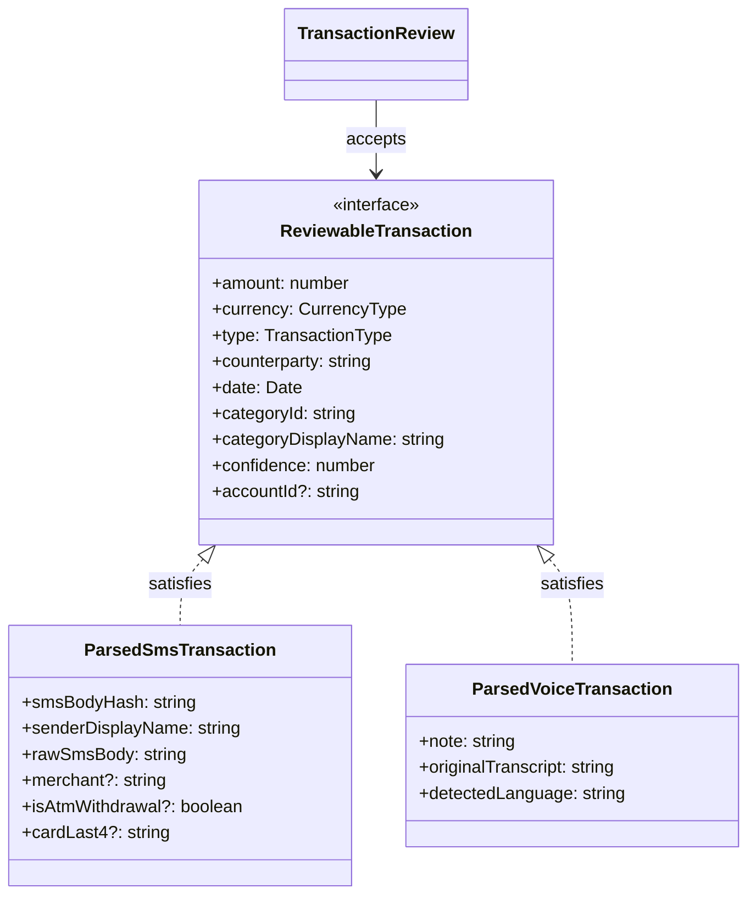

# Data Model: Voice Transaction Infrastructure Refinements

**Branch**: `021-voice-transaction-refinements` | **Date**: 2026-03-26

## Entities

### ReviewableTransaction (NEW — common interface)

Minimum contract for the generic `TransactionReview` component. Both SMS and
Voice parsed types satisfy this interface structurally.

| Field                 | Type                      | Required | Source                       |
| --------------------- | ------------------------- | -------- | ---------------------------- |
| `amount`              | `number`                  | ✅       | AI                           |
| `currency`            | `CurrencyType`            | ✅       | AI (SMS) / Client (Voice)    |
| `type`                | `TransactionType`         | ✅       | AI                           |
| `counterparty`        | `string`                  | ✅       | AI                           |
| `date`                | `Date`                    | ✅       | AI                           |
| `categoryId`          | `Category["id"]`          | ✅       | Resolved via `parseCategory` |
| `categoryDisplayName` | `Category["displayName"]` | ✅       | Resolved via `parseCategory` |
| `confidence`          | `number`                  | ✅       | AI (0–1)                     |
| `accountId`           | `string`                  | ❌       | AI (voice) / Matcher (SMS)   |

---

### ParsedVoiceTransaction (REDESIGNED)

Extends `ReviewableTransaction` with voice-specific fields.

| Field                               | Type     | Required | Source                             |
| ----------------------------------- | -------- | -------- | ---------------------------------- |
| _…all ReviewableTransaction fields_ |          |          |                                    |
| `note`                              | `string` | ✅       | AI `description` field             |
| `originalTranscript`                | `string` | ✅       | AI `original_transcript`           |
| `detectedLanguage`                  | `string` | ✅       | AI `detected_language` (ISO 639-1) |

> Note: The AI response field `confidenceScore` is mapped to `confidence`
> (inherited from `ReviewableTransaction`) during parsing. No separate field
> needed on the type.

**Validation**: Zod schema — all fields required, no `.optional().default()`.

---

### ParsedSmsTransaction (UNCHANGED)

Already satisfies `ReviewableTransaction`. Has additional SMS-specific fields:

| Extra Field         | Type       | Purpose       |
| ------------------- | ---------- | ------------- |
| `smsBodyHash`       | `string`   | Dedup         |
| `senderDisplayName` | `string`   | SMS sender    |
| `rawSmsBody`        | `string`   | Original text |
| `merchant`          | `string?`  | AI merchant   |
| `isAtmWithdrawal`   | `boolean?` | ATM flag      |
| `cardLast4`         | `string?`  | Card matching |

---

### Edge Function Response (EXTENDED)

| Field                 | Type                 | New?   | Description                         |
| --------------------- | -------------------- | ------ | ----------------------------------- |
| `transcript`          | `string`             | No     | English translation                 |
| `original_transcript` | `string`             | ✅ Yes | Original spoken text (any language) |
| `detected_language`   | `string`             | ✅ Yes | ISO 639-1 code (e.g. "ar", "en")    |
| `transactions[]`      | `VoiceTransaction[]` | No     | Parsed transactions                 |

---

## State Machine: VoiceFlowStatus

No changes from existing design — only guard additions.

```text
idle → recording → paused → recording (resume)
                 → analyzing → [0 txns] → error (overlay shows message)
                             → [≥1 txns] → idle (navigate to Review)
```

## Relationships


