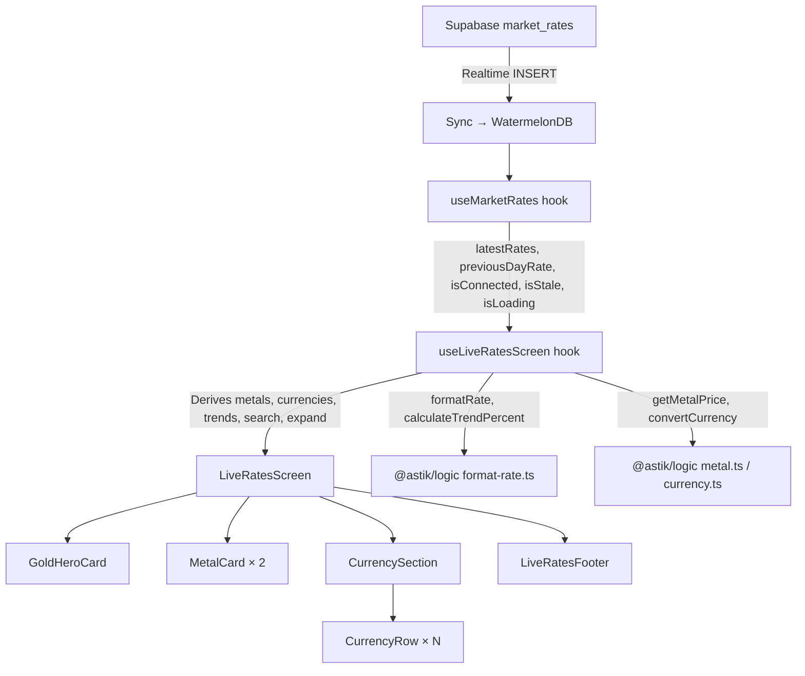

# Implementation Plan: Live Rates Page

**Branch**: `022-live-rates-page` | **Date**: 2026-03-26 | **Spec**:
[spec.md](file:///e:/Work/My%20Projects/Astik/specs/022-live-rates-page/spec.md)
**Input**: Feature specification from `/specs/022-live-rates-page/spec.md`

## Summary

Build a dedicated "Live Rates" screen displaying real-time precious metal prices
(Gold 24K/21K/18K, Silver, Platinum) and 35 fiat currency exchange rates. The
screen uses a unified scrollable layout with metal hero/cards at top and an
expandable currency list below. All data is sourced from the existing
`market_rates` table via the `useMarketRates` hook — no new API endpoints or
database tables are needed.

**Technical approach**: Compose presentation-only components backed by the
existing `useMarketRates` hook, `convertCurrency` and `getMetalPrice` utilities.
Extract a new `useLiveRatesScreen` custom hook to encapsulate all derived state
(search, expand, formatting). Add a new Expo Router screen file and integrate
with existing navigation entry points.

---

## Technical Context

**Language/Version**: TypeScript (strict mode) + React Native (Expo managed)
**Primary Dependencies**: `@astik/db` (MarketRate model), `@astik/logic`
(convertCurrency, getMetalPrice, CURRENCY_INFO_MAP), `react-native-reanimated`
(Skeleton shimmer), `expo-router` (navigation) **Storage**: WatermelonDB
(local), Supabase (remote) — both existing **Testing**: Jest + React Native
Testing Library (existing setup) **Target Platform**: Android + iOS (Expo
managed workflow) **Project Type**: Mobile (monorepo `apps/mobile`)
**Performance Goals**: < 1s first render, < 100ms search filter, 60fps scroll
**Constraints**: Offline-capable (cached rates), no new API endpoints
**Scale/Scope**: 1 new screen, ~8 new component files, ~1 new hook, ~1 new
utility, 2 navigation integration points

---

## Constitution Check

_GATE: Must pass before Phase 0 research. Re-check after Phase 1 design._

| Principle                             | Status  | Notes                                                                                                                                                   |
| ------------------------------------- | ------- | ------------------------------------------------------------------------------------------------------------------------------------------------------- |
| I. Offline-First Data Architecture    | ✅ PASS | `market_rates` is already an approved pull-only exception (constitution §I). No new tables needed. Uses `useMarketRates` which reads from WatermelonDB. |
| II. Documented Business Logic         | ✅ PASS | No new business rules. Purity fractions (0.875/0.75) and currency conversion logic already documented and implemented.                                  |
| III. Type Safety                      | ✅ PASS | All new code will use strict TypeScript. Interfaces for all component props. No `any` types.                                                            |
| IV. Service-Layer Separation          | ✅ PASS | Presentation components receive data via props. Hook handles lifecycle/subscriptions. Calculations via `@astik/logic`.                                  |
| V. Premium UI with Consistent Theming | ✅ PASS | NativeWind (Tailwind) classes primary. Dark/light via `dark:` variants. Shadow via inline styles on interactive components (NativeWind v4 bug).         |
| VI. Monorepo Package Boundaries       | ✅ PASS | No cross-package violations. `apps/mobile` → `@astik/logic` → `@astik/db`.                                                                              |
| VII. Local-First Migrations           | ✅ PASS | No schema changes required. Using existing `market_rates` table as-is.                                                                                  |

**Gate result**: ALL PASS — no violations.

---

## Architecture

### ADR-001: Container/Presenter Pattern for Live Rates Screen

#### Context

The Live Rates screen needs to display market rate data from `useMarketRates`,
derive computed values (21K/18K gold, trend percentages, currency conversions),
manage UI state (search, expand/collapse), and format display values. Putting
all of this in a single component would violate SRP.

#### Decision

Use the **Container/Presenter pattern** with a custom `useLiveRatesScreen` hook
as the container and pure presentational components:

```
useLiveRatesScreen (hook)        ← Derives all state, manages search, expand
  └→ LiveRatesScreen (route)     ← Orchestrates layout
       ├→ LiveRatesHeader        ← Back arrow + title + connection indicator
       ├→ GoldHeroCard           ← 24K price + 21K/18K chips + trend
       ├→ MetalCard              ← Silver/Platinum (reusable)
       ├→ CurrencySection        ← Section header + inline search + list
       │   └→ CurrencyRow        ← Single currency row (flag+code+rate+change)
       └→ LiveRatesFooter        ← Sticky "Updated X min ago" with clock icon
```

#### Consequences

**Positive**: Clear separation of concerns. Components are pure and testable.
Hook logic is unit-testable in isolation. Easy to compose skeleton loading
state.

**Negative**: More files to maintain (8+ components). Slight indirection for
data flow.

**Alternatives Rejected**:

- Single monolithic component: Violates SRP, hard to test
- Redux/Zustand state: Over-engineered for screen-local state

**Status**: Proposed | **Date**: 2026-03-26

---

### ADR-002: Reuse Existing `useMarketRates` Hook Without Extension

#### Context

The existing `useMarketRates` hook already returns `latestRates`,
`previousDayRate`, `isLoading`, `isConnected`, `lastUpdated`, and `isStale`. All
of these are needed for the Live Rates screen. We could either extend the
existing hook or create a wrapper.

#### Decision

**Reuse the hook directly** — compose UI on top without modifying it. Create a
new `useLiveRatesScreen` hook that calls `useMarketRates` internally and adds
screen-specific derived state (search, expand, formatted values, trend
calculations).

#### Consequences

**Positive**: No modifications to existing hook. Other consumers (Dashboard,
Metals) remain unaffected. Single source of truth for market data.

**Negative**: `useLiveRatesScreen` depends on `useMarketRates` — but this is an
acceptable coupling since it's a data-dependency, not a structural one.

**Status**: Proposed | **Date**: 2026-03-26

---

## Project Structure

### Documentation (this feature)

```text
specs/022-live-rates-page/
├── plan.md              # This file
├── spec.md              # Feature specification
├── research.md          # Phase 0 output (N/A — no unknowns)
├── data-model.md        # Phase 1 output (N/A — no new data models)
└── tasks.md             # Phase 2 output (/speckit.tasks command)
```

### Source Code (repository root)

```text
apps/mobile/
├── app/
│   └── live-rates.tsx                    # [NEW] Expo Router screen
├── components/
│   └── live-rates/                       # [NEW] Feature component directory
│       ├── LiveRatesScreen.tsx           # [NEW] Main screen component
│       ├── LiveRatesHeader.tsx           # [NEW] Header with back + title + Live indicator
│       ├── GoldHeroCard.tsx              # [NEW] Hero card for Gold 24K/21K/18K
│       ├── MetalCard.tsx                 # [NEW] Reusable card for Silver, Platinum
│       ├── CurrencySection.tsx           # [NEW] Currencies header + search + list
│       ├── CurrencyRow.tsx              # [NEW] Individual currency row
│       ├── LiveRatesFooter.tsx           # [NEW] Sticky footer with clock + timestamp
│       ├── LiveRatesSkeleton.tsx         # [NEW] Skeleton loading layout
│       └── index.ts                      # [NEW] Barrel exports
│   └── navigation/
│       └── AppDrawer.tsx                 # [MODIFY] Add "Live Rates" nav item
│   └── dashboard/
│       └── LiveRates.tsx                 # [MODIFY] Make strip tappable → navigate
├── hooks/
│   └── useLiveRatesScreen.ts            # [NEW] Screen-specific derived state hook

packages/logic/src/utils/
│   └── format-rate.ts                   # [NEW] Rate formatting utility (2 decimals, strip zeros)
```

**Structure Decision**: Mobile feature module pattern — components grouped under
`components/live-rates/`, screen-specific hook in `hooks/`, shared formatting
utility in `packages/logic/src/utils/`.

---

## Proposed Changes

### 1. Route & Navigation Layer

#### [NEW] `apps/mobile/app/live-rates.tsx`

New Expo Router screen file. Minimal — imports and renders `LiveRatesScreen`.
Uses `Stack.Screen` with `headerShown: false` (custom header).

#### [MODIFY] `apps/mobile/components/navigation/AppDrawer.tsx`

Add a "Live Rates" navigation item to the drawer menu. Position it after
"Metals" in the primary section. Route: `/live-rates`. Icon:
`trending-up-outline` (Ionicons).

#### [MODIFY] `apps/mobile/components/dashboard/LiveRates.tsx`

Wrap the existing `LiveRates` component in a `TouchableOpacity` (or `Pressable`)
that navigates to `/live-rates` on press. Preserves existing pill layout.

---

### 2. Screen Hook

#### [NEW] `apps/mobile/hooks/useLiveRatesScreen.ts`

Custom hook encapsulating all screen state:

- Calls `useMarketRates()` for raw data
- Obtains `preferredCurrency` from the existing `useSettings()` hook
- Derives metal display values (Gold 24K/21K/18K, Silver, Platinum) using
  `getMetalPrice` and `getGoldPurityPrice` from `@astik/logic`
- Computes trend percentages for each metal/currency
- Manages search state (`searchQuery`, `filteredCurrencies`)
- Manages expand/collapse state (`isExpanded`)
- Filters out user's preferred currency from the list
- Computes relative timestamp with 60s auto-refresh timer
- Exposes `onRefresh` callback for pull-to-refresh

Returns a typed interface with all display-ready values.

> **🛡️ Architecture & Design Rationale**
>
> - **Pattern Used**: Container Hook (Custom Hook as Container)
> - **Why**: Separates derived state and side effects from presentation. All
>   state derivation is in one place, testable without rendering.
> - **SOLID Check**: SRP — hook only manages state derivation. Open/Closed — new
>   derived values can be added without modifying components.

---

### 3. Presentation Components

#### [NEW] `apps/mobile/components/live-rates/LiveRatesScreen.tsx`

Main orchestrator component. Renders a `ScrollView` with `RefreshControl` for
pull-to-refresh. Layout:

1. `LiveRatesHeader`
2. `GoldHeroCard`
3. `MetalCard` × 2 (Silver, Platinum) in a flex-row
4. `CurrencySection`
5. `LiveRatesFooter` (positioned as sticky bottom)

Shows `LiveRatesSkeleton` when `isLoading` is true (first render). Shows
illustration + "Rates unavailable" when no cached data exists.

#### [NEW] `apps/mobile/components/live-rates/LiveRatesHeader.tsx`

Props: `isConnected: boolean`, `onBack: () => void`

- Back arrow (Ionicons `arrow-back`)
- "Live Rates" title text
- Connection indicator: green dot (`bg-nileGreen-500`) + "Live" text when
  connected; gray dot (`bg-slate-400`) + muted "Live" text when disconnected

#### [NEW] `apps/mobile/components/live-rates/GoldHeroCard.tsx`

Props: `price24k`, `price21k`, `price18k`, `trendPercent`, `currencySymbol`

- Full-width card with `bg-slate-800` + gold left border (intentionally dark
  surface in both themes for visual emphasis, per approved mockup)
- 24K price prominently displayed (28px)
- Subtitle: "24 Karat · Pure Gold"
- Trend badge (green up / red down / muted flat)
- Two inline chips for 21K and 18K prices

#### [NEW] `apps/mobile/components/live-rates/MetalCard.tsx`

Props: `metalName`, `price`, `trendPercent`, `borderColor`, `currencySymbol`

- Reusable for Silver and Platinum
- Half-width card, `bg-slate-800`, colored left border
- Metal name, price per gram, trend indicator
- Extensible for Palladium later

> **🛡️ Architecture & Design Rationale**
>
> - **Pattern Used**: Composable Components (Atomic Design Level 2 — Molecules)
> - **Why**: `MetalCard` is reused for Silver + Platinum (and future Palladium).
>   `GoldHeroCard` is a separate molecule because Gold has unique chip layout.
> - **SOLID Check**: Open/Closed — adding Palladium = adding another `MetalCard`
>   instance, no modifications needed.

#### [NEW] `apps/mobile/components/live-rates/CurrencySection.tsx`

Props: `currencies`, `searchQuery`, `onSearchChange`, `isExpanded`,
`onToggleExpand`, `preferredCurrencyLabel`, `showSeeAll`

- Section header: "Currencies" + search icon + "vs [X]" badge
- Search input (toggleable via search icon)
- `FlatList` for currency rows (optimized with `keyExtractor`, `getItemLayout`)
- "See all currencies →" link (hidden when search is active with no results)
- Empty state: "No currencies found" message

#### [NEW] `apps/mobile/components/live-rates/CurrencyRow.tsx`

Props: `flag`, `code`, `name`, `rate`, `changePercent`

- 48px height row with divider
- Flag emoji + bold code + name + formatted rate + change badge
- Display-only (no onPress)

#### [NEW] `apps/mobile/components/live-rates/LiveRatesFooter.tsx`

Props: `lastUpdatedText: string`

- Fixed/sticky at bottom of screen
- Clock icon (🕐) + "Updated X min ago" text
- Muted text color (`#475569`)

#### [NEW] `apps/mobile/components/live-rates/LiveRatesSkeleton.tsx`

Composes `Skeleton` primitives to match the page layout:

- Hero card skeleton (full-width, 120px height)
- Two side-by-side card skeletons (half-width, 80px height)
- ~5 currency row skeletons (full-width, 48px height each)

#### [NEW] `apps/mobile/components/live-rates/index.ts`

Barrel file exporting all components.

---

### 4. Shared Logic Layer

#### [NEW] `packages/logic/src/utils/format-rate.ts`

Pure utility for rate formatting per FR-024:

```typescript
export function formatRate(value: number): string;
```

- Maximum 2 decimal places
- Trailing zeros stripped (e.g., "4,850" not "4,850.00", "50.4" not "50.40")
- Thousands separator via `Intl.NumberFormat`

Also:

```typescript
export function calculateTrendPercent(
  current: number,
  previous: number | null
): number;
```

- Returns percentage change, 0 if previous is null
- Used by both metals and currencies

> **🛡️ Architecture & Design Rationale**
>
> - **Pattern Used**: Shared Utility (Domain Logic in `packages/logic`)
> - **Why**: Rate formatting and trend calculation are domain rules, not UI
>   concerns. Placing in `@astik/logic` makes them reusable by the API layer and
>   testable without React.
> - **SOLID Check**: SRP — format-rate only handles number formatting. DIP —
>   components depend on the abstraction (function), not implementation.

---

### 5. Constants

#### [NEW] Constants defined in the hook or a local constants file

```typescript
const DEFAULT_CURRENCY_COUNT = 10;
const TIMESTAMP_REFRESH_INTERVAL_MS = 60_000;
const GOLD_21K_PURITY = 0.875;
const GOLD_18K_PURITY = 0.75;

const DEFAULT_CURRENCIES: readonly CurrencyType[] = [
  "EGP",
  "USD",
  "SAR",
  "AED",
  "EUR",
  "GBP",
  "KWD",
  "QAR",
  "BHD",
  "OMR",
];
```

---

## Data Flow Diagram



---

## Complexity Tracking

No constitution violations — this table is intentionally empty.

---

## Verification Plan

### Automated Tests

#### Unit Tests: `format-rate.ts`

**Command**: `npx nx test logic -- --testPathPattern=format-rate`

- Test `formatRate` with various values: integers, 1 decimal, 2 decimals,
  trailing zeros, large numbers with thousands separators
- Test `calculateTrendPercent` with up/down/flat/null previous cases

#### Unit Tests: `useLiveRatesScreen` (optional — hook composition)

**Command**: `npx nx test mobile -- --testPathPattern=useLiveRatesScreen`

- Test search filtering logic
- Test currency exclusion (preferred currency hidden)
- Test expand/collapse state transitions
- Test default 10 currencies returned when collapsed

### Manual Verification

> The following should be tested on an Android device/emulator after
> implementation is complete.

1. **Navigation**: Open app → Dashboard → tap Live Rates strip → verify
   navigation to Live Rates screen. Also test Drawer → "Live Rates" entry.
2. **Metals Display**: Verify Gold 24K hero card shows correct price. Verify 21K
   and 18K chips show `24K × 0.875` and `24K × 0.75` respectively.
3. **Currency List**: Verify 10 currencies shown by default. Tap "See all" →
   verify full list expands inline. Verify user's preferred currency is NOT in
   the list.
4. **Search**: Tap search icon → type "SAR" → verify only Saudi Riyal shows.
   Type "Dollar" → verify multiple Dollar currencies show. Clear → verify
   original list returns. Type nonsense → verify "No currencies found" + no "See
   all" link.
5. **Theme**: Toggle device dark/light mode → verify all elements render
   correctly in both.
6. **Pull-to-Refresh**: Pull down → verify refresh indicator appears and footer
   timestamp updates.
7. **Footer Timestamp**: Wait 60+ seconds → verify "Updated X min ago" auto-
   increments without data refresh.
8. **Loading State**: Kill app, clear cache, relaunch → verify skeleton shimmer
   shows before data loads.
9. **Connection Indicator**: Header shows green dot + "Live" when connected.
   (Disconnected state can be tested by enabling airplane mode.)
