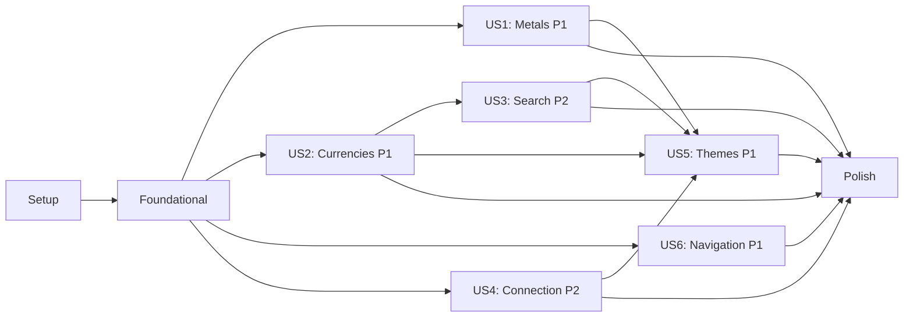

# Tasks: Live Rates Page

**Input**: Design documents from `/specs/022-live-rates-page/`
**Prerequisites**: plan.md ✓, spec.md ✓

## Format: `[ID] [P?] [Story] Description`

- **[P]**: Can run in parallel (different files, no dependencies)
- **[Story]**: Which user story this task belongs to (e.g., US1, US2, US3)
- Include exact file paths in descriptions

---

## Phase 1: Setup (Shared Infrastructure)

**Purpose**: Create the feature directory structure and route entry point

- [ ] T001 Create feature component directory
      `apps/mobile/components/live-rates/` and barrel export
      `apps/mobile/components/live-rates/index.ts`
- [ ] T002 Create Expo Router screen file `apps/mobile/app/live-rates.tsx` with
      `headerShown: false` and minimal `LiveRatesScreen` import
- [ ] T003 [P] Create `formatRate` and `calculateTrendPercent` utilities in
      `packages/logic/src/utils/format-rate.ts`
- [ ] T004 [P] Create `useLiveRatesScreen` hook stub in
      `apps/mobile/hooks/useLiveRatesScreen.ts` with typed return interface
      (empty/default values). Obtains `preferredCurrency` from the existing
      `useSettings()` hook

---

## Phase 2: Foundational (Blocking Prerequisites)

**Purpose**: Core presentational components that ALL user stories depend on

**⚠️ CRITICAL**: No user story work can begin until this phase is complete

- [ ] T005 [P] Create `LiveRatesHeader` component in
      `apps/mobile/components/live-rates/LiveRatesHeader.tsx` with back arrow,
      "Live Rates" title, and connection indicator (green dot/gray dot + "Live"
      text). Props: `isConnected`, `onBack`
- [ ] T006 [P] Create `LiveRatesFooter` component in
      `apps/mobile/components/live-rates/LiveRatesFooter.tsx` with clock icon
      (🕐) and "Updated X min ago" text. Props: `lastUpdatedText`
- [ ] T007 [P] Create `LiveRatesSkeleton` component in
      `apps/mobile/components/live-rates/LiveRatesSkeleton.tsx` composing
      `Skeleton` primitives to match page layout shape (hero card 120px + 2
      half-width cards 80px + 5 currency rows 48px)
- [ ] T008 Create `LiveRatesScreen` shell in
      `apps/mobile/components/live-rates/LiveRatesScreen.tsx` with
      `ScrollView` + `RefreshControl` (wired to `onRefresh` from hook),
      rendering Header, Skeleton (when loading), illustration empty state (when
      no data), and Footer

**Checkpoint**: Screen is navigable and shows loading skeleton → Foundation
ready

---

## Phase 3: User Story 1 — View Precious Metal Rates (Priority: P1) 🎯 MVP

**Goal**: Display Gold 24K/21K/18K hero card + Silver and Platinum side-by-side
cards

**Independent Test**: Open Live Rates screen → verify hero gold card shows
correct 24K price with 21K/18K chips, silver and platinum cards show correct
prices and trends

### Implementation for User Story 1

- [ ] T009 [P] [US1] Create `GoldHeroCard` component in
      `apps/mobile/components/live-rates/GoldHeroCard.tsx` with full-width card,
      gold left border, 24K price (28px), subtitle "24 Karat · Pure Gold", trend
      badge, and inline 21K/18K chips. Props: `price24k`, `price21k`,
      `price18k`, `trendPercent`, `currencySymbol`
- [ ] T010 [P] [US1] Create `MetalCard` component in
      `apps/mobile/components/live-rates/MetalCard.tsx` — reusable half-width
      card with colored left border, metal name, price per gram, and trend
      indicator. Props: `metalName`, `price`, `trendPercent`, `borderColor`,
      `currencySymbol`
- [ ] T011 [US1] Implement metal data derivation in `useLiveRatesScreen` hook in
      `apps/mobile/hooks/useLiveRatesScreen.ts` — call `getMetalPrice` for
      Gold/Silver/Platinum, derive 21K and 18K via new `getGoldPurityPrice`
      function in `packages/logic/src/utils/metal.ts` (keeps purity calculation
      in @astik/logic per Constitution §IV), compute trend percentages using
      `calculateTrendPercent`, format values using `formatRate`, implement
      `onRefresh` callback triggering manual sync
- [ ] T012 [US1] Integrate `GoldHeroCard` and 2× `MetalCard` (Silver + Platinum)
      into `LiveRatesScreen` in
      `apps/mobile/components/live-rates/LiveRatesScreen.tsx`, wired to
      `useLiveRatesScreen` hook output

**Checkpoint**: Gold hero + Silver/Platinum cards render with live data — US1
independently testable

---

## Phase 4: User Story 2 — View Fiat Currency Exchange Rates (Priority: P1)

**Goal**: Display scrollable currency list with 10 defaults, expandable to all
35

**Independent Test**: Scroll to currencies section → verify 10 rows show with
correct flags, codes, names, rates, and change badges. Tap "See all" → verify
full list expands inline

### Implementation for User Story 2

- [ ] T013 [P] [US2] Create `CurrencyRow` component in
      `apps/mobile/components/live-rates/CurrencyRow.tsx` — 48px height row with
      flag emoji, bold code, currency name, formatted rate, and change
      percentage badge. Props: `flag`, `code`, `name`, `rate`, `changePercent`
- [ ] T014 [P] [US2] Create `CurrencySection` component in
      `apps/mobile/components/live-rates/CurrencySection.tsx` — section header
      ("Currencies" + "vs [X]" badge), `FlatList` of `CurrencyRow` items, "See
      all currencies →" link. Props: `currencies`, `isExpanded`,
      `onToggleExpand`, `preferredCurrencyLabel`, `showSeeAll`
- [ ] T015 [US2] Implement currency data derivation in `useLiveRatesScreen` hook
      in `apps/mobile/hooks/useLiveRatesScreen.ts` — build currency list from
      `CURRENCY_INFO_MAP`, convert rates via `convertCurrency`, compute change
      percentages, filter out preferred currency (FR-020), slice to default 10
      or full list based on `isExpanded` state
- [ ] T016 [US2] Integrate `CurrencySection` into `LiveRatesScreen` in
      `apps/mobile/components/live-rates/LiveRatesScreen.tsx` below metal cards,
      wired to `useLiveRatesScreen` hook output

**Checkpoint**: Full currency list renders with expand/collapse — US2
independently testable

---

## Phase 5: User Story 3 — Search Currencies (Priority: P2)

**Goal**: Inline search filtering of the currency list by code or name

**Independent Test**: Tap search icon → type "SAR" → only Saudi Riyal shows.
Type nonsense → "No currencies found" + "See all" hidden. Clear → original list
restores

### Implementation for User Story 3

- [ ] T017 [US3] Add search state and filtering logic to `useLiveRatesScreen`
      hook in `apps/mobile/hooks/useLiveRatesScreen.ts` — `searchQuery` state,
      filter currencies by code/name match (case-insensitive), hide "See all"
      when search has no results (FR-021), properly handle expanded+search
      interaction (edge case)
- [ ] T018 [US3] Add search input toggle to `CurrencySection` in
      `apps/mobile/components/live-rates/CurrencySection.tsx` — search icon in
      header toggles inline `TextInput`, wire `onSearchChange` prop, show "No
      currencies found" empty state message when filtered list is empty

**Checkpoint**: Search filters correctly in all scenarios — US3 independently
testable

---

## Phase 6: User Story 4 — Live Connection Status & Staleness (Priority: P2)

**Goal**: Connection indicator in header + auto-refreshing footer timestamp

**Independent Test**: Verify green dot when connected, gray dot when
disconnected (airplane mode). Verify footer auto-refreshes "Updated X min ago"
every 60s

### Implementation for User Story 4

- [ ] T019 [US4] Implement 60-second auto-refresh timer for relative timestamp
      in `useLiveRatesScreen` hook in `apps/mobile/hooks/useLiveRatesScreen.ts`
      — use `setInterval` with `formatTimeAgo`, cleanup on unmount (FR-025)
- [ ] T020 [US4] Wire `isConnected` from `useMarketRates` to `LiveRatesHeader`
      and `lastUpdatedText` to `LiveRatesFooter` in `LiveRatesScreen` in
      `apps/mobile/components/live-rates/LiveRatesScreen.tsx`
- [ ] T021 [US4] Implement staleness indicator logic — amber dot when `isStale`
      is true (instead of green), update footer text styling for stale rates

**Checkpoint**: Connection and staleness indicators work — US4 independently
testable

---

## Phase 7: User Story 5 — Dark and Light Theme Support (Priority: P1)

**Goal**: All components render correctly in both dark and light themes

**Independent Test**: Toggle device theme → verify all backgrounds, text, cards,
badges render correctly without visual artifacts

### Implementation for User Story 5

- [ ] T022 [US5] Audit and apply Tailwind `dark:` variants across all components
      in `apps/mobile/components/live-rates/` — verify backgrounds (slate-900
      dark, white light), text colors, card borders, badge colors, and footer
      text contrast in both themes
- [ ] T023 [US5] Apply inline shadow styles on any interactive components
      (NativeWind v4 bug avoidance) and verify no crash on
      `TouchableOpacity`/`Pressable` usage in
      `apps/mobile/components/live-rates/`

**Checkpoint**: All elements render correctly in both themes — US5 independently
testable

---

## Phase 8: User Story 6 — Navigation to Live Rates (Priority: P1)

**Goal**: Navigate to Live Rates from Dashboard strip and Drawer

**Independent Test**: Tap Dashboard rates strip → navigates to Live Rates. Open
Drawer → tap "Live Rates" → navigates. Tap back arrow → returns to previous
screen

### Implementation for User Story 6

- [ ] T024 [US6] Add "Live Rates" navigation item to `AppDrawer` in
      `apps/mobile/components/navigation/AppDrawer.tsx` — add entry after
      "Metals" in primary section, route: `/live-rates`, icon:
      `trending-up-outline`
- [ ] T025 [US6] Make Dashboard `LiveRates` strip tappable in
      `apps/mobile/components/dashboard/LiveRates.tsx` — wrap in
      `Pressable`/`TouchableOpacity`, navigate to `/live-rates` on press using
      `router.push`

**Checkpoint**: Both navigation entry points work correctly — US6 independently
testable

---

## Phase 9: Polish & Cross-Cutting Concerns

**Purpose**: Final improvements affecting multiple user stories

- [ ] T026 Update barrel exports in `apps/mobile/components/live-rates/index.ts`
      to export all final components
- [ ] T027 [P] Unit tests for `formatRate` and `calculateTrendPercent` in
      `packages/logic/src/utils/__tests__/format-rate.test.ts`
- [ ] T028 Run TypeScript compilation check (`npx nx run mobile:typecheck`) and
      fix any type errors
- [ ] T029 Run ESLint (`npx nx run mobile:lint`) and fix any lint violations
- [ ] T030 Manual QA — walk through all 9 verification steps from the plan's
      Verification Plan section (includes performance spot-checks: SC-001 < 1s
      first render, SC-005 < 100ms search filter)

---

## Dependencies & Execution Order

### Phase Dependencies

- **Setup (Phase 1)**: No dependencies — can start immediately
- **Foundational (Phase 2)**: Depends on Setup (T001, T002) completion — BLOCKS
  all user stories
- **US1 Metal Rates (Phase 3)**: Depends on Foundational — T005-T008
- **US2 Currency List (Phase 4)**: Depends on Foundational — can run in parallel
  with US1
- **US3 Search (Phase 5)**: Depends on US2 (T014 CurrencySection must exist)
- **US5 Themes (Phase 7)**: Depends on all presentation components existing
  (US1-US4)
- **US6 Navigation (Phase 8)**: Depends on screen existing (Phase 2 T002/T008)
- **Polish (Phase 9)**: Depends on all user stories complete

### User Story Dependencies

### Parallel Opportunities

Within each phase, tasks marked [P] can run in parallel:

- **Setup**: T003 + T004 can run in parallel after T001
- **Foundational**: T005 + T006 + T007 can run in parallel
- **US1**: T009 + T010 can run in parallel (different files)
- **US2**: T013 + T014 can run in parallel (different files)
- **Cross-phase**: US1 + US2 + US4 + US6 can all start after Foundational

---

## Implementation Strategy

### MVP First (User Story 1 Only)

1. Complete Phase 1: Setup (T001-T004)
2. Complete Phase 2: Foundational (T005-T008)
3. Complete Phase 3: User Story 1 — Metals (T009-T012)
4. **STOP and VALIDATE**: Gold hero + Silver/Platinum display correctly
5. Deploy to staging device for demo

### Incremental Delivery

1. Setup + Foundational → Skeleton screen visible ✓
2. - US1 (Metals) → Gold/Silver/Platinum cards live ✓
3. - US2 (Currencies) → Full currency list with expand ✓
4. - US3 (Search) → Currency search working ✓
5. - US4 (Connection) → Status indicators + auto-refresh ✓
6. - US5 (Themes) → Both themes polished ✓
7. - US6 (Navigation) → Drawer + Dashboard entry points ✓
8. Polish → Tests + lint + QA ✓

---

## Summary

| Metric                     | Value                              |
| -------------------------- | ---------------------------------- |
| **Total tasks**            | 30                                 |
| **Setup**                  | 4 tasks                            |
| **Foundational**           | 4 tasks                            |
| **US1 (Metals)**           | 4 tasks                            |
| **US2 (Currencies)**       | 4 tasks                            |
| **US3 (Search)**           | 2 tasks                            |
| **US4 (Connection)**       | 3 tasks                            |
| **US5 (Themes)**           | 2 tasks                            |
| **US6 (Navigation)**       | 2 tasks                            |
| **Polish**                 | 5 tasks                            |
| **Parallel opportunities** | 12 tasks (40%)                     |
| **New files**              | ~12                                |
| **Modified files**         | 2 (AppDrawer, Dashboard LiveRates) |
